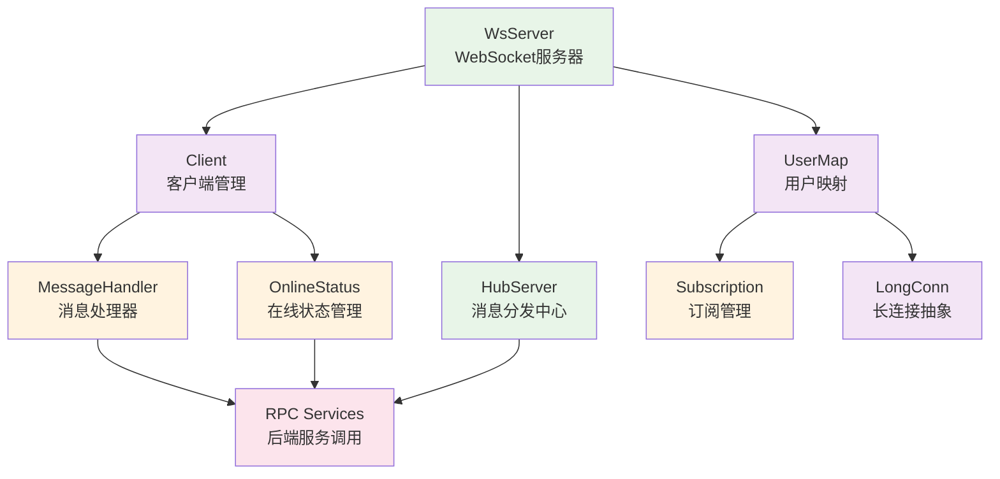
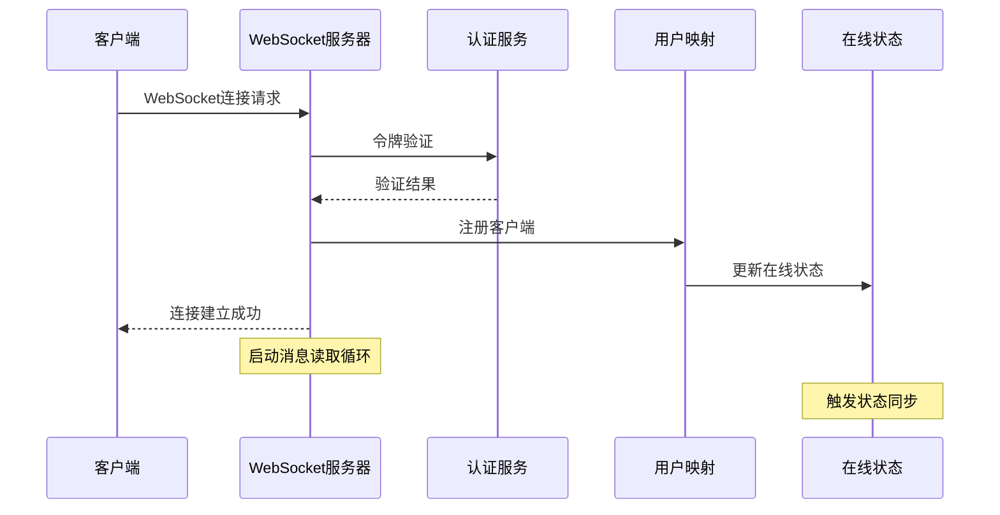
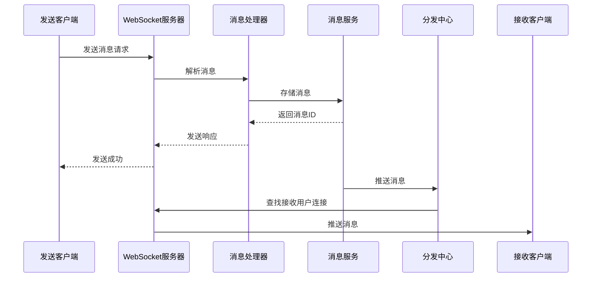
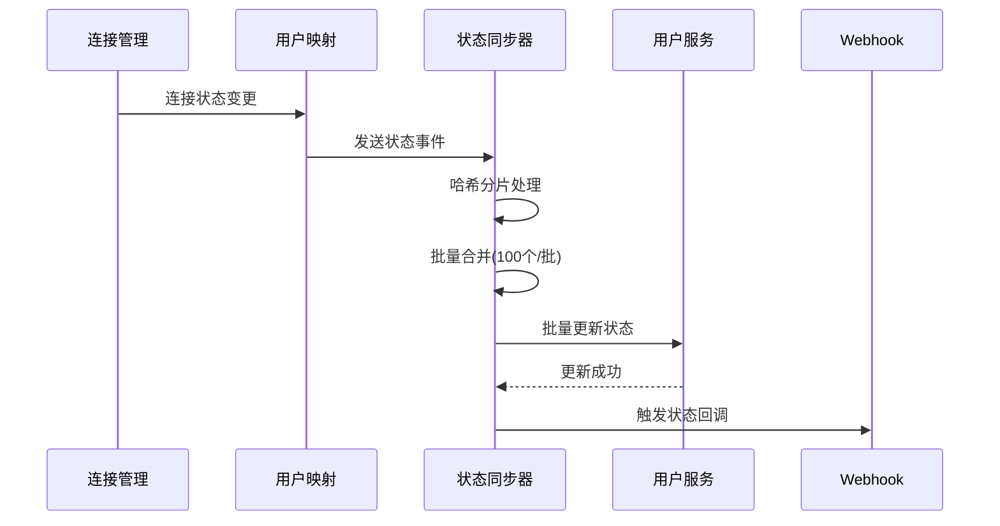

# OpenIM 消息网关模块 (msggateway) 源码分析文档

## 1. 模块概述

OpenIM 消息网关 (msggateway) 是整个 OpenIM 系统的核心通信枢纽，负责管理客户端 WebSocket 连接、实时消息转发、用户在线状态管理等关键功能。它是连接客户端和后端服务的重要桥梁。

### 1.1 核心职责
- **连接管理**: 管理客户端 WebSocket 连接的生命周期
- **消息转发**: 实时接收、处理和转发消息
- **状态管理**: 用户在线状态的实时同步和维护
- **负载均衡**: 支持多实例部署，实现水平扩展
- **认证授权**: 连接建立时的身份验证
- **多端登录**: 多终端登录控制和管理

### 1.2 技术特性
- **高并发**: 支持大量并发 WebSocket 连接
- **高性能**: 优化的消息处理和状态同步机制
- **高可用**: 支持集群部署和故障转移
- **实时性**: 毫秒级消息推送延迟
- **可扩展**: 模块化设计，易于扩展和维护

## 2. 整体架构设计

### 2.1 分层架构

```
┌─────────────────────────────────────────────────────────┐
│                    客户端层                             │
│           iOS/Android/Web/PC 客户端                     │
└─────────────────────────────────────────────────────────┘
                            │ WebSocket
┌─────────────────────────────────────────────────────────┐
│                  WebSocket 服务层                       │
│              ws_server.go (连接管理)                    │
└─────────────────────────────────────────────────────────┘
                            │
┌─────────────────────────────────────────────────────────┐
│                   客户端管理层                          │
│  client.go (客户端抽象) + user_map.go (用户映射)        │
└─────────────────────────────────────────────────────────┘
                            │
┌─────────────────────────────────────────────────────────┐
│                   消息处理层                            │
│  message_handler.go (消息路由) + hub_server.go (分发)   │
└─────────────────────────────────────────────────────────┘
                            │
┌─────────────────────────────────────────────────────────┐
│                   状态管理层                            │
│      online.go (状态同步) + subscription.go (订阅)      │
└─────────────────────────────────────────────────────────┘
                            │
┌─────────────────────────────────────────────────────────┐
│                   后端服务层                            │
│          User/Msg/Push/Auth RPC 服务                    │
└─────────────────────────────────────────────────────────┘
```

### 2.2 核心组件关系



## 3. 核心组件详解

### 3.1 WebSocket 服务器 (ws_server.go)

#### 3.1.1 WsServer 结构体
```go
type WsServer struct {
    msgGatewayConfig  *Config              // 配置信息
    port              int                   // 监听端口
    wsMaxConnNum      int64                // 最大连接数
    registerChan      chan *Client         // 客户端注册通道
    unregisterChan    chan *Client         // 客户端注销通道
    kickHandlerChan   chan *kickHandler    // 踢出处理通道
    clients           UserMap              // 用户连接映射
    online            *rpccache.OnlineCache // 在线状态缓存
    subscription      *Subscription        // 订阅管理
    clientPool        sync.Pool            // 客户端对象池
    onlineUserNum     atomic.Int64         // 在线用户数
    onlineUserConnNum atomic.Int64         // 在线连接数
    // ... 其他字段
}
```

#### 3.1.2 核心功能
- **连接管理**: 通过三个通道异步处理客户端注册、注销和踢出
- **对象池**: 使用 sync.Pool 复用 Client 对象，减少 GC 压力
- **原子计数**: 实时统计在线用户数和连接数
- **异步处理**: 主循环处理各种事件，避免阻塞

#### 3.1.3 事件处理循环
```go
// 主事件循环处理三类事件
for {
    select {
    case client = <-ws.registerChan:
        ws.registerClient(client)      // 客户端注册
    case client = <-ws.unregisterChan:
        ws.unregisterClient(client)    // 客户端注销
    case onlineInfo := <-ws.kickHandlerChan:
        ws.multiTerminalLoginChecker(...) // 多端登录检查
    }
}
```

### 3.2 客户端管理 (client.go)

#### 3.2.1 Client 结构体
```go
type Client struct {
    w              *sync.Mutex          // 写锁
    conn           LongConn             // 长连接抽象
    PlatformID     int                  // 平台ID (iOS/Android/Web等)
    IsCompress     bool                 // 是否压缩
    UserID         string               // 用户ID
    IsBackground   bool                 // 是否后台模式
    SDKType        string               // SDK类型
    Encoder        Encoder              // 编码器 (JSON/Gob)
    ctx            *UserConnContext     // 连接上下文
    longConnServer LongConnServer       // 长连接服务器
    closed         atomic.Bool          // 关闭状态
    closedErr      error                // 关闭错误
    token          string               // 认证令牌
    hbCtx          context.Context      // 心跳上下文
    hbCancel       context.CancelFunc   // 心跳取消函数
    subLock        *sync.Mutex          // 订阅锁
    subUserIDs     map[string]struct{}  // 订阅用户列表
}
```

#### 3.2.2 核心功能

**连接生命周期管理**:
- `ResetClient()`: 重置客户端状态，复用对象
- `readMessage()`: 持续读取消息的主循环
- `close()`: 优雅关闭连接

**消息处理**:
- `handleMessage()`: 处理二进制消息 (protobuf)
- `handlerTextMessage()`: 处理文本消息 (JSON)
- `PushMessage()`: 向客户端推送消息

**心跳机制**:
- `activeHeartbeat()`: 主动心跳发送
- `pingHandler()`: 处理客户端 ping
- `pongHandler()`: 处理客户端 pong

#### 3.2.3 消息处理流程
```go
// 消息读取主循环
for {
    messageType, message, returnErr := c.conn.ReadMessage()
    switch messageType {
    case MessageBinary:  // protobuf 消息
        _ = c.conn.SetReadDeadline(pongWait)
        parseDataErr := c.handleMessage(message)
    case MessageText:    // JSON 消息
        _ = c.conn.SetReadDeadline(pongWait)
        parseDataErr := c.handlerTextMessage(message)
    case PingMessage:    // Ping 消息
        err := c.writePongMsg("")
    case CloseMessage:   // 关闭消息
        c.closedErr = ErrClientClosed
        return
    }
}
```

### 3.3 用户连接映射 (user_map.go)

#### 3.3.1 UserMap 接口设计
```go
type UserMap interface {
    GetAll(userID string) ([]*Client, bool)              // 获取用户所有连接
    Get(userID string, platformID int) ([]*Client, bool, bool) // 获取指定平台连接
    Set(userID string, v *Client)                         // 设置用户连接
    DeleteClients(userID string, clients []*Client) bool // 删除客户端连接
    UserState() <-chan UserState                          // 用户状态变更通道
    GetAllUserStatus(deadline, nowtime time.Time) []UserState // 获取需要续约的用户
    RecvSubChange(userID string, platformIDs []int32) bool    // 接收订阅变更
}
```

#### 3.3.2 数据结构设计
```go
type userMap struct {
    lock sync.RWMutex                    // 读写锁
    data map[string]*UserPlatform        // 用户 -> 平台连接映射
    ch   chan UserState                  // 状态变更通道
}

type UserPlatform struct {
    Time    time.Time    // 最后更新时间
    Clients []*Client    // 客户端连接列表
}

type UserState struct {
    UserID  string   // 用户ID
    Online  []int32  // 上线平台列表
    Offline []int32  // 下线平台列表
}
```

#### 3.3.3 关键特性

**线程安全**: 使用读写锁保护并发访问
**状态通知**: 通过 channel 异步通知状态变更
**多平台支持**: 同一用户可在多个平台同时在线
**自动清理**: 连接断开时自动清理映射关系

### 3.4 消息处理器 (message_handler.go)

#### 3.4.1 MessageHandler 接口
```go
type MessageHandler interface {
    GetSeq(ctx context.Context, data *Req) ([]byte, error)                    // 获取序列号
    SendMessage(ctx context.Context, data *Req) ([]byte, error)               // 发送消息
    SendSignalMessage(ctx context.Context, data *Req) ([]byte, error)         // 发送信令消息
    PullMessageBySeqList(ctx context.Context, data *Req) ([]byte, error)      // 拉取消息
    GetConversationsHasReadAndMaxSeq(ctx context.Context, data *Req) ([]byte, error) // 获取会话已读状态
    GetSeqMessage(ctx context.Context, data *Req) ([]byte, error)             // 获取指定序列号消息
    UserLogout(ctx context.Context, data *Req) ([]byte, error)                // 用户登出
    SetUserDeviceBackground(ctx context.Context, data *Req) ([]byte, bool, error) // 设置后台状态
    GetLastMessage(ctx context.Context, data *Req) ([]byte, error)            // 获取最新消息
}
```

#### 3.4.2 请求/响应结构
```go
// 通用请求结构
type Req struct {
    ReqIdentifier int32  `json:"reqIdentifier" validate:"required"` // 请求标识符
    Token         string `json:"token"`                             // 认证令牌
    SendID        string `json:"sendID" validate:"required"`        // 发送者ID
    OperationID   string `json:"operationID" validate:"required"`   // 操作ID
    MsgIncr       string `json:"msgIncr" validate:"required"`       // 消息增量标识
    Data          []byte `json:"data"`                              // 消息数据
}

// 通用响应结构
type Resp struct {
    ReqIdentifier int32  `json:"reqIdentifier"` // 请求标识符
    MsgIncr       string `json:"msgIncr"`       // 消息增量标识
    OperationID   string `json:"operationID"`   // 操作ID
    ErrCode       int    `json:"errCode"`       // 错误码
    ErrMsg        string `json:"errMsg"`        // 错误信息
    Data          []byte `json:"data"`          // 响应数据
}
```

#### 3.4.3 对象池优化
```go
// 使用对象池减少内存分配
var reqPool = sync.Pool{
    New: func() any {
        return new(Req)
    },
}

func getReq() *Req {
    req := reqPool.Get().(*Req)
    // 重置字段...
    return req
}

func freeReq(req *Req) {
    reqPool.Put(req)
}
```

### 3.5 消息分发中心 (hub_server.go)

#### 3.5.1 Server 结构体
```go
type Server struct {
    msggateway.UnimplementedMsgGatewayServer // gRPC 服务基类
    rpcPort        int                        // RPC 端口
    LongConnServer LongConnServer             // 长连接服务器
    config         *Config                    // 配置信息
    pushTerminal   map[int]struct{}           // 推送终端映射
    ready          func(srv *Server) error    // 就绪回调
    queue          *memamq.MemoryQueue        // 内存队列
    userClient     *rpcli.UserClient          // 用户服务客户端
}
```

#### 3.5.2 核心功能

**消息推送**:
- `pushToUser()`: 向指定用户推送消息
- `SuperGroupOnlineBatchPushOneMsg()`: 批量推送消息

**在线状态查询**:
- `GetUsersOnlineStatus()`: 获取用户在线状态

**多端登录管理**:
- `MultiTerminalLoginCheck()`: 多端登录检查
- `KickUserOffline()`: 踢出用户

#### 3.5.3 批量推送优化
```go
// 使用内存队列和并发处理优化批量推送
ch := make(chan *msggateway.SingleMsgToUserResults, len(req.PushToUserIDs))
var count atomic.Int64
count.Add(int64(len(req.PushToUserIDs)))

for i := range req.PushToUserIDs {
    userID := req.PushToUserIDs[i]
    err := s.queue.PushCtx(ctx, func() {
        ch <- s.pushToUser(ctx, userID, req.MsgData)
        if count.Add(-1) == 0 {
            close(ch)
        }
    })
}
```

### 3.6 在线状态管理 (online.go)

#### 3.6.1 状态同步机制
详见之前的分析，核心特性：
- **并发处理**: 多个 goroutine 并发处理状态更新
- **批量合并**: 动态批量处理，提高效率
- **哈希分片**: 基于用户ID哈希分片，避免热点
- **定时续约**: 防止缓存过期

#### 3.6.2 三大事件循环
1. **定时合并推送**: 每秒强制推送积累的状态变更
2. **定时续约**: 定期续约在线用户状态
3. **实时状态变更**: 处理来自连接管理器的实时事件

### 3.7 订阅管理 (subscription.go)

#### 3.7.1 Subscription 结构体
```go
type Subscription struct {
    rwMutex sync.RWMutex              // 读写锁
    subMap  map[string]map[string]struct{} // 订阅映射: userID -> set[subscriberID]
}
```

#### 3.7.2 核心功能
- **订阅关系管理**: 管理用户之间的订阅关系
- **事件通知**: 订阅用户状态变更通知
- **并发安全**: 读写锁保护并发访问

## 4. 关键技术特性

### 4.1 性能优化

#### 4.1.1 对象池技术
```go
// 客户端对象池
clientPool: sync.Pool{
    New: func() any {
        return new(Client)
    },
}

// 请求对象池
var reqPool = sync.Pool{
    New: func() any {
        return new(Req)
    },
}
```
**优势**: 减少 GC 压力，提高内存分配效率

#### 4.1.2 异步处理
- **通道机制**: 使用 channel 实现异步事件处理
- **协程池**: 并发处理消息和状态更新
- **非阻塞设计**: 避免单点阻塞影响整体性能

#### 4.1.3 批量操作
- **状态批量更新**: 合并多个状态变更，减少网络请求
- **消息批量推送**: 使用内存队列优化推送性能

### 4.2 高可用设计

#### 4.2.1 故障隔离
- **错误处理**: 单个连接错误不影响其他连接
- **超时控制**: 所有 RPC 调用都有超时限制
- **降级策略**: 关键路径失败时的降级处理

#### 4.2.2 状态恢复
- **连接重连**: 客户端断线重连机制
- **状态同步**: 重连后自动同步状态
- **数据一致性**: 确保状态数据的最终一致性

### 4.3 扩展性设计

#### 4.3.1 模块化架构
- **接口抽象**: 核心组件都有接口定义
- **依赖注入**: 通过接口注入依赖
- **插件化**: 支持自定义编码器、压缩器等

#### 4.3.2 水平扩展
- **无状态设计**: 网关节点无状态，易于扩展
- **负载均衡**: 客户端可连接任意网关节点
- **服务发现**: 集成服务发现机制

## 5. 消息流程分析

### 5.1 客户端连接流程


### 5.2 消息发送流程


### 5.3 状态同步流程


## 6. 配置与部署

### 6.1 核心配置项
```yaml
msggateway:
  listenIP: "0.0.0.0"
  ports: [10001, 10002, 10003]  # 支持多端口部署
  websocketMaxConnNum: 100000   # 最大连接数
  websocketTimeout: 10          # WebSocket超时
  websocketMaxMsgLen: 4096      # 最大消息长度
```

### 6.2 性能调优参数
- **并发数**: `ChangeOnlineStatus` 的并发 goroutine 数量
- **缓冲区大小**: 各种 channel 的缓冲区大小
- **超时时间**: 心跳、读写、RPC 调用超时
- **批次大小**: 状态更新批次大小

## 7. 监控与运维

### 7.1 关键指标
- **连接数**: 实时连接数和最大连接数
- **消息量**: 消息发送/接收速率
- **延迟**: 消息推送延迟
- **错误率**: 连接失败率、消息失败率
- **状态同步**: 状态更新频率和延迟

### 7.2 日志记录
- **连接日志**: 连接建立、断开、错误
- **消息日志**: 消息发送、接收、处理
- **状态日志**: 状态变更、同步、续约
- **性能日志**: 处理时间、队列长度

## 8. 总结

OpenIM 消息网关模块采用了精心设计的分层架构，通过以下关键技术实现了高性能、高可用的实时通信：

### 8.1 核心优势
1. **高性能**: 对象池、异步处理、批量操作等优化
2. **高并发**: 支持数万并发连接
3. **高可用**: 故障隔离、状态恢复、集群部署
4. **实时性**: 毫秒级消息推送
5. **可扩展**: 模块化设计，易于扩展

### 8.2 设计亮点
1. **状态管理**: 创新的批量合并+哈希分片状态同步机制
2. **连接管理**: 完善的连接生命周期管理
3. **消息处理**: 灵活的消息路由和处理框架
4. **性能优化**: 全方位的性能优化措施

### 8.3 适用场景
- **即时通讯**: IM 应用的核心消息网关
- **实时推送**: 消息、通知的实时推送
- **在线状态**: 用户在线状态管理
- **多端同步**: 多终端消息同步

这个消息网关模块为 OpenIM 提供了坚实的技术基础，能够支撑大规模的实时通信应用。 