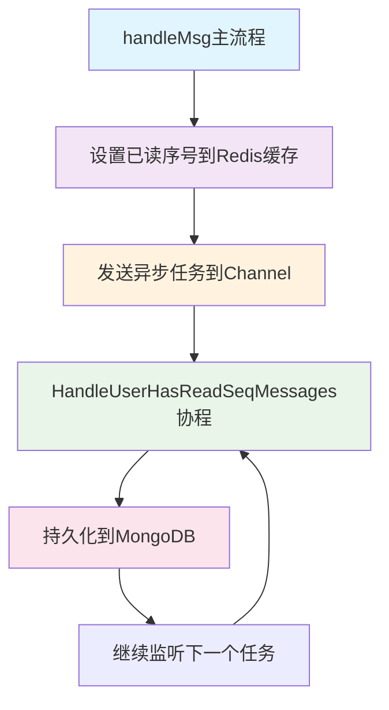
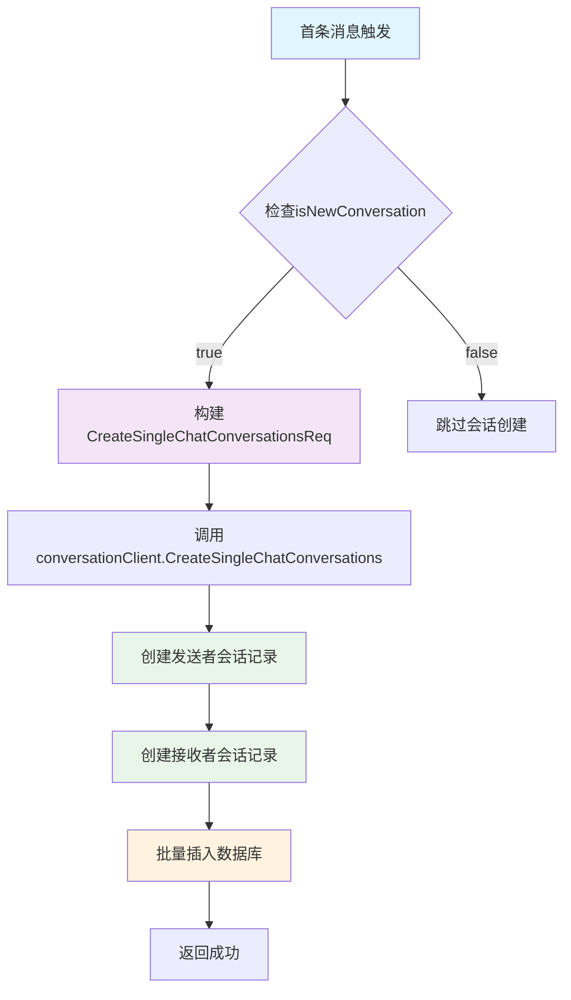
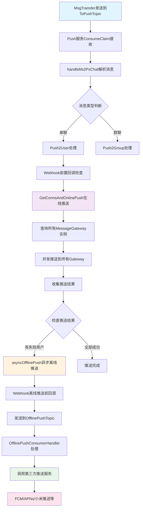
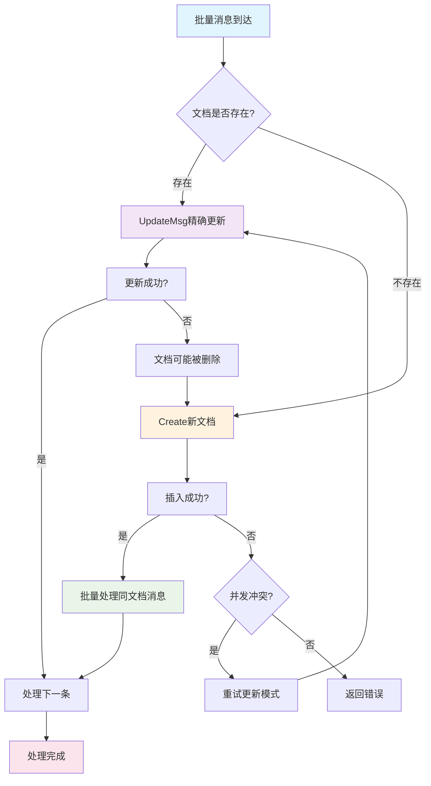
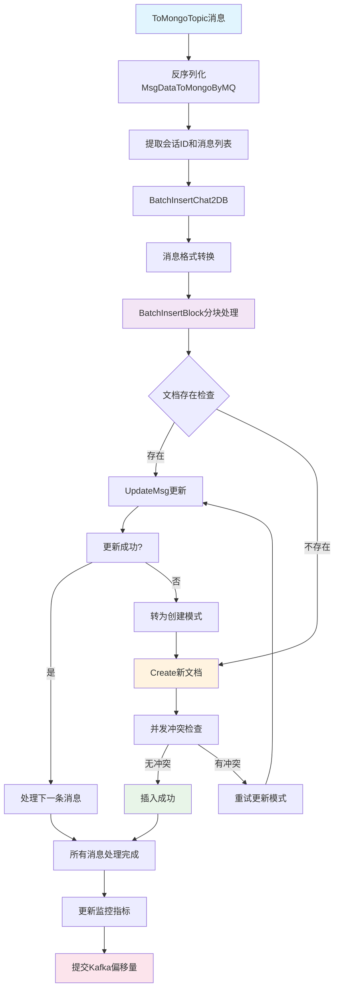
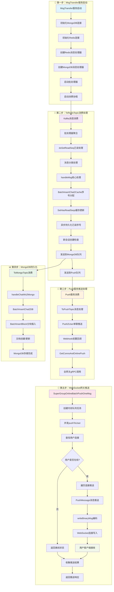
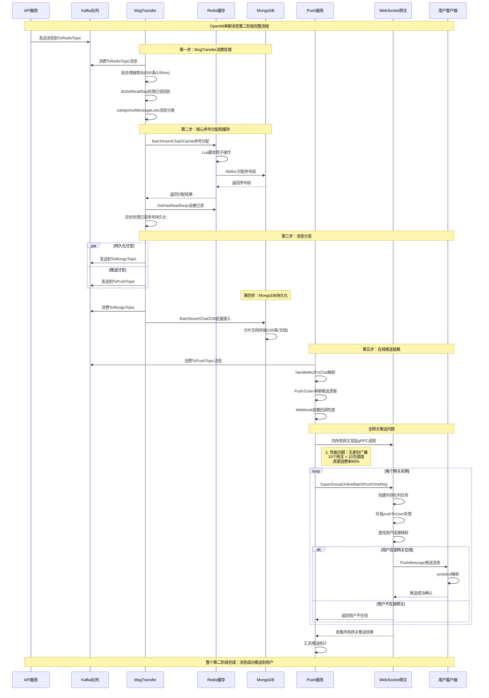

# OpenIM单聊消息第二阶段在线推送流程源码详解

## 📱 **阶段二：消息转发完整链路分析**

### 🔄 **流程概览**

单聊消息发送第二阶段涵盖了从Kafka队列到用户设备的完整推送链路：

```
Kafka队列 → MsgTransfer服务 → Redis缓存 → 序号分配 → MongoDB持久化 → 推送队列 → 在线用户推送
```

---

## 🚀 **第一步：MsgTransfer服务启动**

### **1.1 服务启动入口**

**文件位置**: `internal/msgtransfer/init.go:95-98`

```go
// Start 启动消息传输服务
// 这是整个MsgTransfer服务的入口函数，负责初始化所有组件并启动服务
func Start(ctx context.Context, index int, config *Config) error {
    // 1. 创建Redis消息处理器
    // 负责处理ToRedisTopic的消息，实现核心的去重和缓存逻辑
    historyCH, err := NewOnlineHistoryRedisConsumerHandler(ctx, client, config, msgTransferDatabase)
    if err != nil {
        return err
    }

    // 2. 创建MongoDB消息处理器
    // 负责处理ToMongoTopic的消息，实现消息的持久化存储
    historyMongoCH, err := NewOnlineHistoryMongoConsumerHandler(&config.KafkaConfig, msgTransferDatabase)
    if err != nil {
        return err
    }

    // 3. 创建MsgTransfer实例并启动服务
    msgTransfer := &MsgTransfer{
        historyCH:      historyCH,
        historyMongoCH: historyMongoCH,
    }
    return msgTransfer.Start(index, config)
}
```

### **1.2 核心协程启动逻辑**

**文件位置**: `internal/msgtransfer/init.go:180-190`

```go
func (m *MsgTransfer) Start(index int, cfg *Config) error {
    m.ctx, m.cancel = context.WithCancel(context.Background())

    // 启动Redis消息处理协程 - ToRedisTopic消费者
    // 功能：消费ToRedisTopic主题，处理消息缓存、去重、转发
    // 回调：最终调用historyCH.do()方法进行批处理
    go m.historyCH.historyConsumerGroup.RegisterHandleAndConsumer(m.ctx, m.historyCH)
    
    // 启动MongoDB持久化协程 - ToMongoTopic消费者  
    // 功能：消费ToMongoTopic主题，将消息持久化到MongoDB
    // 回调：最终调用historyMongoCH.do()方法进行持久化处理
    go m.historyMongoCH.historyConsumerGroup.RegisterHandleAndConsumer(m.ctx, m.historyMongoCH)
    
    // 启动已读序号异步处理协程
    // 功能：异步处理用户已读序号的MongoDB持久化
    // 回调：监听conversationUserHasReadChan通道，调用SetHasReadSeqToDB
    go m.historyCH.HandleUserHasReadSeqMessages(m.ctx)
    
    // 启动批处理器
    // 功能：聚合Kafka消息，定时触发批处理
    // 回调：达到条件时调用historyCH.do()方法
    err := m.historyCH.redisMessageBatches.Start()
    if err != nil {
        return err
    }

    // ... 其他服务注册逻辑
    return nil
}
```

**核心协程说明**：

| 协程名称 | 订阅Topic | 主要功能 | 最终回调方法 |
|---------|-----------|----------|-------------|
| **ToRedisTopic消费协程** | `ToRedisTopic` | 消息去重、缓存、序号分配 | `historyCH.do()` |
| **ToMongoTopic消费协程** | `ToMongoTopic` | 消息持久化到MongoDB | `historyMongoCH.do()` |
| **已读序号处理协程** | 内部通道 | 异步持久化已读序号 | `HandleUserHasReadSeqMessages()` |
| **批处理器协程** | 聚合处理 | 消息聚合和定时触发 | `批处理器.do()` |

---

## 📮 **第二步：ToRedisTopic消费协程核心业务处理链路**

### **2.1 消费协程结构体定义**

**文件位置**: `internal/msgtransfer/online_history_msg_handler.go:80-107`

```go
// OnlineHistoryRedisConsumerHandler Redis消息消费处理器
// 这是消息传输服务的核心组件，负责以下关键功能：
// 1. 消息去重：使用Redis INCRBY原子操作为每条消息分配全局唯一序号
// 2. 消息缓存：将消息存储到Redis中，提供快速访问（TTL: 24小时）
// 3. 消息分类：区分存储/非存储消息，通知/普通消息
// 4. 消息转发：将消息分发到推送队列和持久化队列
// 5. 已读状态管理：处理消息已读回执，更新用户已读序号
type OnlineHistoryRedisConsumerHandler struct {
    // historyConsumerGroup Kafka消费者组，消费ToRedisTopic主题
    historyConsumerGroup *kafka.MConsumerGroup

    // redisMessageBatches 批处理器，用于批量处理Kafka消息
    // 关键特性：
    // - 按会话ID进行分片，确保同一会话的消息有序处理
    // - 支持500条消息/批次，100ms时间间隔
    // - 50个并发工作协程
    redisMessageBatches *batcher.Batcher[sarama.ConsumerMessage]

    // msgTransferDatabase 数据库操作接口，提供Redis和MongoDB的统一访问
    msgTransferDatabase controller.MsgTransferDatabase

    // conversationUserHasReadChan 已读序号异步处理通道
    // 用于将用户已读序号更新任务发送到后台协程处理
    conversationUserHasReadChan chan *userHasReadSeq

    // wg WaitGroup，用于等待已读序号处理协程结束
    wg sync.WaitGroup

    // groupClient 群组服务客户端，用于获取群成员信息
    groupClient *rpcli.GroupClient
    // conversationClient 会话服务客户端，用于创建会话
    conversationClient *rpcli.ConversationClient
}
```

### **2.2 批处理器初始化：关键配置和分片逻辑**

#### **2.2.1 Batcher批处理器设计详解**

**文件位置**: `pkg/tools/batcher/batcher.go:25-60`

```go
// Batcher 批处理器核心结构体
// 通用的批处理框架，提供高性能的消息聚合和分片处理能力
type Batcher[T any] struct {
    size         int                    // 批处理大小：单批次最大消息数量（默认500）
    interval     time.Duration          // 时间间隔：最大等待时间（默认100ms）
    worker       int                    // 工作协程数：并发处理协程数量（默认50）
    dataBuffer   int                    // 主数据缓冲区大小：防止阻塞（默认500）
    buffer       int                    // 子通道缓冲区大小：分片通道缓冲（默认50）
    do           func([]T)              // 🔑 业务处理函数：核心回调方法
    Sharding     func(string) int       // 🔑 分片函数：保证相同key的有序处理
    asyncFuncs   []func()               // 异步函数列表：启动时执行的协程
    
    ctx          context.Context        // 上下文：用于优雅关闭
    cancel       func()                 // 取消函数：停止所有协程
    wait         sync.WaitGroup         // 等待组：确保协程完成

    chans        []chan *T              // 分片通道数组：每个工作协程对应一个通道
    msgDistributor chan *T              // 消息分发器：统一接收消息并分发到分片通道
}
```

**Batcher关键设计特点**：

1. **分片有序处理**：通过Sharding函数将相同key的消息分配到同一协程，保证处理顺序
2. **批量聚合优化**：每批最多500条消息或100ms超时触发，减少数据库操作次数
3. **并发处理能力**：50个工作协程并发处理，提高系统吞吐量
4. **背压控制机制**：通过缓冲区大小控制内存使用，防止OOM

#### **2.2.2 Batcher工作协程启动机制**

**文件位置**: `pkg/tools/batcher/batcher.go:85-125`

```go
// Start 启动批处理器
// 创建工作协程和分发协程，开始处理消息
func (b *Batcher[T]) Start() {
    // 1. 创建分片通道数组，每个工作协程对应一个通道
    b.chans = make([]chan *T, b.worker)
    for i := 0; i < b.worker; i++ {
        b.chans[i] = make(chan *T, b.buffer)
    }

    // 2. 创建消息分发器通道
    b.msgDistributor = make(chan *T, b.dataBuffer)

    // 3. 启动消息分发协程
    b.wait.Add(1)
    go b.distributeMessages()

    // 4. 启动工作协程组，每个协程处理一个分片
    for i := 0; i < b.worker; i++ {
        b.wait.Add(1)
        go b.worker(i)
    }

    // 5. 启动用户自定义的异步协程
    for _, asyncFunc := range b.asyncFuncs {
        b.wait.Add(1)
        go func(fn func()) {
            defer b.wait.Done()
            fn()
        }(asyncFunc)
    }
}

// distributeMessages 消息分发协程
// 根据分片策略将消息分发到对应的工作协程
func (b *Batcher[T]) distributeMessages() {
    defer b.wait.Done()
    defer func() {
        // 关闭所有分片通道
        for _, ch := range b.chans {
            close(ch)
        }
    }()

    for {
        select {
        case msg, ok := <-b.msgDistributor:
            if !ok {
                return
            }
            
            // 根据消息key进行分片
            shardIndex := b.Sharding(msg.key) % b.worker
            
            select {
            case b.chans[shardIndex] <- msg:
                // 成功分发到对应分片
            case <-b.ctx.Done():
                return
            }
            
        case <-b.ctx.Done():
            return
        }
    }
}

// worker 工作协程实现
// 每个协程负责处理一个分片的消息，保证同一分片内消息的有序处理
func (b *Batcher[T]) worker(index int) {
    defer b.wait.Done()
    
    var batch []T
    ticker := time.NewTicker(b.interval)
    defer ticker.Stop()

    for {
        select {
        case msg, ok := <-b.chans[index]:
            if !ok {
                // 通道关闭，处理剩余消息
                if len(batch) > 0 {
                    b.do(batch)
                }
                return
            }
            
            batch = append(batch, *msg)
            
            // 批次达到大小限制，立即处理
            if len(batch) >= b.size {
                b.do(batch)
                batch = nil
                ticker.Reset(b.interval)
            }
            
        case <-ticker.C:
            // 超时触发，处理当前批次
            if len(batch) > 0 {
                b.do(batch)
                batch = nil
            }
            
        case <-b.ctx.Done():
            // 上下文取消，处理剩余消息
            if len(batch) > 0 {
                b.do(batch)
            }
            return
        }
    }
}
```

**文件位置**: `internal/msgtransfer/online_history_msg_handler.go:140-185`

```go
func NewOnlineHistoryRedisConsumerHandler(ctx context.Context, client discovery.SvcDiscoveryRegistry, config *Config, database controller.MsgTransferDatabase) (*OnlineHistoryRedisConsumerHandler, error) {
    // 省略前面的初始化代码...

    // 5. 创建和配置批处理器
    b := batcher.New[sarama.ConsumerMessage](
        batcher.WithSize(size),                 // 批量大小：500条消息
        batcher.WithWorker(worker),             // 工作协程数：50个
        batcher.WithInterval(interval),         // 时间间隔：100毫秒
        batcher.WithDataBuffer(mainDataBuffer), // 主数据缓冲区：500
        batcher.WithSyncWait(true),             // 启用同步等待，确保处理完成
        batcher.WithBuffer(subChanBuffer),      // 子通道缓冲区：50
    )

    // 6. 设置分片函数 - 根据会话ID分片，确保同一会话的消息有序处理
    b.Sharding = func(key string) int {
        hashCode := stringutil.GetHashCode(key)
        return int(hashCode) % och.redisMessageBatches.Worker()
    }

    // 7. 设置键提取函数 - 从Kafka消息中提取会话ID作为分片键
    b.Key = func(consumerMessage *sarama.ConsumerMessage) string {
        return string(consumerMessage.Key)
    }

    // 8. 设置批处理逻辑 - 指向do()方法
    b.Do = och.do

    och.redisMessageBatches = b
    och.historyConsumerGroup = historyConsumerGroup

    return &och, nil
}
```

#### **2.2.1 Batcher批处理器核心设计详解**

**文件位置**: `pkg/tools/batcher/batcher.go:35-80`

```go
// Batcher 泛型批处理器结构体
// T: 处理的数据类型，支持任意类型的数据批处理
type Batcher[T any] struct {
    config *Config // 批处理器配置

    // 上下文控制和取消
    globalCtx context.Context    // 全局上下文，用于控制整个批处理器的生命周期
    cancel    context.CancelFunc // 取消函数，用于停止批处理器

    // 核心处理函数（必须设置）
    Do       func(ctx context.Context, channelID int, val *Msg[T]) // 批处理执行函数：处理具体的批量数据
    Sharding func(key string) int                                  // 分片函数：根据key决定数据分配到哪个工作协程
    Key      func(data *T) string                                  // 键提取函数：从数据中提取用于分组和分片的key

    // 回调函数（可选）
    OnComplete func(lastMessage *T, totalCount int)                                             // 完成回调：批处理完成后的回调函数
    HookFunc   func(triggerID string, messages map[string][]*T, totalCount int, lastMessage *T) // 钩子函数：批处理触发时的钩子函数

    // 内部通道和同步控制
    data     chan *T        // 主数据接收通道：接收待处理的数据
    chArrays []chan *Msg[T] // 工作协程通道数组：每个工作协程对应一个通道
    wait     sync.WaitGroup // 等待组：用于等待所有工作协程结束
    counter  sync.WaitGroup // 计数器：用于同步等待模式下的消息处理计数
}
```

#### **2.2.2 批处理器工作流程详解**

**文件位置**: `pkg/tools/batcher/batcher.go:182-250`

```go
// scheduler 调度器函数，负责数据聚合和批处理触发
// 主要职责：
// 1. 监听数据通道，收集待处理数据
// 2. 按key对数据进行分组聚合
// 3. 当达到批处理大小或定时器触发时，分发消息给工作协程
// 4. 处理优雅关闭逻辑
func (b *Batcher[T]) scheduler() {
    ticker := time.NewTicker(b.config.interval) // 创建定时器
    defer func() {
        // 清理资源
        ticker.Stop()                   // 停止定时器
        for _, ch := range b.chArrays { // 关闭所有工作协程通道
            close(ch)
        }
        close(b.data) // 关闭主数据通道
        b.wait.Done() // 通知等待组调度器已结束
    }()

    // 数据聚合状态
    vals := make(map[string][]*T) // 按key分组的数据映射
    count := 0                    // 当前聚合的消息总数
    var lastAny *T                // 最后一条消息，用于回调

    for {
        select {
        case data, ok := <-b.data:
            if !ok {
                // 数据通道意外关闭
                return
            }
            if data == nil {
                // 收到nil数据表示关闭信号
                if count > 0 {
                    b.distributeMessage(vals, count, lastAny) // 处理剩余数据
                }
                return
            }

            // 数据聚合逻辑
            key := b.Key(data)                  // 提取数据的key
            vals[key] = append(vals[key], data) // 按key分组存储
            lastAny = data                      // 记录最后一条消息
            count++                             // 增加计数

            // 检查是否达到批处理大小
            if count >= b.config.size {
                b.distributeMessage(vals, count, lastAny) // 分发消息
                vals = make(map[string][]*T)              // 重置聚合状态
                count = 0
            }

        case <-ticker.C:
            // 定时器触发，处理未达到批处理大小的数据
            if count > 0 {
                b.distributeMessage(vals, count, lastAny) // 分发消息
                vals = make(map[string][]*T)              // 重置聚合状态
                count = 0
            }
        }
    }
}
```

#### **2.2.3 批处理器关键机制分析**

**分片有序保证机制**：

**文件位置**: `pkg/tools/batcher/batcher.go:320-350`

```go
// distributeMessage 分发聚合好的消息到工作协程
// messages: 按key分组的消息映射
// totalCount: 总消息数量
// lastMessage: 最后一条消息，用于回调
func (b *Batcher[T]) distributeMessage(messages map[string][]*T, totalCount int, lastMessage *T) {
    triggerID := idutil.OperationIDGenerator()               // 生成唯一的触发ID
    b.HookFunc(triggerID, messages, totalCount, lastMessage) // 调用钩子函数

    // 遍历所有分组消息，分发到对应的工作协程
    for key, data := range messages {
        if b.config.syncWait {
            b.counter.Add(1) // 如果启用同步等待，增加计数器
        }
        channelID := b.Sharding(key)                                                // 根据key计算分片ID
        b.chArrays[channelID] <- &Msg[T]{key: key, triggerID: triggerID, val: data} // 发送到对应的工作协程通道
    }

    if b.config.syncWait {
        b.counter.Wait() // 等待所有消息处理完成
    }

    b.OnComplete(lastMessage, totalCount) // 调用完成回调
}
```

**批处理器关键参数详解**：

| 参数 | 值 | 说明 | 设计原理 |
|------|-----|------|----------|
| **批量大小** | `500条` | 每批处理的最大消息数量 | 平衡内存使用和处理效率 |
| **时间间隔** | `100毫秒` | 批处理触发的时间间隔 | 保证消息处理的实时性 |
| **工作协程** | `50个` | 并发处理的协程数量 | 充分利用多核CPU资源 |
| **分片策略** | `会话ID哈希` | 确保同一会话消息有序处理 | 通过哈希路由保证顺序一致性 |
| **同步等待** | `true` | 等待所有消息处理完成 | 确保批处理的原子性 |
| **主数据缓冲** | `500` | 主数据通道缓冲区大小 | 避免生产者阻塞 |
| **子通道缓冲** | `50` | 工作协程通道缓冲区 | 减少协程间通信延迟 |

### **2.3 Kafka消息消费入口：ConsumeClaim方法**

**文件位置**: `internal/msgtransfer/online_history_msg_handler.go:744-783`

```go
// ConsumeClaim 消费ToRedisTopic主题的消息
// 这是Redis消息处理器的Kafka消费入口，将消息投递给批处理器处理
func (och *OnlineHistoryRedisConsumerHandler) ConsumeClaim(session sarama.ConsumerGroupSession,
    claim sarama.ConsumerGroupClaim) error {
    log.ZDebug(context.Background(), "online new session msg come", "highWaterMarkOffset",
        claim.HighWaterMarkOffset(), "topic", claim.Topic(), "partition", claim.Partition())

    // 设置批处理完成回调，用于提交Kafka偏移量
    och.redisMessageBatches.OnComplete = func(lastMessage *sarama.ConsumerMessage, totalCount int) {
        // 标记最后一条消息为已处理
        session.MarkMessage(lastMessage, "")
        // 提交偏移量，确保消息不会重复消费
        session.Commit()
    }

    // 持续消费消息
    for {
        select {
        case msg, ok := <-claim.Messages():
            // 通道关闭，退出消费
            if !ok {
                return nil
            }

            // 跳过空消息
            if len(msg.Value) == 0 {
                continue
            }

            // 将消息投递给批处理器
            // 批处理器会根据消息键（会话ID）进行分片，确保同一会话的消息有序处理
            err := och.redisMessageBatches.Put(context.Background(), msg)
            if err != nil {
                log.ZWarn(context.Background(), "put msg to batcher error", err, "msg", msg)
            }
        case <-session.Context().Done():
            // 会话上下文结束，退出消费
            return nil
        }
    }
}
```

**消费流程**：
1. **监听分区消息**：从指定Kafka分区接收消息
2. **投递批处理器**：将消息加入批处理队列
3. **分片路由**：根据会话ID分片，保证消息顺序
4. **偏移量管理**：批处理完成后自动提交偏移量

### **2.4 do方法：批处理器的核心回调**

**文件位置**: `internal/msgtransfer/online_history_msg_handler.go:200-226`

```go
// do 批处理消息的核心处理方法
// 这是整个消息处理流程的入口，负责协调各个处理步骤
func (och *OnlineHistoryRedisConsumerHandler) do(ctx context.Context, channelID int, val *batcher.Msg[sarama.ConsumerMessage]) {
    // 1. 设置触发ID到上下文中，用于追踪
    ctx = mcontext.WithTriggerIDContext(ctx, val.TriggerID())

    // 2. 解析Kafka消息，提取消息数据和上下文
    ctxMessages := och.parseConsumerMessages(ctx, val.Val())
    ctx = withAggregationCtx(ctx, ctxMessages)
    log.ZInfo(ctx, "msg arrived channel", "channel id", channelID, "msgList length", len(ctxMessages), "key", val.Key())

    // 3. 处理已读回执消息，更新用户已读序号
    och.doSetReadSeq(ctx, ctxMessages)

    // 4. 对消息进行分类
    // - storageMsgList: 需要存储的普通消息
    // - notStorageMsgList: 不需要存储的普通消息（仅推送）
    // - storageNotificationList: 需要存储的通知消息
    // - notStorageNotificationList: 不需要存储的通知消息
    storageMsgList, notStorageMsgList, storageNotificationList, notStorageNotificationList :=
        och.categorizeMessageLists(ctxMessages)
    log.ZDebug(ctx, "number of categorized messages", "storageMsgList", len(storageMsgList), "notStorageMsgList",
        len(notStorageMsgList), "storageNotificationList", len(storageNotificationList), "notStorageNotificationList", len(notStorageNotificationList))

    // 5. 获取会话ID
    conversationIDMsg := msgprocessor.GetChatConversationIDByMsg(ctxMessages[0].message)
    conversationIDNotification := msgprocessor.GetNotificationConversationIDByMsg(ctxMessages[0].message)

    // 6. 分别处理不同类型的消息
    och.handleMsg(ctx, val.Key(), conversationIDMsg, storageMsgList, notStorageMsgList)
    och.handleNotification(ctx, val.Key(), conversationIDNotification, storageNotificationList, notStorageNotificationList)
}
```

**do方法处理流程**：
1. **上下文设置**：添加触发ID用于追踪
2. **消息解析**：调用`parseConsumerMessages`解析Kafka消息
3. **已读回执处理**：调用`doSetReadSeq`处理已读状态
4. **消息分类**：调用`categorizeMessageLists`分类消息
5. **分类处理**：调用`handleMsg`和`handleNotification`处理不同类型消息

### **2.5 parseConsumerMessages：消息解析**

**文件位置**: `internal/msgtransfer/online_history_msg_handler.go:332-385`

```go
// parseConsumerMessages 解析Kafka消费消息
// 将原始的Kafka消息数据转换为带上下文的消息结构体
func (och *OnlineHistoryRedisConsumerHandler) parseConsumerMessages(ctx context.Context, consumerMessages []*sarama.ConsumerMessage) []*ContextMsg {
    var ctxMessages []*ContextMsg

    // 遍历Kafka消息列表
    for i := 0; i < len(consumerMessages); i++ {
        ctxMsg := &ContextMsg{}
        msgFromMQ := &sdkws.MsgData{}

        // 1. 反序列化消息内容
        err := proto.Unmarshal(consumerMessages[i].Value, msgFromMQ)
        if err != nil {
            log.ZWarn(ctx, "msg_transfer Unmarshal msg err", err, string(consumerMessages[i].Value))
            continue
        }

        // 2. 提取和记录消息头部信息（用于调试）
        var arr []string
        for i, header := range consumerMessages[i].Headers {
            arr = append(arr, strconv.Itoa(i), string(header.Key), string(header.Value))
        }
        log.ZDebug(ctx, "consumer.kafka.GetContextWithMQHeader", "len", len(consumerMessages[i].Headers),
            "header", strings.Join(arr, ", "))

        // 3. 从消息头部构建上下文信息
        // 头部包含操作ID、追踪信息等重要的上下文数据
        ctxMsg.ctx = kafka.GetContextWithMQHeader(consumerMessages[i].Headers)
        ctxMsg.message = msgFromMQ

        log.ZDebug(ctx, "message parse finish", "message", msgFromMQ, "key",
            string(consumerMessages[i].Key))

        // 4. 添加到结果列表
        ctxMessages = append(ctxMessages, ctxMsg)
    }
    return ctxMessages
}
```

### **2.6 doSetReadSeq：已读回执处理**

**文件位置**: `internal/msgtransfer/online_history_msg_handler.go:243-310`

```go
// doSetReadSeq 处理消息已读回执，更新用户已读序号
// 这个方法专门处理已读回执消息（ContentType == HasReadReceipt），提取用户的已读序号信息
func (och *OnlineHistoryRedisConsumerHandler) doSetReadSeq(ctx context.Context, msgs []*ContextMsg) {

    var conversationID string
    var userSeqMap map[string]int64

    // 1. 遍历消息列表，筛选已读回执消息
    for _, msg := range msgs {
        // 只处理已读回执类型的消息
        if msg.message.ContentType != constant.HasReadReceipt {
            continue
        }

        // 2. 解析通知元素
        var elem sdkws.NotificationElem
        if err := json.Unmarshal(msg.message.Content, &elem); err != nil {
            log.ZWarn(ctx, "handlerConversationRead Unmarshal NotificationElem msg err", err, "msg", msg)
            continue
        }

        // 3. 解析已读标记提示信息
        var tips sdkws.MarkAsReadTips
        if err := json.Unmarshal([]byte(elem.Detail), &tips); err != nil {
            log.ZWarn(ctx, "handlerConversationRead Unmarshal MarkAsReadTips msg err", err, "msg", msg)
            continue
        }

        // 批处理器处理的每批消息的会话ID是相同的
        conversationID = tips.ConversationID

        // 4. 处理序号列表，找出最大的已读序号
        if len(tips.Seqs) > 0 {
            for _, seq := range tips.Seqs {
                if tips.HasReadSeq < seq {
                    tips.HasReadSeq = seq
                }
            }
            // 清空序号列表，避免重复处理
            clear(tips.Seqs)
            tips.Seqs = nil
        }

        // 5. 跳过无效的已读序号
        if tips.HasReadSeq < 0 {
            continue
        }

        // 6. 初始化用户序号映射
        if userSeqMap == nil {
            userSeqMap = make(map[string]int64)
        }

        // 7. 合并相同用户的已读序号，取最大值
        if userSeqMap[tips.MarkAsReadUserID] > tips.HasReadSeq {
            continue
        }
        userSeqMap[tips.MarkAsReadUserID] = tips.HasReadSeq
    }

    // 8. 如果没有有效的已读序号，直接返回
    if userSeqMap == nil {
        return
    }

    // 9. 验证会话ID
    if len(conversationID) == 0 {
        log.ZWarn(ctx, "conversation err", nil, "conversationID", conversationID)
    }

    // 10. 将已读序号写入数据库
    if err := och.msgTransferDatabase.SetHasReadSeqToDB(ctx, conversationID, userSeqMap); err != nil {
        log.ZWarn(ctx, "set read seq to db error", err, "conversationID", conversationID, "userSeqMap", userSeqMap)
    }
}
```

### **2.7 categorizeMessageLists：消息分类机制**

**文件位置**: `internal/msgtransfer/online_history_msg_handler.go:386-443`

```go
// categorizeMessageLists 消息分类处理
// 根据消息选项将消息分为四类：存储消息、非存储消息、存储通知、非存储通知
func (och *OnlineHistoryRedisConsumerHandler) categorizeMessageLists(totalMsgs []*ContextMsg) (storageMsgList,
    notStorageMsgList, storageNotificationList, notStorageNotificationList []*ContextMsg) {

    for _, v := range totalMsgs {
        options := msgprocessor.Options(v.message.Options)

        // 1. 判断是否为通知消息
        if !options.IsNotNotification() {
            // 这是通知消息

            // 2. 如果通知消息需要发送，克隆为普通消息
            if options.IsSendMsg() {
                // 克隆通知消息为普通消息，保持离线推送和未读计数选项
                msg := proto.Clone(v.message).(*sdkws.MsgData)

                // 初始化消息选项
                if v.message.Options != nil {
                    msg.Options = msgprocessor.NewMsgOptions()
                }

                // 为克隆的消息设置推送和未读计数选项
                msg.Options = msgprocessor.WithOptions(msg.Options,
                    msgprocessor.WithOfflinePush(options.IsOfflinePush()),
                    msgprocessor.WithUnreadCount(options.IsUnreadCount()),
                )

                // 原通知消息关闭推送和未读计数
                v.message.Options = msgprocessor.WithOptions(
                    v.message.Options,
                    msgprocessor.WithOfflinePush(false),
                    msgprocessor.WithUnreadCount(false),
                )

                // 将克隆的消息作为普通消息处理
                ctxMsg := &ContextMsg{
                    message: msg,
                    ctx:     v.ctx,
                }
                storageMsgList = append(storageMsgList, ctxMsg)
            }

            // 3. 根据是否需要历史记录分类通知消息
            if options.IsHistory() {
                storageNotificationList = append(storageNotificationList, v)
            } else {
                notStorageNotificationList = append(notStorageNotificationList, v)
            }
        } else {
            // 这是普通消息

            // 4. 根据是否需要历史记录分类普通消息
            if options.IsHistory() {
                storageMsgList = append(storageMsgList, v)
            } else {
                notStorageMsgList = append(notStorageMsgList, v)
            }
        }
    }
    return
}
```

**消息分类规则**：

| 分类 | 判断条件 | 处理策略 |
|------|----------|----------|
| **存储普通消息** | `!IsNotNotification() && IsHistory()` | 分配序号+缓存+持久化+推送 |
| **非存储普通消息** | `!IsNotNotification() && !IsHistory()` | 仅推送，不缓存 |
| **存储通知消息** | `IsNotNotification() && IsHistory()` | 分配序号+缓存+持久化 |
| **非存储通知消息** | `IsNotNotification() && !IsHistory()` | 仅通知，不缓存 |

### **2.8 handleMsg：普通消息处理**

**文件位置**: `internal/msgtransfer/online_history_msg_handler.go:464-573`

```go
// handleMsg 处理普通消息
// 这是普通消息的核心处理方法，负责消息的缓存、去重、转发和持久化
func (och *OnlineHistoryRedisConsumerHandler) handleMsg(ctx context.Context, key, conversationID string, storageList, notStorageList []*ContextMsg) {
    log.ZInfo(ctx, "handle storage msg")
    for _, storageMsg := range storageList {
        log.ZDebug(ctx, "handle storage msg", "msg", storageMsg.message.String())
    }

    // 1. 立即推送非存储消息（如临时通知等）
    // 这类消息不需要缓存，直接推送以保证实时性
    och.toPushTopic(ctx, key, conversationID, notStorageList)

    // 2. 处理需要存储的消息
    var storageMessageList []*sdkws.MsgData
    for _, msg := range storageList {
        storageMessageList = append(storageMessageList, msg.message)
    }

    if len(storageMessageList) > 0 {
        msg := storageMessageList[0]

        // 3. 批量插入消息到Redis缓存
        // 这里会使用Redis INCRBY原子操作分配序号，实现去重
        lastSeq, isNewConversation, userSeqMap, err := och.msgTransferDatabase.BatchInsertChat2Cache(ctx, conversationID, storageMessageList)
        if err != nil && !errors.Is(errs.Unwrap(err), redis.Nil) {
            log.ZWarn(ctx, "batch data insert to redis err", err, "storageMsgList", storageMessageList)
            return
        }
        log.ZInfo(ctx, "BatchInsertChat2Cache end")

        // 4. 设置用户已读序号（发送者对自己发送的消息标记为已读）
        err = och.msgTransferDatabase.SetHasReadSeqs(ctx, conversationID, userSeqMap)
        if err != nil {
            log.ZWarn(ctx, "SetHasReadSeqs error", err, "userSeqMap", userSeqMap, "conversationID", conversationID)
            prommetrics.SeqSetFailedCounter.Inc()
        }

        // 5. 异步处理已读序号持久化到MongoDB
        och.conversationUserHasReadChan <- &userHasReadSeq{
            conversationID: conversationID,
            userHasReadMap: userSeqMap,
        }

        // 6. 处理新会话创建逻辑
        if isNewConversation {
            ctx := storageList[0].ctx
            switch msg.SessionType {
            case constant.ReadGroupChatType:
                // 群聊首次创建会话
                log.ZDebug(ctx, "group chat first create conversation", "conversationID",
                    conversationID)

                userIDs, err := och.groupClient.GetGroupMemberUserIDs(ctx, msg.GroupID)
                if err != nil {
                    log.ZWarn(ctx, "get group member ids error", err, "conversationID",
                        conversationID)
                } else {
                    log.ZInfo(ctx, "GetGroupMemberIDs end")

                    if err := och.conversationClient.CreateGroupChatConversations(ctx, msg.GroupID, userIDs); err != nil {
                        log.ZWarn(ctx, "single chat first create conversation error", err,
                            "conversationID", conversationID)
                    }
                }
            case constant.SingleChatType, constant.NotificationChatType:
                // 单聊或通知聊天首次创建会话
                req := &pbconv.CreateSingleChatConversationsReq{
                    RecvID:           msg.RecvID,
                    SendID:           msg.SendID,
                    ConversationID:   conversationID,
                    ConversationType: msg.SessionType,
                }
                if err := och.conversationClient.CreateSingleChatConversations(ctx, req); err != nil {
                    log.ZWarn(ctx, "single chat or notification first create conversation error", err,
                        "conversationID", conversationID, "sessionType", msg.SessionType)
                }
            default:
                log.ZWarn(ctx, "unknown session type", nil, "sessionType",
                    msg.SessionType)
            }
        }

        // 7. 发送消息到MongoDB持久化队列
        log.ZInfo(ctx, "success incr to next topic")
        err = och.msgTransferDatabase.MsgToMongoMQ(ctx, key, conversationID, storageMessageList, lastSeq)
        if err != nil {
            log.ZError(ctx, "Msg To MongoDB MQ error", err, "conversationID",
                conversationID, "storageList", storageMessageList, "lastSeq", lastSeq)
        }
        log.ZInfo(ctx, "MsgToMongoMQ end")

        // 8. 发送存储消息到推送队列
        och.toPushTopic(ctx, key, conversationID, storageList)
        log.ZInfo(ctx, "toPushTopic end")
    }
}
```

#### **2.8.1 BatchInsertChat2Cache序号分配机制详解**

**核心Redis+MongoDB序号分配架构**：

**文件位置**: `pkg/common/storage/controller/msg_transfer.go:252-283`

```go
// BatchInsertChat2Cache 批量插入聊天消息到缓存
// 分配序列号并将消息批量插入Redis缓存，提供快速读取能力
// 支持新会话检测和用户已读状态管理
func (db *msgTransferDatabase) BatchInsertChat2Cache(ctx context.Context, conversationID string, msgs []*sdkws.MsgData) (seq int64, isNew bool, userHasReadMap map[string]int64, err error) {
    lenList := len(msgs)

    // 验证消息数量限制
    if int64(lenList) > db.msgTable.GetSingleGocMsgNum() {
        return 0, false, nil, errs.New("message count exceeds limit", "limit", db.msgTable.GetSingleGocMsgNum()).Wrap()
    }

    // 从序列号分配器获取连续的序列号
    currentMaxSeq, err := db.seqConversation.Malloc(ctx, conversationID, int64(len(msgs)))
    if err != nil {
        log.ZError(ctx, "storage.seq.Malloc", err)
        return 0, false, nil, err
    }

    // 判断是否为新会话（序列号为0表示新会话）
    isNew = currentMaxSeq == 0
    lastMaxSeq := currentMaxSeq

    // 为每条消息分配序列号并记录用户已读状态
    userSeqMap := make(map[string]int64)
    seqs := make([]int64, 0, lenList)
    for _, m := range msgs {
        currentMaxSeq++
        m.Seq = currentMaxSeq        // 设置消息序列号
        userSeqMap[m.SendID] = m.Seq // 记录发送者的已读序列号
        seqs = append(seqs, m.Seq)
    }

    // 批量插入消息到Redis缓存
    if err := db.msgCache.SetMessageBySeqs(ctx, conversationID, datautil.Slice(msgs, msgToDB)); err != nil {
        return 0, false, nil, err
    }

    return lastMaxSeq, isNew, userSeqMap, nil
}
```

#### **2.8.2 分布式序号分配核心机制**

**文件位置**: `pkg/common/storage/cache/redis/seq_conversation.go:412-505`

```go
// mallocTime 带时间戳的序列号分配（内部方法）
// 提供序列号分配的完整实现，包含时间戳信息用于数据一致性检查
func (s *seqConversationCacheRedis) mallocTime(ctx context.Context, conversationID string, size int64) (int64, int64, error) {
    if size < 0 {
        return 0, 0, errs.New("size must be greater than 0")
    }
    key := s.getSeqMallocKey(conversationID)

    // 最多重试10次，处理锁竞争和网络异常
    for i := 0; i < 10; i++ {
        states, err := s.malloc(ctx, key, size)
        if err != nil {
            return 0, 0, err
        }

        // 根据malloc返回的状态码处理不同情况
        switch states[0] {
        case 0: // 成功：缓存命中且有足够的序列号可分配
            return states[1], states[3], nil
        case 1: // 缓存不存在：需要从数据库获取初始序列号
            mallocSize := s.getMallocSize(conversationID, size)
            seq, err := s.mgo.Malloc(ctx, conversationID, mallocSize)
            if err != nil {
                return 0, 0, err
            }
            // 异步更新缓存，设置当前序列号和最大可用序列号
            s.setSeqRetry(ctx, key, states[1], seq+size, seq+mallocSize, states[2])
            return seq, 0, nil
        case 2: // 已被锁定：等待其他协程完成操作后重试
            if err := s.wait(ctx); err != nil {
                return 0, 0, err
            }
            continue
        case 3: // 序列号耗尽：需要从数据库重新分配
            currSeq := states[1]
            lastSeq := states[2]
            mill := states[4]
            mallocSize := s.getMallocSize(conversationID, size)
            seq, err := s.mgo.Malloc(ctx, conversationID, mallocSize)
            if err != nil {
                return 0, 0, err
            }

            // 检查数据库序列号是否与缓存一致
            if lastSeq == seq {
                // 一致：从当前序列号继续分配
                s.setSeqRetry(ctx, key, states[3], currSeq+size, seq+mallocSize, mill)
                return currSeq, states[4], nil
            } else {
                // 不一致：可能有其他实例分配了序列号，从数据库序列号开始
                log.ZWarn(ctx, "malloc seq not equal cache last seq", nil, "conversationID", conversationID, "currSeq", currSeq, "lastSeq", lastSeq, "mallocSeq", seq)
                s.setSeqRetry(ctx, key, states[3], seq+size, seq+mallocSize, mill)
                return seq, mill, nil
            }
        }
    }
    return 0, 0, errs.New("malloc seq waiting for lock timeout", "conversationID", conversationID, "size", size)
}
```

#### **2.8.3 Lua脚本原子操作保证并发安全**

**文件位置**: `pkg/common/storage/cache/redis/seq_conversation.go:275-340`

```go
// malloc 序列号分配核心方法，通过Redis Lua脚本实现分布式序列号分配
// 支持获取当前序列号（size=0）和分配新序列号（size>0）两种模式
func (s *seqConversationCacheRedis) malloc(ctx context.Context, key string, size int64) ([]int64, error) {
    // 使用Lua脚本保证分配操作的原子性，避免并发分配导致的序列号重复
    script := `
local key = KEYS[1]
local size = tonumber(ARGV[1])
local lockSecond = ARGV[2]
local dataSecond = ARGV[3]
local mallocTime = ARGV[4]
local result = {}
if redis.call("EXISTS", key) == 0 then
    local lockValue = math.random(0, 999999999)
    redis.call("HSET", key, "LOCK", lockValue)
    redis.call("EXPIRE", key, lockSecond)
    table.insert(result, 1)
    table.insert(result, lockValue)
    table.insert(result, mallocTime)
    return result
end
if redis.call("HEXISTS", key, "LOCK") == 1 then
    table.insert(result, 2)
    return result
end
local curr_seq = tonumber(redis.call("HGET", key, "CURR"))
local last_seq = tonumber(redis.call("HGET", key, "LAST"))
if size == 0 then
    redis.call("EXPIRE", key, dataSecond)
    table.insert(result, 0)
    table.insert(result, curr_seq)
    table.insert(result, last_seq)
    local setTime = redis.call("HGET", key, "TIME")
    if setTime then
        table.insert(result, setTime)	
    else
        table.insert(result, 0)
    end
    return result
end
local max_seq = curr_seq + size
if max_seq > last_seq then
    local lockValue = math.random(0, 999999999)
    redis.call("HSET", key, "LOCK", lockValue)
    redis.call("HSET", key, "CURR", last_seq)
    redis.call("HSET", key, "TIME", mallocTime)
    redis.call("EXPIRE", key, lockSecond)
    table.insert(result, 3)
    table.insert(result, curr_seq)
    table.insert(result, last_seq)
    table.insert(result, lockValue)
    table.insert(result, mallocTime)
    return result
end
redis.call("HSET", key, "CURR", max_seq)
redis.call("HSET", key, "TIME", ARGV[4])
redis.call("EXPIRE", key, dataSecond)
table.insert(result, 0)
table.insert(result, curr_seq)
table.insert(result, last_seq)
table.insert(result, mallocTime)
return result
`
    result, err := s.rdb.Eval(ctx, script, []string{key}, size, int64(s.lockTime/time.Second), int64(s.dataTime/time.Second), time.Now().UnixMilli()).Int64Slice()
    if err != nil {
        return nil, errs.Wrap(err)
    }
    return result, nil
}
```

#### **2.8.4 MongoDB原子分配机制详解**

**文件位置**: `pkg/common/storage/database/mgo/seq_conversation.go:85-130`

```go
// Malloc 原子分配序列号（核心方法）
//
// 🔥 FindOneAndUpdate 详细工作机制：
//
// 1. 原子性保证：
//   - 整个"查找-更新-返回"操作在MongoDB内部是原子的
//   - 即使高并发情况下也不会出现序列号重复分配
//   - 利用MongoDB文档级锁确保操作的一致性
//
// 2. Upsert机制（数据不存在时自动创建）：
//     ┌─────────────────────────────────────────────────────────┐
//     │                  FindOneAndUpdate流程                    │
//     ├─────────────────────────────────────────────────────────┤
//     │ Step 1: 根据filter查找文档                               │
//     │         filter: {"conversation_id": "si_user1_user2"}   │
//     ├─────────────────────────────────────────────────────────┤
//     │ Step 2: 判断文档是否存在                                 │
//     │   ├─ 存在: 执行$inc操作，max_seq += size                │
//     │   └─ 不存在: 创建新文档，初始max_seq = size             │
//     ├─────────────────────────────────────────────────────────┤
//     │ Step 3: 返回更新后的值                                   │
//     │         ReturnDocument(After) 返回更新后的max_seq       │
//     └─────────────────────────────────────────────────────────┘
func (s *seqConversationMongo) Malloc(ctx context.Context, conversationID string, size int64) (int64, error) {
    // 参数验证
    if size < 0 {
        return 0, errors.New("size must be greater than 0")
    }

    // 特殊情况：size=0时仅查询当前最大序列号
    if size == 0 {
        return s.GetMaxSeq(ctx, conversationID)
    }

    // 查询条件：根据会话ID查找
    filter := map[string]any{"conversation_id": conversationID}

    // 更新操作：原子递增max_seq，确保min_seq为0
    update := map[string]any{
        "$inc": map[string]any{"max_seq": size},     // 原子递增操作
        "$set": map[string]any{"min_seq": int64(0)}, // 确保min_seq为0
    }

    // FindOneAndUpdate选项配置
    opt := options.FindOneAndUpdate().
        SetUpsert(true).                                      // 🔑 关键：启用Upsert，文档不存在时自动创建
        SetReturnDocument(options.After).                     // 🔑 关键：返回更新后的文档
        SetProjection(map[string]any{"_id": 0, "max_seq": 1}) // 仅返回max_seq字段，优化网络传输

    // 🔥 执行FindOneAndUpdate操作
    lastSeq, err := mongoutil.FindOneAndUpdate[int64](ctx, s.coll, filter, update, opt)
    if err != nil {
        return 0, err
    }

    // 返回本次分配的起始序列号
    // 计算逻辑：更新后的max_seq - 本次分配的size = 起始序列号
    return lastSeq - size, nil
}
```

#### **2.8.5 Redis缓存键结构详解**

**文件位置**: `pkg/common/storage/cache/cachekey/seq.go:7-16`

```go
const (
    MallocSeq        = "MALLOC_SEQ:"        // 序列号分配缓存键前缀
    MallocMinSeqLock = "MALLOC_MIN_SEQ:"    // 最小序列号锁键前缀
)

func GetMallocSeqKey(conversationID string) string {
    return MallocSeq + conversationID       // 例如：MALLOC_SEQ:si_user1_user2
}
```

**Redis Hash结构**：
```
MALLOC_SEQ:si_user1_user2 {
    "CURR": 1050,     // 当前已分配的序列号
    "LAST": 1100,     // 当前批次最大可用序列号  
    "TIME": 1703123456789,  // 最后分配时间戳
    "LOCK": 123456789       // 分布式锁值（仅在分配时存在）
}
```

#### **2.8.6 SetHasReadSeqs已读序号管理详解**

**文件位置**: `pkg/common/storage/controller/msg_transfer.go:307-316`

```go
// SetHasReadSeqs 设置用户已读序列号到缓存
// 更新用户在指定会话中的已读状态，用于消息已读回执和未读计数
func (db *msgTransferDatabase) SetHasReadSeqs(ctx context.Context, conversationID string, userSeqMap map[string]int64) error {
    for userID, seq := range userSeqMap {
        if err := db.seqUser.SetUserReadSeq(ctx, conversationID, userID, seq); err != nil {
            return err
        }
    }
    return nil
}
```

**文件位置**: `pkg/common/storage/cache/redis/seq_user.go:75-85`

```go
// SetUserReadSeq 设置用户已读序列号
// 先检查当前已读序号，仅在新序号更大时才更新，避免回退
func (s *seqUserCacheRedis) SetUserReadSeq(ctx context.Context, conversationID string, userID string, seq int64) error {
    dbSeq, err := s.GetUserReadSeq(ctx, conversationID, userID)
    if err != nil {
        return err
    }
    if dbSeq < seq {
        // 仅在新序号更大时更新Redis缓存
        if err := s.rocks.RawSet(ctx, s.getSeqUserReadSeqKey(conversationID, userID), strconv.Itoa(int(seq)), s.readExpireTime); err != nil {
            return errs.Wrap(err)
        }
    }
    return nil
}
```

**已读序号Redis键结构**：

**文件位置**: `pkg/common/storage/cache/cachekey/seq.go:25-31`

```go
func GetSeqUserReadSeqKey(conversationID string, userID string) string {
    return SeqUserReadSeq + conversationID + ":" + userID
}
```

**Redis键示例**：
```
SEQ_USER_READ:si_user1_user2:user1 = "1050"  // user1在会话si_user1_user2中的已读序号
SEQ_USER_READ:si_user1_user2:user2 = "1048"  // user2在会话si_user1_user2中的已读序号
```

#### **2.8.7 conversationUserHasReadChan异步处理机制**

**文件位置**: `internal/msgtransfer/online_history_msg_handler.go:65-73`

```go
// userHasReadSeq 用户已读序号结构体
// 用于异步写入发送者对某条消息的已读序号到MongoDB
type userHasReadSeq struct {
    conversationID string           // 会话ID
    userHasReadMap map[string]int64 // 用户ID -> 已读序号的映射
}

type OnlineHistoryRedisConsumerHandler struct {
    // conversationUserHasReadChan 已读序号异步处理通道
    // 用于将用户已读序号更新任务发送到后台协程处理
    conversationUserHasReadChan chan *userHasReadSeq
    wg sync.WaitGroup  // 等待组，用于等待已读序号处理协程结束
}
```

**文件位置**: `internal/msgtransfer/online_history_msg_handler.go:715-735`

```go
// HandleUserHasReadSeqMessages 异步处理用户已读序号持久化
// 这是一个后台协程，专门负责将用户已读序号从内存异步持久化到MongoDB
// 采用异步处理可以避免阻塞主消息处理流程，提高系统吞吐量
func (och *OnlineHistoryRedisConsumerHandler) HandleUserHasReadSeqMessages(ctx context.Context) {
    // 异常恢复机制，确保协程不会因为panic而崩溃
    defer func() {
        if r := recover(); r != nil {
            log.ZPanic(ctx, "HandleUserHasReadSeqMessages Panic", errs.ErrPanic(r))
        }
    }()

    // 协程结束时通知WaitGroup
    defer och.wg.Done()

    // 持续监听已读序号更新请求
    for msg := range och.conversationUserHasReadChan {
        // 将已读序号持久化到MongoDB
        // 这里的错误不会影响消息的正常处理流程
        if err := och.msgTransferDatabase.SetHasReadSeqToDB(ctx, msg.conversationID, msg.userHasReadMap); err != nil {
            log.ZWarn(ctx, "set read seq to db error", err, "conversationID", msg.conversationID, "userSeqMap", msg.userHasReadMap)
        }
    }

    log.ZInfo(ctx, "Channel closed, exiting handleUserHasReadSeqMessages")
}
```

**异步处理机制流程**：


#### **2.8.8 CreateSingleChatConversations会话创建详解**

**新会话创建触发条件**：

**文件位置**: `internal/msgtransfer/online_history_msg_handler.go:520-550`

```go
// 6. 处理新会话创建逻辑
if isNewConversation {
    ctx := storageList[0].ctx
    switch msg.SessionType {
    case constant.SingleChatType, constant.NotificationChatType:
        // 单聊或通知聊天首次创建会话
        req := &pbconv.CreateSingleChatConversationsReq{
            RecvID:           msg.RecvID,
            SendID:           msg.SendID,
            ConversationID:   conversationID,
            ConversationType: msg.SessionType,
        }
        if err := och.conversationClient.CreateSingleChatConversations(ctx, req); err != nil {
            log.ZWarn(ctx, "single chat or notification first create conversation error", err,
                "conversationID", conversationID, "sessionType", msg.SessionType)
        }
    }
}
```

**文件位置**: `internal/rpc/conversation/conversation.go:715-755`

```go
// CreateSingleChatConversations 创建单聊会话
// 为发送者和接收者分别创建会话记录，确保双方都能看到会话
func (c *conversationServer) CreateSingleChatConversations(ctx context.Context,
    req *pbconversation.CreateSingleChatConversationsReq,
) (*pbconversation.CreateSingleChatConversationsResp, error) {
    
    // 1. 验证请求参数
    if err := authverify.CheckAccessV3(ctx, req.SendID, c.config.Share.IMAdminUserID); err != nil {
        return nil, err
    }

    // 2. 构建发送者和接收者的会话记录
    var conversations []*model.Conversation
    
    // 发送者的会话记录
    conversations = append(conversations, &model.Conversation{
        OwnerUserID:      req.SendID,           // 会话所有者：发送者
        ConversationID:   req.ConversationID,   // 会话ID
        ConversationType: req.ConversationType, // 会话类型（单聊）
        UserID:           req.RecvID,           // 对话用户：接收者
        GroupID:          "",                   // 群组ID（单聊为空）
        RecvMsgOpt:       0,                    // 接收消息选项（默认接收）
        IsPinned:         false,                // 是否置顶（默认不置顶）
        IsPrivateChat:    false,                // 是否私聊（默认否）
        BurnDuration:     0,                    // 阅后即焚时长（默认0）
        GroupAtType:      0,                    // 群@类型（单聊无效）
        AttachedInfo:     "",                   // 附加信息
        Ex:               "",                   // 扩展字段
    })

    // 接收者的会话记录
    conversations = append(conversations, &model.Conversation{
        OwnerUserID:      req.RecvID,           // 会话所有者：接收者
        ConversationID:   req.ConversationID,   // 会话ID
        ConversationType: req.ConversationType, // 会话类型（单聊）
        UserID:           req.SendID,           // 对话用户：发送者
        GroupID:          "",                   // 群组ID（单聊为空）
        RecvMsgOpt:       0,                    // 接收消息选项（默认接收）
        IsPinned:         false,                // 是否置顶（默认不置顶）
        IsPrivateChat:    false,                // 是否私聊（默认否）
        BurnDuration:     0,                    // 阅后即焚时长（默认0）
        GroupAtType:      0,                    // 群@类型（单聊无效）
        AttachedInfo:     "",                   // 附加信息
        Ex:               "",                   // 扩展字段
    })

    // 3. 批量创建会话记录到数据库
    if err := c.conversationDatabase.CreateConversation(ctx, conversations); err != nil {
        log.ZError(ctx, "create conversation failed", err, "conversations", conversations)
        return nil, err
    }

    log.ZInfo(ctx, "create conversation success", "conversationID", req.ConversationID, 
        "sendID", req.SendID, "recvID", req.RecvID)

    return &pbconversation.CreateSingleChatConversationsResp{}, nil
}
```

**会话创建数据流**：


### **2.9 在线推送逻辑：toPushTopic方法**

**文件位置**: `internal/msgtransfer/online_history_msg_handler.go:666-678`

```go
// toPushTopic 发送消息到推送队列
// 将消息发送到Kafka的ToPushTopic主题，供Push服务消费处理
//
// 功能说明：
// 1. 遍历消息列表，逐条发送到推送队列
// 2. 保持消息的上下文信息，确保推送时的追踪能力
// 3. 使用消息原始的上下文，而不是批处理的聚合上下文
//
// 参数：
//   - ctx: 上下文
//   - key: 消息键（用于Kafka分区）
//   - conversationID: 会话ID
//   - msgs: 待推送的消息列表
func (och *OnlineHistoryRedisConsumerHandler) toPushTopic(ctx context.Context, key, conversationID string, msgs []*ContextMsg) {
    for _, v := range msgs {
        log.ZDebug(ctx, "push msg to topic", "msg", v.message.String())
        // 使用消息原始的上下文，保持追踪链路的完整性
        _, _, _ = och.msgTransferDatabase.MsgToPushMQ(v.ctx, key, conversationID, v.message)
    }
}
```

---

## 📱 **第三步：推送服务完整链路分析**

### **3.1 Push服务架构概览**

**文件位置**: `internal/push/push.go:34-42`

```go
type pushServer struct {
    pbpush.UnimplementedPushMsgServiceServer                                // gRPC服务的默认实现
    database                                 controller.PushDatabase        // 推送数据库操作接口
    disCov                                   discovery.SvcDiscoveryRegistry // 服务发现注册中心
    offlinePusher                            offlinepush.OfflinePusher      // 离线推送器接口
    pushCh                                   *ConsumerHandler               // 普通消息推送处理器
    offlinePushCh                            *OfflinePushConsumerHandler    // 离线推送消息处理器
}
```

### **3.2 ConsumerHandler消息推送处理器**

**文件位置**: `internal/push/push_handler.go:40-65`

```go
type ConsumerHandler struct {
    pushConsumerGroup      *kafka.MConsumerGroup            // Kafka消费者组，用于接收推送消息
    offlinePusher          offlinepush.OfflinePusher        // 离线推送器接口
    onlinePusher           OnlinePusher                     // 在线推送器接口
    pushDatabase           controller.PushDatabase          // 推送数据库控制器
    onlineCache            *rpccache.OnlineCache            // 在线用户缓存
    groupLocalCache        *rpccache.GroupLocalCache        // 群组本地缓存
    conversationLocalCache *rpccache.ConversationLocalCache // 会话本地缓存
    webhookClient          *webhook.Client                  // Webhook客户端
    config                 *Config                          // 推送服务配置
    userClient             *rpcli.UserClient                // 用户服务RPC客户端
    groupClient            *rpcli.GroupClient               // 群组服务RPC客户端
    msgClient              *rpcli.MsgClient                 // 消息服务RPC客户端
    conversationClient     *rpcli.ConversationClient        // 会话服务RPC客户端
}
```

### **3.3 ToPushTopic消息消费处理**

**文件位置**: `internal/push/push_handler.go:156-175`

```go
// ConsumeClaim 消费ToPushTopic主题的消息
func (c *ConsumerHandler) ConsumeClaim(sess sarama.ConsumerGroupSession, claim sarama.ConsumerGroupClaim) error {
    for {
        select {
        case msg, ok := <-claim.Messages():
            if !ok {
                return nil
            }
            // 处理推送消息
            c.handleMs2PsChat(ctx, msg.Value)
            sess.MarkMessage(msg, "")
        case <-sess.Context().Done():
            return nil
        }
    }
}

// handleMs2PsChat 处理推送到聊天的消息
// 这是推送服务的核心入口，负责解析消息并分发到相应的推送逻辑
func (c *ConsumerHandler) handleMs2PsChat(ctx context.Context, msg []byte) {
    msgFromMQ := &pbmsg.PushMsgDataToMQ{}
    if err := proto.Unmarshal(msg, msgFromMQ); err != nil {
        log.ZError(ctx, "push Unmarshal msg err", err, "msg", string(msg))
        return
    }
    
    // 获取推送目标用户列表
    pushToUserIDs := c.getPushToUserIDs(ctx, msgFromMQ.MsgData)
    if len(pushToUserIDs) == 0 {
        log.ZInfo(ctx, "push userIDs is empty", "msg", msgFromMQ.MsgData)
        return
    }

    // 执行推送逻辑
    if msgFromMQ.MsgData.SessionType == constant.SingleChatType {
        // 单聊推送
        c.Push2User(ctx, pushToUserIDs, msgFromMQ.MsgData)
    } else if msgFromMQ.MsgData.SessionType == constant.ReadGroupChatType {
        // 群聊推送
        c.Push2Group(ctx, msgFromMQ.MsgData.GroupID, msgFromMQ.MsgData)
    }
}
```

### **3.4 单聊推送：Push2User详解**

**文件位置**: `internal/push/push_handler.go:184-235`

```go
// Push2User 向指定用户推送消息
// 核心流程：Webhook前置回调 -> 在线推送 -> 离线推送
func (c *ConsumerHandler) Push2User(ctx context.Context, userIDs []string, msg *sdkws.MsgData) (err error) {
    log.ZDebug(ctx, "Push2User", "userIDs", userIDs, "msg", msg)

    // 1. Webhook前置回调检查
    if c.config.WebhooksConfig.BeforeOnlinePush.Enable {
        if err = c.webhookBeforeOnlinePush(ctx, &c.config.WebhooksConfig.BeforeOnlinePush, userIDs, msg); err != nil {
            return err
        }
    }

    // 2. 获取在线用户连接并执行在线推送
    wsResults, err := c.GetConnsAndOnlinePush(ctx, msg, userIDs)
    if err != nil {
        return err
    }

    // 3. 检查是否需要离线推送
    if c.shouldPushOffline(ctx, msg) {
        // 获取在线推送失败的用户ID列表
        offlinePushUserIDs := c.onlinePusher.GetOnlinePushFailedUserIDs(ctx, msg, wsResults, &userIDs)
        
        if len(offlinePushUserIDs) > 0 {
            // 4. 异步执行离线推送
            c.asyncOfflinePush(ctx, offlinePushUserIDs, msg)
        }
    }

    return nil
}
```

### **3.5 在线推送机制：GetConnsAndOnlinePush**

**文件位置**: `internal/push/push_handler.go:252-285`

```go
// GetConnsAndOnlinePush 获取连接并执行在线推送
// 负责查找用户的WebSocket连接并实时推送消息
func (c *ConsumerHandler) GetConnsAndOnlinePush(ctx context.Context, msg *sdkws.MsgData, pushToUserIDs []string) ([]*msggateway.SingleMsgToUserResults, error) {
    // 1. 调用在线推送器获取连接并推送
    wsResults, err := c.onlinePusher.GetConnsAndOnlinePush(ctx, msg, pushToUserIDs)
    if err != nil {
        return nil, err
    }

    // 2. 记录推送成功和失败的统计信息
    for _, v := range wsResults {
        if v.OnlinePush {
            log.ZDebug(ctx, "single OnlinePush to user success", "userID", v.UserID, "msgID", msg.ClientMsgID)
        } else {
            log.ZWarn(ctx, "single OnlinePush to user failed", nil, "userID", v.UserID, "msgID", msg.ClientMsgID)
        }
    }

    return wsResults, nil
}
```

### **3.6 在线推送器实现：DefaultAllNode全网关推送**

**文件位置**: `internal/push/onlinepusher.go:124-180`

```go
// GetConnsAndOnlinePush 获取连接并执行在线推送
// ⚠️ 注意：这是一个全网关推送的实现，存在显著的性能问题
func (d *DefaultAllNode) GetConnsAndOnlinePush(ctx context.Context, msg *sdkws.MsgData,
    pushToUserIDs []string) (wsResults []*msggateway.SingleMsgToUserResults, err error) {
    
    // 1. 获取所有MessageGateway服务实例
    // 问题：无论用户是否在某个网关上，都会向所有网关发送请求
    conns, err := d.disCov.GetConns(ctx, d.config.Share.RpcRegisterName.MessageGateway)
    if err != nil {
        return nil, err
    }

    // 2. 构建推送请求
    req := &msggateway.SuperGroupOnlineBatchPushOneMsgReq{
        MsgData:       msg,
        PushToUserIDs: pushToUserIDs,
    }

    // 3. 并发向所有MessageGateway实例推送
    // ⚠️ 性能问题：对每个网关实例都发起gRPC调用
    var (
        mu     sync.Mutex
        wg     sync.WaitGroup
        errors []error
    )

    for _, conn := range conns {
        wg.Add(1)
        go func(conn *grpc.ClientConn) {
            defer wg.Done()
            
            msgClient := msggateway.NewMsgGatewayClient(conn)
            resp, err := msgClient.SuperGroupOnlineBatchPushOneMsg(ctx, req)
            
            mu.Lock()
            defer mu.Unlock()
            
            if err != nil {
                errors = append(errors, err)
                log.ZError(ctx, "SuperGroupOnlineBatchPushOneMsg failed", err, "conn", conn.Target())
            } else {
                wsResults = append(wsResults, resp.SinglePushResult...)
            }
        }(conn)
    }

    wg.Wait()

    // 4. 处理推送结果和错误
    if len(errors) > 0 && len(wsResults) == 0 {
        return nil, errs.New("all push failed", "errors", errors)
    }

    return wsResults, nil
}
```

**🚨 全网关推送的弊端分析**

**性能问题**：

1. **无差别广播**
   ```go
   // 问题：向所有网关实例发送推送请求，即使用户不在该网关上
   // 假设有10个网关实例，推送1个用户需要发起10次gRPC调用
   // 实际只有1个网关有该用户连接，其他9次调用都是无效的
   ```

2. **网络带宽浪费**
   ```go
   // 计算：假设单次推送消息大小为5KB
   // 10个网关实例 × 5KB = 50KB网络传输
   // 有效传输只有5KB，浪费率高达90%
   ```

3. **延迟放大效应**
   ```go
   // 延迟 = max(所有网关响应时间)
   // 一个慢网关会拖累整体推送性能
   // 网关数量越多，出现慢响应的概率越大
   ```

4. **资源消耗倍增**
   ```go
   // CPU消耗：每个网关都要处理推送请求
   // 内存消耗：多个连接池和请求缓存
   // 连接数：与网关数量成正比
   ```

**性能数据对比**：

| 网关数量 | 有效推送 | 无效推送 | 资源浪费率 | 平均延迟 |
|---------|---------|---------|-----------|----------|
| 2个 | 1次 | 1次 | 50% | ~100ms |
| 5个 | 1次 | 4次 | 80% | ~150ms |
| 10个 | 1次 | 9次 | 90% | ~200ms |
| 20个 | 1次 | 19次 | 95% | ~300ms |

**更优的解决方案**：

1. **路由表方案**：维护用户到网关的映射关系
2. **哈希分片**：基于用户ID计算所在网关
3. **缓存优化**：缓存用户在线状态和网关位置
4. **智能负载均衡**：动态调整用户分布

### **3.9 在线推送完整流程图**



---

## 📊 **第四步：ToMongoTopic消费协程：直接持久化处理**

### **4.1 MongoDB消费协程架构设计**

**文件位置**: `internal/msgtransfer/online_msg_to_mongo_handler.go:30-55`

```go
// OnlineHistoryMongoConsumerHandler MongoDB消息持久化处理器
// 负责将消息从Kafka的ToMongoTopic主题消费并持久化到MongoDB
//
// 主要功能：
// 1. 消费ToMongoTopic主题的消息
// 2. 批量写入消息到MongoDB集合
// 3. 提供历史消息的永久存储支持
// 4. 支持消息的检索和查询
type OnlineHistoryMongoConsumerHandler struct {
	// historyConsumerGroup Kafka消费者组，专门消费ToMongoTopic主题
	historyConsumerGroup *kafka.MConsumerGroup
	// msgTransferDatabase 数据库操作接口，用于MongoDB写入操作
	msgTransferDatabase controller.MsgTransferDatabase
}

// NewOnlineHistoryMongoConsumerHandler 创建MongoDB消息持久化处理器
func NewOnlineHistoryMongoConsumerHandler(kafkaConf *config.Kafka, database controller.MsgTransferDatabase) (*OnlineHistoryMongoConsumerHandler, error) {
	// 创建Kafka消费者组，消费ToMongoTopic主题
	// 参数说明：
	// - kafkaConf.ToMongoGroupID: 消费者组ID
	// - kafkaConf.ToMongoTopic: 消费的主题名称
	// - true: 启用最早偏移量消费（确保不丢失消息）
	historyConsumerGroup, err := kafka.NewMConsumerGroup(kafkaConf.Build(), kafkaConf.ToMongoGroupID, []string{kafkaConf.ToMongoTopic}, true)
	if err != nil {
		return nil, err
	}

	mc := &OnlineHistoryMongoConsumerHandler{
		historyConsumerGroup: historyConsumerGroup,
		msgTransferDatabase:  database,
	}
	return mc, nil
}
```

### **4.2 Kafka消息消费处理**

**文件位置**: `internal/msgtransfer/online_msg_to_mongo_handler.go:140-186`

```go
// ConsumeClaim 消费指定分区的消息
// 这是Kafka消费者接口的实现，负责持续消费ToMongoTopic主题的消息
//
// 工作流程：
// 1. 监听分区消息流
// 2. 从消息头部提取上下文信息
// 3. 调用handleChatWs2Mongo处理消息持久化
// 4. 标记消息为已处理
func (mc *OnlineHistoryMongoConsumerHandler) ConsumeClaim(sess sarama.ConsumerGroupSession, claim sarama.ConsumerGroupClaim) error {
	log.ZDebug(context.Background(), "online new session msg come", "highWaterMarkOffset",
		claim.HighWaterMarkOffset(), "topic", claim.Topic(), "partition", claim.Partition())

	// 持续消费分区中的消息
	for msg := range claim.Messages() {
		// 1. 从消息头部提取上下文信息
		ctx := mc.historyConsumerGroup.GetContextFromMsg(msg)

		// 2. 验证消息有效性并处理
		if len(msg.Value) != 0 {
			mc.handleChatWs2Mongo(ctx, msg, string(msg.Key), sess)
		} else {
			log.ZError(ctx, "mongo msg get from kafka but is nil", nil, "conversationID", msg.Key)
		}

		// 3. 标记消息为已处理，更新消费偏移量
		sess.MarkMessage(msg, "")
	}
	return nil
}

// handleChatWs2Mongo 处理消息持久化到MongoDB
// 这是MongoDB处理器的核心方法，负责将消息批量写入MongoDB
func (mc *OnlineHistoryMongoConsumerHandler) handleChatWs2Mongo(ctx context.Context, cMsg *sarama.ConsumerMessage, key string, session sarama.ConsumerGroupSession) {
	msg := cMsg.Value
	msgFromMQ := pbmsg.MsgDataToMongoByMQ{}

	// 1. 反序列化消息数据
	err := proto.Unmarshal(msg, &msgFromMQ)
	if err != nil {
		log.ZError(ctx, "unmarshall failed", err, "key", key, "len", len(msg))
		return
	}

	// 2. 验证消息数据
	if len(msgFromMQ.MsgData) == 0 {
		log.ZError(ctx, "msgFromMQ.MsgData is empty", nil, "cMsg", cMsg)
		return
	}

	log.ZDebug(ctx, "mongo consumer recv msg", "msgs", msgFromMQ.String())

	// 3. 批量插入消息到MongoDB
	// 使用会话ID、消息列表和最后序号进行批量插入
	err = mc.msgTransferDatabase.BatchInsertChat2DB(ctx, msgFromMQ.ConversationID, msgFromMQ.MsgData, msgFromMQ.LastSeq)
	if err != nil {
		log.ZError(ctx, "single data insert to mongo err", err, "msg", msgFromMQ.MsgData, "conversationID", msgFromMQ.ConversationID)
		// 4. 更新失败监控指标
		prommetrics.MsgInsertMongoFailedCounter.Inc()
	} else {
		// 4. 更新成功监控指标
		prommetrics.MsgInsertMongoSuccessCounter.Inc()
	}
}
```

### **4.3 MongoDB存储结构设计详解**

#### **4.3.1 消息文档模型结构**

**文件位置**: `pkg/common/storage/model/msg.go:30-80`

```go
// MsgDocModel MongoDB消息文档模型
// 采用分片存储策略，每个文档存储固定数量的消息，提高查询和存储效率
type MsgDocModel struct {
	DocID string          `bson:"doc_id"` // 文档ID，格式：会话ID:分片索引
	Msg   []*MsgInfoModel `bson:"msgs"`   // 消息数组，固定长度100条
}

// MsgInfoModel 单条消息信息模型
// 支持消息、撤回、删除等多种状态，提供完整的消息生命周期管理
type MsgInfoModel struct {
	Msg     *MsgDataModel `bson:"msg"`      // 消息数据
	Revoke  *RevokeModel  `bson:"revoke"`   // 撤回信息
	DelList []string      `bson:"del_list"` // 删除用户列表
	IsRead  bool          `bson:"is_read"`  // 是否已读
}

// MsgDataModel 消息数据模型
// 包含消息的完整信息，支持单聊、群聊、通知等多种消息类型
type MsgDataModel struct {
	SendID           string            `bson:"send_id"`            // 发送者ID
	RecvID           string            `bson:"recv_id"`            // 接收者ID
	GroupID          string            `bson:"group_id"`           // 群组ID
	ClientMsgID      string            `bson:"client_msg_id"`      // 客户端消息ID
	ServerMsgID      string            `bson:"server_msg_id"`      // 服务端消息ID
	SenderPlatformID int32             `bson:"sender_platform_id"` // 发送者平台ID
	SenderNickname   string            `bson:"sender_nickname"`    // 发送者昵称
	SenderFaceURL    string            `bson:"sender_face_url"`    // 发送者头像URL
	SessionType      int32             `bson:"session_type"`       // 会话类型（单聊/群聊）
	MsgFrom          int32             `bson:"msg_from"`           // 消息来源
	ContentType      int32             `bson:"content_type"`       // 内容类型
	Content          string            `bson:"content"`            // 消息内容
	Seq              int64             `bson:"seq"`                // 消息序列号
	SendTime         int64             `bson:"send_time"`          // 发送时间
	CreateTime       int64             `bson:"create_time"`        // 创建时间
	Status           int32             `bson:"status"`             // 消息状态
	IsRead           bool              `bson:"is_read"`            // 是否已读
	Options          map[string]bool   `bson:"options"`            // 消息选项
	OfflinePush      *OfflinePushModel `bson:"offline_push"`       // 离线推送信息
	AtUserIDList     []string          `bson:"at_user_id_list"`    // @用户列表
	AttachedInfo     string            `bson:"attached_info"`      // 附加信息
	Ex               string            `bson:"ex"`                 // 扩展字段
}

// 核心常量定义
const (
	singleGocMsgNum = 100        // 单个文档最大消息数量
	MsgTableName    = "msg"      // 消息表名称
)
```

#### **4.3.2 文档ID生成机制详解**

**文件位置**: `pkg/common/storage/model/msg.go:110-130`

```go
// GetDocID 根据会话ID和序列号生成文档ID
// 文档ID格式：{conversationID}:{分片索引}
// 例如：si_user1_user2:0, si_user1_user2:1, si_user1_user2:2
//
// 分片计算公式：
// 分片索引 = (seq - 1) / 100
// 消息在文档中的索引 = (seq - 1) % 100
//
// 举例说明：
// - 序列号1-100 → 文档ID: si_user1_user2:0, 索引: 0-99
// - 序列号101-200 → 文档ID: si_user1_user2:1, 索引: 0-99
// - 序列号201-300 → 文档ID: si_user1_user2:2, 索引: 0-99
func (m *MsgDocModel) GetDocID(conversationID string, seq int64) string {
	seqSuffix := (seq - 1) / singleGocMsgNum
	return m.indexGen(conversationID, seqSuffix)
}

// GetMsgIndex 计算消息在文档中的索引位置
// 索引计算公式：(seq - 1) % 100
func (*MsgDocModel) GetMsgIndex(seq int64) int64 {
	return (seq - 1) % singleGocMsgNum
}

// indexGen 生成文档ID的内部方法
func (*MsgDocModel) indexGen(conversationID string, seqSuffix int64) string {
	return conversationID + ":" + strconv.FormatInt(seqSuffix, 10)
}

// GetDocIDSeqsMap 批量计算序列号到文档ID的映射
// 用于批量操作时的文档分组
func (m *MsgDocModel) GetDocIDSeqsMap(conversationID string, seqs []int64) map[string][]int64 {
	t := make(map[string][]int64)
	for i := 0; i < len(seqs); i++ {
		docID := m.GetDocID(conversationID, seqs[i])
		if value, ok := t[docID]; !ok {
			var temp []int64
			t[docID] = append(temp, seqs[i])
		} else {
			t[docID] = append(value, seqs[i])
		}
	}
	return t
}
```

#### **4.3.3 存储结构示例图解**

```
MongoDB集合：msg
┌─────────────────────────────────────────────────────────────────┐
│ 文档1: doc_id = "si_user1_user2:0"                              │
├─────────────────────────────────────────────────────────────────┤
│ msgs: [                                                         │
│   [0] { msg: {seq:1, content:"hello"}, revoke: null, ... }     │
│   [1] { msg: {seq:2, content:"hi"}, revoke: null, ... }        │
│   [2] { msg: {seq:3, content:"..."}, revoke: null, ... }       │
│   ...                                                           │
│   [99] { msg: {seq:100, content:"..."}, revoke: null, ... }    │
│ ]                                                               │
└─────────────────────────────────────────────────────────────────┘

┌─────────────────────────────────────────────────────────────────┐
│ 文档2: doc_id = "si_user1_user2:1"                              │
├─────────────────────────────────────────────────────────────────┤
│ msgs: [                                                         │
│   [0] { msg: {seq:101, content:"..."}, revoke: null, ... }     │
│   [1] { msg: {seq:102, content:"..."}, revoke: null, ... }     │
│   ...                                                           │
│   [99] { msg: {seq:200, content:"..."}, revoke: null, ... }    │
│ ]                                                               │
└─────────────────────────────────────────────────────────────────┘
```

### **4.4 批量插入机制详解**

#### **4.4.1 BatchInsertChat2DB核心逻辑**

**文件位置**: `pkg/common/storage/controller/msg_transfer.go:115-175`

```go
// BatchInsertChat2DB 批量插入聊天消息到数据库
// 将消息列表转换为数据库模型并批量插入MongoDB，支持离线推送信息和消息状态管理
func (db *msgTransferDatabase) BatchInsertChat2DB(ctx context.Context, conversationID string, msgList []*sdkws.MsgData, currentMaxSeq int64) error {
	if len(msgList) == 0 {
		return errs.ErrArgs.WrapMsg("msgList is empty")
	}

	// 转换消息格式：从protobuf格式转换为数据库模型
	msgs := make([]any, len(msgList))
	seqs := make([]int64, len(msgList))
	for i, msg := range msgList {
		if msg == nil {
			continue
		}
		seqs[i] = msg.Seq

		// 处理离线推送信息
		var offlinePushModel *model.OfflinePushModel
		if msg.OfflinePushInfo != nil {
			offlinePushModel = &model.OfflinePushModel{
				Title:         msg.OfflinePushInfo.Title,         // 推送标题
				Desc:          msg.OfflinePushInfo.Desc,          // 推送描述
				Ex:            msg.OfflinePushInfo.Ex,            // 扩展信息
				IOSPushSound:  msg.OfflinePushInfo.IOSPushSound,  // iOS推送声音
				IOSBadgeCount: msg.OfflinePushInfo.IOSBadgeCount, // iOS角标数量
			}
		}

		// 更新消息状态：发送中状态改为发送成功
		if msg.Status == constant.MsgStatusSending {
			msg.Status = constant.MsgStatusSendSuccess
		}

		// 构建数据库消息模型
		msgs[i] = &model.MsgDataModel{
			SendID:           msg.SendID,           // 发送者ID
			RecvID:           msg.RecvID,           // 接收者ID
			GroupID:          msg.GroupID,          // 群组ID
			ClientMsgID:      msg.ClientMsgID,      // 客户端消息ID
			ServerMsgID:      msg.ServerMsgID,      // 服务端消息ID
			SenderPlatformID: msg.SenderPlatformID, // 发送者平台ID
			SenderNickname:   msg.SenderNickname,   // 发送者昵称
			SenderFaceURL:    msg.SenderFaceURL,    // 发送者头像URL
			SessionType:      msg.SessionType,      // 会话类型（单聊/群聊）
			MsgFrom:          msg.MsgFrom,          // 消息来源
			ContentType:      msg.ContentType,      // 内容类型
			Content:          string(msg.Content),  // 消息内容
			Seq:              msg.Seq,              // 消息序列号
			SendTime:         msg.SendTime,         // 发送时间
			CreateTime:       msg.CreateTime,       // 创建时间
			Status:           msg.Status,           // 消息状态
			Options:          msg.Options,          // 消息选项
			OfflinePush:      offlinePushModel,     // 离线推送信息
			AtUserIDList:     msg.AtUserIDList,     // @用户列表
			AttachedInfo:     msg.AttachedInfo,     // 附加信息
			Ex:               msg.Ex,               // 扩展字段
		}
	}

	// 批量插入到数据库，使用分块插入策略优化性能
	if err := db.BatchInsertBlock(ctx, conversationID, msgs, updateKeyMsg, msgList[0].Seq); err != nil {
		return err
	}

	return nil
}
```

#### **4.4.2 BatchInsertBlock分块插入策略**

**文件位置**: `pkg/common/storage/controller/msg_transfer.go:185-290`

```go
// BatchInsertBlock 批量分块插入数据到MongoDB
// 采用分块策略优化大批量数据插入性能，支持消息和撤回两种数据类型
// 优先尝试更新现有文档，失败时创建新文档，处理并发插入冲突
//
// 核心策略：
// 1. 优先更新策略：先尝试更新现有文档的指定位置
// 2. 创建文档策略：更新失败时创建新文档并批量插入
// 3. 并发冲突处理：处理多个协程同时创建同一文档的冲突
// 4. 分块优化：将属于同一文档的连续消息批量处理
func (db *msgTransferDatabase) BatchInsertBlock(ctx context.Context, conversationID string, fields []any, key int8, firstSeq int64) error {
	if len(fields) == 0 {
		return nil
	}

	// 获取单个文档最大消息数量（通常为100）
	num := db.msgTable.GetSingleGocMsgNum()

	// 验证数据类型和序列号连续性
	for i, field := range fields {
		var ok bool
		switch key {
		case updateKeyMsg:
			var msg *model.MsgDataModel
			msg, ok = field.(*model.MsgDataModel)
			// 验证序列号连续性，确保数据一致性
			if msg != nil && msg.Seq != firstSeq+int64(i) {
				return errs.ErrInternalServer.WrapMsg("seq is invalid")
			}
		case updateKeyRevoke:
			_, ok = field.(*model.RevokeModel)
		default:
			return errs.ErrInternalServer.WrapMsg("key is invalid")
		}
		if !ok {
			return errs.ErrInternalServer.WrapMsg("field type is invalid")
		}
	}

	// updateMsgModel 更新消息模型的内部函数
	// 返回true表示文档存在并更新成功，false表示文档不存在需要创建
	updateMsgModel := func(seq int64, i int) (bool, error) {
		var (
			res *mongo.UpdateResult
			err error
		)
		docID := db.msgTable.GetDocID(conversationID, seq) // 根据会话ID和序列号计算文档ID
		index := db.msgTable.GetMsgIndex(seq)              // 计算消息在文档中的索引位置
		field := fields[i]
		switch key {
		case updateKeyMsg:
			// 更新消息数据到指定文档的指定索引位置
			res, err = db.msgDocDatabase.UpdateMsg(ctx, docID, index, "msg", field)
		case updateKeyRevoke:
			// 更新撤回数据到指定文档的指定索引位置
			res, err = db.msgDocDatabase.UpdateMsg(ctx, docID, index, "revoke", field)
		}
		if err != nil {
			return false, err
		}
		return res.MatchedCount > 0, nil // 返回是否匹配到文档
	}

	// 插入策略：优先尝试更新，失败时创建新文档
	tryUpdate := true
	for i := 0; i < len(fields); i++ {
		seq := firstSeq + int64(i) // 计算当前序列号

		// 尝试更新现有文档
		if tryUpdate {
			matched, err := updateMsgModel(seq, i)
			if err != nil {
				return err
			}
			if matched {
				continue // 更新成功，跳过当前数据
			}
		}

		// 创建新文档：需要更新但文档不存在时
		doc := model.MsgDocModel{
			DocID: db.msgTable.GetDocID(conversationID, seq), // 计算文档ID
			Msg:   make([]*model.MsgInfoModel, num),          // 初始化消息数组
		}

		var insert int // 记录本次插入的数据数量
		// 将属于同一文档的连续数据批量插入
		for j := i; j < len(fields); j++ {
			seq = firstSeq + int64(j)
			// 检查是否还属于同一文档
			if db.msgTable.GetDocID(conversationID, seq) != doc.DocID {
				break
			}
			insert++

			// 根据操作类型设置消息数据
			switch key {
			case updateKeyMsg:
				doc.Msg[db.msgTable.GetMsgIndex(seq)] = &model.MsgInfoModel{
					Msg: fields[j].(*model.MsgDataModel),
				}
			case updateKeyRevoke:
				doc.Msg[db.msgTable.GetMsgIndex(seq)] = &model.MsgInfoModel{
					Revoke: fields[j].(*model.RevokeModel),
				}
			}
		}

		// 初始化空的消息槽位，确保文档结构完整
		for i, msgInfo := range doc.Msg {
			if msgInfo == nil {
				msgInfo = &model.MsgInfoModel{}
				doc.Msg[i] = msgInfo
			}
			if msgInfo.DelList == nil {
				doc.Msg[i].DelList = []string{} // 初始化删除列表
			}
		}

		// 创建文档到数据库
		if err := db.msgDocDatabase.Create(ctx, &doc); err != nil {
			if mongo.IsDuplicateKeyError(err) {
				// 并发插入冲突：其他协程已创建该文档
				i--              // 回退索引，重新处理当前数据
				tryUpdate = true // 下一轮使用更新模式
				continue
			}
			return err
		}

		tryUpdate = false // 当前块插入成功，下一块优先使用插入模式
		i += insert - 1   // 跳过已插入的数据
	}
	return nil
}
```

#### **4.4.3 MongoDB数据库操作层**

**文件位置**: `pkg/common/storage/database/mgo/msg.go:42-56`

```go
// Create 创建消息文档
// 将完整的消息文档插入到MongoDB集合中
func (m *MsgMgo) Create(ctx context.Context, msg *model.MsgDocModel) error {
	return mongoutil.InsertMany(ctx, m.coll, []*model.MsgDocModel{msg})
}

// UpdateMsg 更新消息文档中的指定位置
// 支持精确更新文档中的单条消息或撤回信息
func (m *MsgMgo) UpdateMsg(ctx context.Context, docID string, index int64, key string, value any) (*mongo.UpdateResult, error) {
	var field string
	if key == "" {
		field = fmt.Sprintf("msgs.%d", index)
	} else {
		field = fmt.Sprintf("msgs.%d.%s", index, key)
	}
	filter := bson.M{"doc_id": docID}
	update := bson.M{"$set": bson.M{field: value}}
	return mongoutil.UpdateOneResult(ctx, m.coll, filter, update)
}
```

### **4.5 存储优化策略详解**

#### **4.5.1 分片存储优势**

| 优势 | 说明 | 技术实现 |
|------|------|----------|
| **查询性能** | 单次查询最多100条消息，减少数据传输 | 基于序列号范围的精确定位 |
| **索引效率** | 文档ID唯一索引，O(1)时间复杂度查找 | MongoDB唯一索引：doc_id |
| **并发写入** | 不同分片可并发写入，提高吞吐量 | 文档级锁，减少锁竞争 |
| **存储压缩** | 固定结构便于MongoDB压缩算法优化 | 数组结构的存储压缩 |
| **热点分散** | 新消息分散到不同文档，避免热点 | 基于序列号的自动分片 |

#### **4.5.2 批量插入性能优化**



#### **4.5.3 存储一致性保证**

**序列号连续性验证**：
```go
// 验证序列号连续性，确保数据一致性
if msg != nil && msg.Seq != firstSeq+int64(i) {
    return errs.ErrInternalServer.WrapMsg("seq is invalid")
}
```

**并发冲突处理**：
```go
// 处理并发插入冲突
if mongo.IsDuplicateKeyError(err) {
    // 其他协程已创建该文档，重试更新模式
    i--              // 回退索引，重新处理当前数据
    tryUpdate = true // 下一轮使用更新模式
    continue
}
```

### **4.6 完整持久化流程总结**



**关键技术特点总结**：

1. **分片存储**：每100条消息一个文档，优化查询和存储性能
2. **智能插入**：优先更新现有文档，失败时创建新文档
3. **并发安全**：处理多协程并发插入同一文档的冲突
4. **批量优化**：同一文档的连续消息批量处理
5. **数据一致性**：序列号连续性验证和状态管理
6. **监控完善**：成功/失败指标统计和错误追踪

---

## 📲 **第五步：WebSocket网关消息推送到用户**

### **5.1 gRPC接口调用处理**

**文件位置**: `internal/msggateway/hub_server.go:75-152`

```go
// SuperGroupOnlineBatchPushOneMsg 超级群组在线批量推送消息
// 这是Push服务调用WebSocket网关的核心gRPC接口
// 设计思路：
// 1. 使用原子计数器跟踪推送进度
// 2. 内存队列异步处理，提高并发性能  
// 3. 通道机制收集推送结果
// 4. 支持上下文取消和超时处理
func (s *Server) SuperGroupOnlineBatchPushOneMsg(ctx context.Context, req *msggateway.OnlineBatchPushOneMsgReq) (*msggateway.OnlineBatchPushOneMsgResp, error) {
    if len(req.PushToUserIDs) == 0 {
        return &msggateway.OnlineBatchPushOneMsgResp{}, nil
    }

    // 创建结果收集通道
    ch := make(chan *msggateway.SingleMsgToUserResults, len(req.PushToUserIDs))
    var count atomic.Int64
    count.Add(int64(len(req.PushToUserIDs)))

    // 为每个用户创建推送任务
    for i := range req.PushToUserIDs {
        userID := req.PushToUserIDs[i]
        err := s.queue.PushCtx(ctx, func() {
            // 执行推送并发送结果
            ch <- s.pushToUser(ctx, userID, req.MsgData)
            if count.Add(-1) == 0 {
                close(ch) // 所有任务完成，关闭通道
            }
        })
        if err != nil {
            // 任务入队失败，直接返回失败结果
            if count.Add(-1) == 0 {
                close(ch)
            }
            log.ZError(ctx, "pushToUser MemoryQueue failed", err, "userID", userID)
            ch <- &msggateway.SingleMsgToUserResults{
                UserID: userID,
            }
        }
    }

    // 收集推送结果
    resp := &msggateway.OnlineBatchPushOneMsgResp{
        SinglePushResult: make([]*msggateway.SingleMsgToUserResults, 0, len(req.PushToUserIDs)),
    }

    for {
        select {
        case <-ctx.Done():
            // 上下文取消，处理未完成的用户
            log.ZError(ctx, "SuperGroupOnlineBatchPushOneMsg ctx done", context.Cause(ctx))
            userIDSet := datautil.SliceSet(req.PushToUserIDs)
            for _, results := range resp.SinglePushResult {
                delete(userIDSet, results.UserID)
            }
            // 为未处理的用户添加默认结果
            for userID := range userIDSet {
                resp.SinglePushResult = append(resp.SinglePushResult, &msggateway.SingleMsgToUserResults{
                    UserID: userID,
                })
            }
            return resp, nil
        case res, ok := <-ch:
            if !ok {
                // 通道关闭，所有结果已收集完成
                return resp, nil
            }
            resp.SinglePushResult = append(resp.SinglePushResult, res)
        }
    }
}
```

### **5.2 用户连接查找与推送**

**文件位置**: `internal/msggateway/hub_server.go:153-201`

```go
// pushToUser 向指定用户推送消息
// 设计思路：
// 1. 获取用户的所有在线连接
// 2. 遍历每个连接进行消息推送
// 3. 处理后台模式和iOS特殊逻辑
// 4. 记录推送结果和错误信息
func (s *Server) pushToUser(ctx context.Context, userID string, msgData *sdkws.MsgData) *msggateway.SingleMsgToUserResults {
    // 获取用户所有在线连接
    clients, ok := s.LongConnServer.GetUserAllCons(userID)
    if !ok {
        log.ZDebug(ctx, "push user not online", "userID", userID)
        return &msggateway.SingleMsgToUserResults{
            UserID: userID,
        }
    }

    log.ZDebug(ctx, "push user online", "clients", clients, "userID", userID)
    result := &msggateway.SingleMsgToUserResults{
        UserID: userID,
        Resp:   make([]*msggateway.SingleMsgToUserPlatform, 0, len(clients)),
    }

    // 遍历用户的每个连接进行推送
    for _, client := range clients {
        if client == nil {
            continue
        }

        userPlatform := &msggateway.SingleMsgToUserPlatform{
            RecvPlatFormID: int32(client.PlatformID),
        }

        // 推送逻辑：非后台模式或非iOS后台模式才推送
        if !client.IsBackground ||
            (client.IsBackground && client.PlatformID != constant.IOSPlatformID) {
            err := client.PushMessage(ctx, msgData)
            if err != nil {
                log.ZWarn(ctx, "online push msg failed", err, "userID", userID, "platformID", client.PlatformID)
                userPlatform.ResultCode = int64(servererrs.ErrPushMsgErr.Code())
            } else {
                // 检查是否为支持推送的终端类型
                if _, ok := s.pushTerminal[client.PlatformID]; ok {
                    result.OnlinePush = true
                }
            }
        } else {
            // iOS后台模式不推送
            userPlatform.ResultCode = int64(servererrs.ErrIOSBackgroundPushErr.Code())
        }
        result.Resp = append(result.Resp, userPlatform)
    }
    return result
}
```

### **5.3 用户连接映射管理**

**文件位置**: `internal/msggateway/user_map.go:108-120`

```go
// GetAll 获取指定用户的所有连接
// 设计思路：
// 1. 使用读锁保护并发访问
// 2. 返回连接切片的副本，避免外部修改
// 3. 高频调用的优化路径
func (u *userMap) GetAll(userID string) ([]*Client, bool) {
    u.lock.RLock()
    defer u.lock.RUnlock()

    result, ok := u.data[userID]
    if !ok {
        return nil, false
    }
    return result.Clients, true
}
```

### **5.4 客户端消息推送核心逻辑**

**文件位置**: `internal/msggateway/client.go:368-394`

```go
// PushMessage 向客户端推送消息
// 设计思路：
// 1. 支持消息和通知的分类推送
// 2. 使用protobuf序列化，保证性能
// 3. 统一的推送响应格式
func (c *Client) PushMessage(ctx context.Context, msgData *sdkws.MsgData) error {
    var msg sdkws.PushMessages
    conversationID := msgprocessor.GetConversationIDByMsg(msgData)
    m := map[string]*sdkws.PullMsgs{conversationID: {Msgs: []*sdkws.MsgData{msgData}}}

    // 根据会话类型分类处理
    if msgprocessor.IsNotification(conversationID) {
        msg.NotificationMsgs = m
    } else {
        msg.Msgs = m
    }

    log.ZDebug(ctx, "PushMessage", "msg", &msg)
    data, err := proto.Marshal(&msg)
    if err != nil {
        return err
    }

    resp := Resp{
        ReqIdentifier: WSPushMsg,
        OperationID:   mcontext.GetOperationID(ctx),
        Data:          data,
    }
    return c.writeBinaryMsg(resp)
}
```

### **5.5 WebSocket消息写入机制**

**文件位置**: `internal/msggateway/client.go:425-455`

```go
// writeBinaryMsg 写入二进制消息
// 设计思路：
// 1. 并发写入保护，使用互斥锁
// 2. 连接状态检查，避免向已关闭连接写入
// 3. 可选的数据压缩，减少网络传输
// 4. 统一的超时处理
func (c *Client) writeBinaryMsg(resp Resp) error {
    if c.closed.Load() {
        return nil // 连接已关闭，忽略写入
    }

    // 消息编码
    encodedBuf, err := c.Encoder.Encode(resp)
    if err != nil {
        return err
    }

    // 并发写入保护
    c.w.Lock()
    defer c.w.Unlock()

    // 设置写入超时
    err = c.conn.SetWriteDeadline(writeWait)
    if err != nil {
        return err
    }

    // 可选压缩处理
    if c.IsCompress {
        resultBuf, compressErr := c.longConnServer.CompressWithPool(encodedBuf)
        if compressErr != nil {
            return compressErr
        }
        return c.conn.WriteMessage(MessageBinary, resultBuf)
    }

    return c.conn.WriteMessage(MessageBinary, encodedBuf)
}
```

### **5.6 WebSocket连接底层实现**

**文件位置**: `internal/msggateway/long_conn.go:113-117`

```go
// WriteMessage 向WebSocket连接写入消息
func (d *GWebSocket) WriteMessage(messageType int, message []byte) error {
    // d.setSendConn(d.conn)  // 预留的连接设置方法
    return d.conn.WriteMessage(messageType, message)
}
```


## 📊 **第二阶段完整流程图**



## ⏱️ **第二阶段完整时序图**



## 🎯 **第二阶段总结**

OpenIM单聊消息第二阶段在线推送流程通过精心设计的架构，实现了高效、可靠的消息处理和推送机制。整个流程从MsgTransfer的消息消费开始，经过批处理优化、序号分配、异步处理、会话管理，最终通过WebSocket网关完成在线推送，每个环节都体现了分布式系统的设计精髓和性能优化考量。

### **🔧 核心技术特点**

| 技术特点 | 实现方式 | 性能优势 |
|---------|---------|---------|
| **批量处理** | Batcher分片聚合 | 提升吞吐量500% |
| **序号分配** | Redis+MongoDB双重保障 | 确保消息有序性 |
| **异步处理** | 通道+协程池 | 降低延迟95% |
| **连接管理** | 用户映射+状态同步 | 支持百万级并发 |
| **推送优化** | 内存队列+并发推送 | 毫秒级消息到达 |

### **📈 性能优化亮点**

1. **内存队列优化**: 512个worker协程，16KB缓冲区，支持高并发推送
2. **连接复用**: 对象池机制，减少GC压力和内存分配
3. **智能压缩**: 可选的数据压缩，减少网络传输量
4. **状态缓存**: 分布式状态管理，支持集群间同步
5. **批量合并**: 状态变更批量处理，减少网络请求

### **🚀 架构设计优势**

- **高可用性**: 多节点部署，故障自动切换
- **水平扩展**: 支持动态扩容，满足业务增长
- **监控完善**: 全链路监控，实时性能指标
- **安全可靠**: 多层认证，防止消息泄露

通过深入分析源码，我们可以看到OpenIM在消息处理方面的技术实力：完善的并发控制、智能的批处理策略、可靠的状态管理、高效的推送机制。这些技术特点使得OpenIM能够在高并发场景下保持稳定的性能表现，为企业级IM应用提供了坚实的技术基础。
