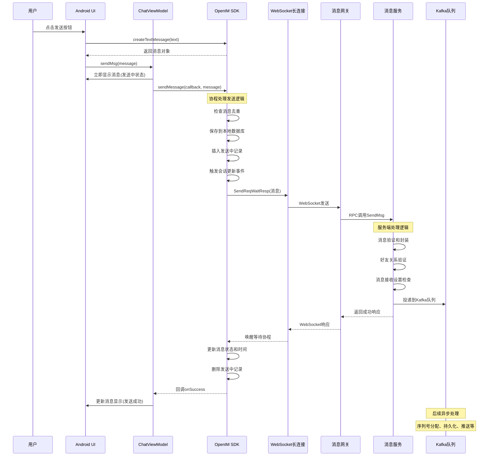

# 单聊消息（第一阶段）发送流程源码详解

## 📱 **阶段一：消息发送完整链路分析**

### 🔄 **流程概览**

单聊消息发送第一阶段涵盖了从Android客户端创建消息到服务端处理完成的完整链路：

```
Android客户端 → OpenIM SDK → WebSocket长连接 → 服务端消息网关 → 消息服务 → Kafka队列
```

---

## 🚀 **第一步：Android客户端消息创建**

### **1.1 用户输入触发消息创建**

**文件位置**: `BottomInputCote.java:90-109`

```java
// 用户点击发送按钮或按下回车键触发
view.chatMoreOrSend.setOnClickListener(chatMoreOrSendClick = new OnDedrepClickListener() {
    @Override
    public void click(View v) {
        if (!isSend) {
            // 显示更多功能面板
            switchFragment(inputExpandFragment);
            return;
        }
        // 核心逻辑：创建文本消息
        Message msg = OpenIMClient.getInstance().messageManager.createTextMessage(vm.inputMsg.val().toString());
        if (null != msg) {
            // 调用ViewModel发送消息
            vm.sendMsg(msg);
            reset(); // 重置UI状态
        }
    }
});
```

**核心要点**：
- **输入校验**：检查是否有可发送内容（`isSend`标志）
- **消息创建**：调用OpenIM SDK的`createTextMessage`接口
- **UI重置**：发送后清空输入框和相关状态

### **1.2 SDK接口调用（JNI桥接）**

**文件位置**: `conversation_msg.go:57-59`

```go
func CreateTextMessage(operationID string, text string) string {
    // 同步调用：通过JNI桥接到Go SDK
    return syncCall(operationID, IMUserContext.Conversation().CreateTextMessage, text)
}
```

**调用链路分析**：
1. **Java层调用**：Android通过JNI调用Go SDK接口
2. **同步执行**：`syncCall`确保操作完成后再返回
3. **上下文传递**：`IMUserContext`提供全局SDK上下文

---

## 📝 **第二步：SDK核心消息结构创建**

### **2.1 消息基础信息初始化**

**文件位置**: `create_message.go:18-27`

```go
func (c *Conversation) CreateTextMessage(ctx context.Context, text string) (*sdk_struct.MsgStruct, error) {
    s := sdk_struct.MsgStruct{}
    // 核心步骤：初始化消息基础信息
    err := c.initBasicInfo(ctx, &s, constant.UserMsgType, constant.Text)
    if err != nil {
        return nil, err
    }
    // 设置文本消息特有内容
    s.TextElem = &sdk_struct.TextElem{Content: text}
    return &s, nil
}
```

### **2.2 消息基础字段详细解析**

**文件位置**: `api.go:1481-1519`

```go
func (c *Conversation) initBasicInfo(ctx context.Context, message *sdk_struct.MsgStruct, msgFrom, contentType int32) error {
    // 时间戳设置
    message.CreateTime = utils.GetCurrentTimestampByMill()
    message.SendTime = message.CreateTime

    // 消息状态设置（关键字段）
    message.IsRead = false                    // 默认未读状态
    message.Status = constant.MsgStatusSending // 发送中状态

    // 发送者信息设置
    message.SendID = c.loginUserID
    message.SenderPlatformID = c.platform

    // 生成客户端消息ID（去重关键）
    ClientMsgID := utils.GetMsgID(message.SendID)
    message.ClientMsgID = ClientMsgID

    // 消息属性设置
    message.MsgFrom = msgFrom           // 消息来源（用户/系统/机器人）
    message.ContentType = contentType   // 内容类型（文本/图片/音频等）
    
    // 获取发送者用户信息
    userInfo, err := c.user.GetUserInfoWithCache(ctx, c.loginUserID)
    if err != nil {
        return err
    }
    message.SenderFaceURL = userInfo.FaceURL
    message.SenderNickname = userInfo.Nickname

    return nil
}
```

**核心字段说明**：

| 字段名 | 类型 | 作用 | 初始值 |
|--------|------|------|---------|
| **ClientMsgID** | string | 客户端唯一标识，防重发 | UUID格式 |
| **IsRead** | bool | 已读状态标记 | `false` |
| **Status** | int32 | 消息发送状态 | `MsgStatusSending(1)` |
| **CreateTime** | int64 | 本地创建时间戳 | 当前毫秒时间戳 |
| **SendTime** | int64 | 发送时间戳 | 初始等于CreateTime |
| **SendID** | string | 发送者用户ID | 当前登录用户ID |
| **ContentType** | int32 | 消息内容类型 | `Text(101)` |

---

## 📤 **第三步：Android端发送消息**

### **3.1 ViewModel调用发送**

**文件位置**: `ChatVM.java:843-894`

```java
public void sendMsg(Message msg) {
    sendMsg(msg, false); // 非重发模式
}

public void sendMsg(Message msg, boolean isResend) {
    // 消息去重检查
    if (!isResend) {
        for (Message message : mMsgList) {
            if (TextUtils.equals(message.getClientMsgID(), msg.getClientMsgID())) {
                return; // 防止重复发送
            }
        }
    }

    // 添加到本地消息列表（立即显示）
    insertMessageToList(msg);

    // 调用SDK发送消息（异步操作）
    OpenIMClient.getInstance().messageManager.sendMessage(
        new OnMsgSendCallback() {
            @Override
            public void onError(int code, String error) {
                // 🔴 发送失败处理
                msg.setStatus(MessageStatus.SEND_FAILURE);
                updateMsgStatusAndRefresh(msg);
            }

            @Override
            public void onSuccess(Message message) {
                // 🟢 发送成功处理
                msg.setStatus(MessageStatus.SEND_SUCCESS);
                msg.setServerMsgID(message.getServerMsgID());
                msg.setSendTime(message.getSendTime());
                updateMsgStatusAndRefresh(msg);
            }
        }, msg, userID, groupID, null
    );
}
```

**关键逻辑**：
1. **去重保护**：检查ClientMsgID防止重复发送
2. **乐观更新**：立即显示消息在聊天界面
3. **异步发送**：调用SDK异步发送，通过回调更新状态

---

## 🔗 **第四步：SDK协程调用机制**

### **4.1 异步调用封装**

**文件位置**: `conversation_msg.go:119-121`

```go
func SendMessage(callback open_im_sdk_callback.SendMsgCallBack, operationID, message, recvID, groupID, offlinePushInfo string, isOnlineOnly bool) {
    // 消息发送专用协程调用
    messageCall(callback, operationID, IMUserContext.Conversation().SendMessage, message, recvID, groupID, offlinePushInfo, isOnlineOnly)
}
```

### **4.2 协程调用实现**

**文件位置**: `caller.go:361-485`

```go
func messageCall(callback open_im_sdk_callback.SendMsgCallBack, operationID string, fn any, args ...any) {
    // 启动独立协程处理消息发送
    go messageCall_(callback, operationID, fn, args...)
}

func messageCall_(callback open_im_sdk_callback.SendMsgCallBack, operationID string, fn any, args ...any) {
    // 异常处理和结果回调
    defer func() {
        if r := recover(); r != nil {
            callback.OnError(sdkerrs.ErrInternalServer.ErrCode, fmt.Sprintf("messageCall panic: %+v", r))
        }
    }()

    // 反射调用实际发送方法
    res, err := call_(operationID, fn, args...)
    if err != nil {
        callback.OnError(err.(*sdkerrs.CodeError).ErrCode, err.Error())
        return
    }

    // 发送成功回调
    callback.OnSuccess(res.(string))
}
```

**设计要点**：
- **异步执行**：所有SDK调用都在独立协程中执行
- **异常保护**：`defer recover()`确保异常不会崩溃主线程
- **回调机制**：通过callback将结果返回给上层

---

## 📨 **第五步：SDK核心发送逻辑**

### **5.1 消息发送主流程**

**文件位置**: `api.go:489-600`

```go
func (c *Conversation) SendMessage(ctx context.Context, s *sdk_struct.MsgStruct, recvID, groupID string, p *sdkws.OfflinePushInfo, isOnlineOnly bool) (*sdk_struct.MsgStruct, error) {
    // 第一步：校验和设置消息接收者
    lc, err := c.checkID(ctx, s, recvID, groupID, options)
    if err != nil {
        return s, err
    }

    // 第二步：检查消息是否已存在（防重发）
    oldMessage, err := c.db.GetMessage(ctx, lc.ConversationID, s.ClientMsgID)
    if err == nil {
        // 消息已存在，检查是否为失败重发
        if oldMessage.Status != constant.MsgStatusSendFailure {
            return nil, sdkerrs.ErrRepeatMessage
        }
        // 失败重发：更新消息状态
        s.Status = constant.MsgStatusSending
        s.SendTime = utils.GetCurrentTimestampByMill()
    } else {
        // 第三步：新消息入库
        err = c.db.InsertMessage(ctx, lc.ConversationID, s)
        if err != nil {
            return s, err
        }
        
        // 第四步：插入发送中记录
        err = c.db.InsertSendingMessage(ctx, lc.ConversationID, s.ClientMsgID)
        if err != nil {
            log.ZWarn(ctx, "InsertSendingMessage failed", err)
        }
    }

    // 第五步：触发会话更新事件
    c.msgListener().OnMsgSendCallback(&CallbackMessage{
        LocalEx: constant.AddConOrUpLatMsg,
        Msg:     s,
        ConversationMsg: &model_struct.LocalConversation{
            ConversationID: lc.ConversationID,
            LatestMsg:      utils.StructToJsonString(s),
        },
    })

    // 第六步：发送到服务端
    return c.sendMessageToServer(ctx, s, lc, callback, delFiles, p, options, isOnlineOnly)
}
```

### **5.2 ID校验和会话设置**

**文件位置**: `api.go:348-444`

```go
func (c *Conversation) checkID(ctx context.Context, s *sdk_struct.MsgStruct, recvID, groupID string, options map[string]bool) (*model_struct.LocalConversation, error) {
    // 参数校验
    if recvID == "" && groupID == "" {
        return nil, sdkerrs.ErrArgs.WrapMsg("recv_id and group_id are both empty")
    }
    if recvID != "" && groupID != "" {
        return nil, sdkerrs.ErrArgs.WrapMsg("recv_id and group_id cannot both be set")
    }

    var lc model_struct.LocalConversation
    
    if recvID != "" {
        // 单聊逻辑
        lc.ConversationID = c.getConversationIDBySessionType(recvID, constant.SingleChatType)
        lc.UserID = recvID
        lc.ConversationType = constant.SingleChatType
        lc.FaceURL = faceUrl
        lc.ShowName = name
    } else {
        // 群聊逻辑（此处省略）
    }

    // 设置消息字段
    s.SendID = c.loginUserID
    s.SenderPlatformID = c.platform
    s.ConversationID = lc.ConversationID
    s.SessionType = lc.ConversationType

    return &lc, nil
}
```

---

## 🌐 **第六步：WebSocket长连接发送**

### **6.1 服务端发送接口调用**

**文件位置**: `api.go:933-1021`

```go
func (c *Conversation) sendMessageToServer(ctx context.Context, s *sdk_struct.MsgStruct, lc *model_struct.LocalConversation, callback open_im_sdk_callback.SendMsgCallBack, delFiles []string, offlinePushInfo *sdkws.OfflinePushInfo, options map[string]bool, isOnlineOnly bool) (*sdk_struct.MsgStruct, error) {
    
    // 构建发送请求
    req := &msg.SendMsgReq{
        MsgData:         convert.MsgStructToPb(s),
        OfflinePushInfo: offlinePushInfo,
        IsOnlineOnly:    isOnlineOnly,
    }

    // 关键步骤：通过长连接发送（阻塞等待响应）
    resp, err := c.LongConnMgr.SendReqWaitResp(ctx, req, constant.WSSendMsg, &msg.SendMsgResp{})
    if err != nil {
        return s, err
    }

    // 解析服务端响应
    msgResp := resp.(*msg.SendMsgResp)
    s.SendTime = msgResp.SendTime
    s.ServerMsgID = msgResp.ServerMsgID
    s.Status = constant.MsgStatusSendSuccess

    // 更新本地数据库
    c.updateMsgStatusAndTriggerConversation(ctx, s.ClientMsgID, s.ServerMsgID, s.SendTime, s.Status, s, lc, isOnlineOnly)

    return s, nil
}
```

### **6.2 长连接管理器发送实现**

**文件位置**: `long_conn_mgr.go:192-241`

```go
func (c *LongConnMgr) SendReqWaitResp(ctx context.Context, m proto.Message, reqIdentifier int, resp proto.Message) error {
    // 序列化请求消息
    data, err := proto.Marshal(m)
    if err != nil {
        return err
    }

    // 构建WebSocket请求
    req := GeneralWsReq{
        ReqIdentifier: reqIdentifier,
        Token:         c.token,
        SendID:        c.userID,
        OperationID:   mcontext.GetOperationID(ctx),
        MsgIncr:       GenMsgIncr(c.userID),
        Data:          data,
    }

    // 发送并等待响应（关键阻塞点）
    wsResp, err := c.sendAndWaitResp(&req)
    if err != nil {
        return err
    }

    // 解析响应数据
    if wsResp.ErrCode != 0 {
        return sdkerrs.NewCodeError(wsResp.ErrCode, wsResp.ErrMsg)
    }

    return proto.Unmarshal(wsResp.Data, resp)
}
```

### **6.3 异步响应处理机制**

**文件位置**: `long_conn_mgr.go:504-531`

```go
func (c *LongConnMgr) sendAndWaitResp(msg *GeneralWsReq) (*GeneralWsResp, error) {
    // 创建响应通道
    ch, err := c.writeBinaryMsgAndRetry(msg)
    if err != nil {
        return nil, err
    }

    // 确保清理响应通道
    defer c.Syncer.DelCh(msg.MsgIncr)

    // 等待响应（超时30秒）
    select {
    case resp := <-ch:
        if resp == nil {
            return nil, errors.New("response channel closed")
        }
        return resp, nil
    case <-time.After(30 * time.Second):
        return nil, errors.New("send message timeout")
    }
}
```

### **6.4 WebSocket连接复用和重试机制**

**文件位置**: `long_conn_mgr.go:532-569`

```go
func (c *LongConnMgr) writeBinaryMsgAndRetry(msg *GeneralWsReq) (chan *GeneralWsResp, error) {
    // 关键机制：通过MsgIncr建立请求-响应绑定关系
    msgIncr, ch := c.Syncer.AddCh(c.userID)
    msg.MsgIncr = msgIncr  // 设置消息增量ID，这是同步的核心
    
    // 重试机制：最多重试3次
    var err error
    for i := 0; i < 3; i++ {
        err = c.writeBinaryMsg(*msg)
        if err == nil {
            return ch, nil  // 发送成功，返回响应通道
        }
        
        // 连接异常处理：尝试重连
        if c.IsConnected() {
            continue  // 连接正常但发送失败，直接重试
        }
        
        // 连接断开：等待重连完成
        select {
        case <-c.ctx.Done():
            return nil, c.ctx.Err()
        case <-time.After(time.Second * 2):
            // 等待2秒后重试，给重连机制时间
        }
    }
    
    // 重试失败：清理通道并返回错误
    c.Syncer.DelCh(msgIncr)
    return nil, fmt.Errorf("writeBinaryMsgAndRetry failed after 3 attempts: %w", err)
}
```

**MsgIncr机制的核心作用**：

1. **唯一标识**：每个WebSocket请求都有唯一的MsgIncr标识
2. **上下文绑定**：建立发送协程和响应协程之间的关联
3. **并发安全**：多个协程同时发送消息时不会串扰
4. **超时控制**：支持单独的请求超时和清理
5. **重连恢复**：连接断开重连后能正确匹配响应

**异步响应原理**：

**文件位置**: `ws_resp_asyn.go:61-86`

```go
func (u *WsRespAsyn) AddCh(userID string) (string, chan *GeneralWsResp) {
    u.wsMutex.Lock()
    defer u.wsMutex.Unlock()
    
    // 生成唯一消息增量ID
    msgIncr := GenMsgIncr(userID)
    ch := make(chan *GeneralWsResp, 1)
    
    // 注册响应通道
    u.wsNotification[msgIncr] = ch
    return msgIncr, ch
}

func (u *WsRespAsyn) NotifyResp(ctx context.Context, wsResp GeneralWsResp) error {
    u.wsMutex.RLock()
    ch, exists := u.wsNotification[wsResp.MsgIncr]
    u.wsMutex.RUnlock()
    
    if !exists {
        return errors.New("notification channel not found")
    }

    // 通知等待的协程
    return u.notifyCh(ch, &wsResp, 3000) // 3秒超时
}
```

**WebSocket同步机制总结**：

| 阶段 | 操作 | MsgIncr作用 | 并发处理 |
|------|------|-------------|----------|
| **请求发送** | 生成MsgIncr并注册通道 | 建立唯一标识 | 线程安全的map操作 |
| **等待响应** | 阻塞在channel上 | 通过MsgIncr匹配响应 | 每个请求独立的channel |
| **接收响应** | 服务端返回相同MsgIncr | 精确路由到对应协程 | 避免响应串扰 |
| **清理资源** | 删除通道和MsgIncr映射 | 防止内存泄露 | 确保资源及时释放 |

---

## 🌐 **第七步：服务端消息接收处理**

### **7.1 WebSocket服务器消息读取**

**文件位置**: `ws_server.go:768-850`

```go
func (ws *WsServer) wsHandler(w http.ResponseWriter, r *http.Request) {
    // 升级为WebSocket连接
    conn, err := ws.upgrader.Upgrade(w, r, nil)
    if err != nil {
        return
    }

    // 创建客户端连接对象
    client := ws.clientPool.Get().(*Client)
    client.ResetClient(&UserConnContext{...}, newGWebSocket(conn), ws)

    // 启动消息读取协程
    go client.readMessage()
}
```

### **7.2 客户端消息处理**

**文件位置**: `client.go:186-263`

```go
func (c *Client) readMessage() {
    defer func() {
        c.close()                    // 确保连接关闭
        c.longConnServer.UnRegister(c) // 注销客户端
    }()

    for {
        // 读取WebSocket消息
        _, message, err := c.conn.ReadMessage()
        if err != nil {
            return
        }

        // 处理接收到的消息
        if err := c.handleMessage(message); err != nil {
            log.ZError(context.Background(), "handle message error", err)
        }
    }
}

func (c *Client) handleMessage(message []byte) error {
    var binaryReq Req
    err := c.Encoder.Decode(message, &binaryReq)
    if err != nil {
        return err
    }

    // 根据请求标识符路由消息
    switch binaryReq.ReqIdentifier {
    case WSSendMsg:
        // 处理发送消息请求
        return c.longConnServer.SendMessage(ctx, &binaryReq)
    case WSPullMsgBySeqList:
        // 处理拉取消息请求
        return c.longConnServer.PullMessageBySeqList(ctx, &binaryReq)
    default:
        return fmt.Errorf("unknown request identifier: %d", binaryReq.ReqIdentifier)
    }
}
```

### **7.3 消息网关调用消息服务**

**文件位置**: `message_handler.go:169-194`

```go
// SendMessage handles the sending of messages through gRPC. It unmarshals the request data,
// validates the message, and then sends it using the message RPC client.
func (g *GrpcHandler) SendMessage(ctx context.Context, data *Req) ([]byte, error) {
    var msgData sdkws.MsgData
    if err := proto.Unmarshal(data.Data, &msgData); err != nil {
        return nil, errs.WrapMsg(err, "SendMessage: error unmarshaling message data", "action", "unmarshal", "dataType", "MsgData")
    }

    if err := g.validate.Struct(&msgData); err != nil {
        return nil, errs.WrapMsg(err, "SendMessage: message data validation failed", "action", "validate", "dataType", "MsgData")
    }

    req := msg.SendMsgReq{MsgData: &msgData}
    // 调用消息服务RPC接口（阻塞调用）
    resp, err := g.msgClient.MsgClient.SendMsg(ctx, &req)
    if err != nil {
        return nil, err
    }

    // 序列化响应数据
    c, err := proto.Marshal(resp)
    if err != nil {
        return nil, errs.WrapMsg(err, "SendMessage: error marshaling response", "action", "marshal", "dataType", "SendMsgResp")
    }

    return c, nil
}
```

**消息网关处理流程**：
1. **消息解析**：将WebSocket二进制数据解析为MsgData结构
2. **数据验证**：验证消息数据的完整性和合法性
3. **RPC调用**：同步调用消息服务的SendMsg接口
4. **响应处理**：将RPC响应序列化后返回给客户端

---

## 📮 **第八步：消息服务RPC处理**

### **8.1 消息服务核心发送逻辑**

**文件位置**: `send.go:37-61`

```go
func (m *msgServer) SendMsg(ctx context.Context, req *pbmsg.SendMsgReq) (*pbmsg.SendMsgResp, error) {
    // 第一步：消息数据封装
    m.encapsulateMsgData(req.MsgData)

    // 第二步：消息验证
    if err := m.messageVerification(ctx, req); err != nil {
        return nil, err
    }

    // 第三步：根据会话类型处理
    switch req.MsgData.SessionType {
    case constant.SingleChatType:
        return m.sendMsgSingleChat(ctx, req)
    case constant.GroupChatType:
        return m.sendMsgGroupChat(ctx, req)
    case constant.NotificationChatType:
        return m.sendMsgNotification(ctx, req)
    default:
        return nil, sdkerrs.ErrArgs.WrapMsg("invalid session type")
    }
}
```

### **8.2 消息数据封装**

**文件位置**: `verify.go:177-236`

```go
func (m *msgServer) encapsulateMsgData(msg *sdkws.MsgData) {
    // 生成唯一的服务器消息ID
    msg.ServerMsgID = GetMsgID(msg.SendID)

    // 设置发送时间（如果客户端没有提供）
    if msg.SendTime == 0 {
        msg.SendTime = timeutil.GetCurrentTimestampByMill()
    }

    // 设置消息选项（默认配置）
    if msg.Options == nil {
        msg.Options = msgprocessor.NewMsgOptions()
    }
}

func GetMsgID(sendID string) string {
    // 使用时间戳 + 用户ID + 随机数生成唯一ID
    return utils.Md5(fmt.Sprintf("%d%s%d", timeutil.GetCurrentTimestampByMill(), sendID, rand.Int63()))
}
```

### **8.3 单聊消息处理**

**文件位置**: `send.go:216-280`

```go
func (m *msgServer) sendMsgSingleChat(ctx context.Context, req *pbmsg.SendMsgReq) (resp *pbmsg.SendMsgResp, err error) {
    // 第一步：好友关系和黑名单验证
    if err := m.verifyFriendship(ctx, req.MsgData.SendID, req.MsgData.RecvID); err != nil {
        return nil, err
    }

    // 第二步：检查接收方消息接收设置
    canSend, err := m.modifyMessageByUserMessageReceiveOpt(ctx, req.MsgData.RecvID, 
        utils.GetConversationIDByMsg(req.MsgData), int(req.MsgData.SessionType), req)
    if err != nil {
        return nil, err
    }
    if !canSend {
        // 对方设置了不接收消息
        return &pbmsg.SendMsgResp{
            ServerMsgID: req.MsgData.ServerMsgID,
            SendTime:    req.MsgData.SendTime,
        }, nil
    }

    // 第三步：生成会话唯一键
    conversationID := msgprocessor.GetConversationIDByMsg(req.MsgData)

    // 第四步：设置消息选项
    options := msgprocessor.Options(req.MsgData.Options)
    if !options.IsNotNotification() {
        // 普通消息，设置推送选项
        req.MsgData.Options = msgprocessor.WithOptions(req.MsgData.Options,
            msgprocessor.WithOfflinePush(true),
            msgprocessor.WithUnreadCount(true),
        )
    }

    // 第五步：将消息投递到消息队列
    if err := m.MsgDatabase.MsgToMQ(ctx, conversationutil.GenConversationUniqueKeyForSingle(req.MsgData.SendID, req.MsgData.RecvID), req.MsgData); err != nil {
        prommetrics.SingleChatMsgProcessFailedCounter.Inc()
        return nil, err
    }

    // 第六步：返回成功响应
    prommetrics.SingleChatMsgProcessSuccessCounter.Inc()
    return &pbmsg.SendMsgResp{
        ServerMsgID: req.MsgData.ServerMsgID,
        SendTime:    req.MsgData.SendTime,
    }, nil
}
```

### **8.4 用户消息接收设置检查**

**文件位置**: `verify.go:244-300`

```go
func (m *msgServer) modifyMessageByUserMessageReceiveOpt(ctx context.Context, userID, conversationID string, sessionType int, pb *msg.SendMsgReq) (bool, error) {
    // 获取用户的全局消息接收设置
    opt, err := m.UserLocalCache.GetUserGlobalMsgRecvOpt(ctx, userID)
    if err != nil {
        return false, err
    }

    switch opt {
    case constant.ReceiveMessage:
        // 正常接收消息

    case constant.NotReceiveMessage:
        // 不接收任何消息
        return false, nil

    case constant.ReceiveNotNotifyMessage:
        // 接收消息但不推送通知
        if pb.MsgData.Options == nil {
            pb.MsgData.Options = make(map[string]bool, 10)
        }
        // 关闭离线推送选项
        datautil.SetSwitchFromOptions(pb.MsgData.Options, constant.IsOfflinePush, false)
        return true, nil
    }

    // 检查会话级别的接收设置
    singleOpt, err := m.ConversationLocalCache.GetSingleConversationRecvMsgOpt(ctx, userID, conversationID)
    if errs.ErrRecordNotFound.Is(err) {
        return true, nil
    } else if err != nil {
        return false, err
    }

    switch singleOpt {
    case constant.ReceiveMessage:
        return true, nil
    case constant.NotReceiveMessage:
        // 特殊消息类型仍需接收（如系统通知）
        if datautil.Contain(int(pb.MsgData.ContentType), ExcludeContentType...) {
            return true, nil
        }
        return false, nil
    case constant.ReceiveNotNotifyMessage:
        if pb.MsgData.Options == nil {
            pb.MsgData.Options = make(map[string]bool, 10)
        }
        datautil.SetSwitchFromOptions(pb.MsgData.Options, constant.IsOfflinePush, false)
        return true, nil
    }
    return true, nil
}
```

### **8.5 消息选项配置详解**

消息选项（Options）控制消息的处理行为，OpenIM通过`msgprocessor.Options`类型实现细粒度的消息控制。

**文件位置**: `options.go:31-539`

#### **Options字段详细说明**

| 选项名称 | 类型 | 默认值 | 作用描述 | 使用场景 |
|----------|------|--------|----------|----------|
| **IsNotNotification** | bool | `false` | **是否为非通知消息**<br/>• `true` = 系统通知消息<br/>• `false` = 普通用户消息<br/>• 影响推送和计数策略 | 系统通知、群管理消息 |
| **IsSendMsg** | bool | `true` | **是否发送消息**<br/>• `true` = 需要发送到接收方<br/>• `false` = 仅本地处理<br/>• 控制消息传递行为 | 草稿保存、本地记录 |
| **IsHistory** | bool | `true` | **是否保存历史记录**<br/>• `true` = 消息持久化到数据库<br/>• `false` = 仅临时处理<br/>• 影响消息存储策略 | 临时消息、阅后即焚 |
| **IsPersistent** | bool | `true` | **是否持久化存储**<br/>• `true` = 存储到MongoDB<br/>• `false` = 仅缓存处理<br/>• 决定数据持久性 | 重要消息、合规要求 |
| **IsOfflinePush** | bool | `true` | **是否离线推送**<br/>• `true` = 用户离线时推送<br/>• `false` = 不推送通知<br/>• 控制推送行为 | 免打扰设置、静默消息 |
| **IsUnreadCount** | bool | `true` | **是否计入未读数**<br/>• `true` = 增加未读计数<br/>• `false` = 不影响未读数<br/>• 影响会话未读统计 | 系统提示、状态消息 |
| **IsConversationUpdate** | bool | `true` | **是否更新会话**<br/>• `true` = 更新会话最新消息<br/>• `false` = 不更新会话列表<br/>• 控制会话显示 | 静默消息、后台同步 |
| **IsSenderSync** | bool | `true` | **是否发送者同步**<br/>• `true` = 同步到发送者其他设备<br/>• `false` = 仅发送给接收者<br/>• 多端同步控制 | 单设备消息、临时通知 |
| **IsNotPrivate** | bool | `false` | **是否非私密消息**<br/>• `true` = 公开消息<br/>• `false` = 私密消息<br/>• 隐私保护相关 | 群公告、系统广播 |
| **IsSenderConversationUpdate** | bool | `true` | **是否更新发送者会话**<br/>• `true` = 更新发送者会话列表<br/>• `false` = 不更新发送者会话<br/>• 发送者界面控制 | 单向消息、系统通知 |
| **IsReactionFromCache** | bool | `false` | **是否从缓存获取反应**<br/>• `true` = 优先使用缓存数据<br/>• `false` = 实时查询数据库<br/>• 性能优化选项 | 高频查询、性能敏感场景 |

#### **消息选项的组合使用**

```go
// 普通用户消息（默认配置）
normalMsgOptions := msgprocessor.NewMsgOptions()
// 等价于：
// map[string]bool{
//     "isNotNotification": false,
//     "isSendMsg": true,
//     "isHistory": true,
//     "isPersistent": true,
//     "isOfflinePush": true,
//     "isUnreadCount": true,
//     "isConversationUpdate": true,
//     "isSenderSync": true,
//     "isNotPrivate": false,
//     "isSenderConversationUpdate": true,
//     "isReactionFromCache": false,
// }

// 系统通知消息
notificationOptions := msgprocessor.WithOptions(msgprocessor.NewMsgOptions(),
    msgprocessor.WithNotNotification(true),   // 标记为通知消息
    msgprocessor.WithOfflinePush(false),      // 不推送
    msgprocessor.WithUnreadCount(false),      // 不计入未读
)

// 阅后即焚消息
burnAfterReadOptions := msgprocessor.WithOptions(msgprocessor.NewMsgOptions(),
    msgprocessor.WithHistory(false),          // 不保存历史
    msgprocessor.WithPersistent(),            // 但要持久化（用于追溯）
    msgprocessor.WithNotPrivate(),            // 标记为非私密
)

// 群组静默消息
silentGroupMsgOptions := msgprocessor.WithOptions(msgprocessor.NewMsgOptions(),
    msgprocessor.WithOfflinePush(false),      // 静默推送
    msgprocessor.WithUnreadCount(false),      // 不增加未读数
    msgprocessor.WithConversationUpdate(),    // 但更新会话列表
)
```

#### **消息选项的判断方法**

```go
// 检查消息类型
if options.IsNotNotification() {
    // 处理系统通知逻辑
}

// 检查是否需要推送
if options.IsOfflinePush() {
    // 发送离线推送
}

// 检查是否计入未读数
if options.IsUnreadCount() {
    // 增加未读计数
}

// 检查是否更新会话
if options.IsConversationUpdate() {
    // 更新会话最新消息和时间
}
```

#### **业务场景映射**

| 业务场景 | 选项配置 | 说明 |
|----------|----------|------|
| **普通聊天消息** | 全部默认true | 完整的消息流程和用户体验 |
| **系统通知** | `IsNotNotification=true`, `IsOfflinePush=false` | 不推送但显示在聊天中 |
| **输入状态** | `IsHistory=false`, `IsPersistent=false` | 临时状态，不保存 |
| **已读回执** | `IsUnreadCount=false`, `IsConversationUpdate=false` | 不影响会话状态 |
| **阅后即焚** | `IsHistory=false` | 阅读后自动删除 |
| **群管理消息** | `IsNotNotification=true`, `IsUnreadCount=false` | 管理类通知消息 |
| **撤回通知** | `IsNotNotification=true`, `IsOfflinePush=false` | 撤回提示消息 |

---

## 📊 **第九步：消息投递到Kafka队列**

### **9.1 Kafka消息投递**

```go
// 将消息投递到Kafka队列进行异步处理
func (d *msgDatabase) MsgToMQ(ctx context.Context, key string, msg *sdkws.MsgData) error {
    // 序列化消息
    data, err := proto.Marshal(msg)
    if err != nil {
        return err
    }

    // 投递到不同的Topic
    return d.producer.SendMessage(ctx, &sarama.ProducerMessage{
        Topic: d.config.Kafka.ToRedisTopic,    // 消息缓存处理
        Key:   sarama.StringEncoder(key),      // 分区键：会话ID
        Value: sarama.ByteEncoder(data),       // 消息数据
    })
}
```

**Kafka Topic分配**：
- **toRedisTopic**: 消息缓存和序列号分配
- **toMongoTopic**: 消息持久化存储  
- **toPushTopic**: 在线用户推送
- **toOfflinePushTopic**: 离线用户推送

---

## 🔄 **第十步：响应返回和状态更新**

### **10.1 服务端响应返回**

当消息成功投递到Kafka后，服务端立即返回响应：

```go
// 响应包含服务端生成的关键信息
response := &pbmsg.SendMsgResp{
    ServerMsgID: req.MsgData.ServerMsgID,  // 服务端消息ID
    SendTime:    req.MsgData.SendTime,     // 服务端时间戳
}
```

### **10.2 客户端状态更新**

**Android端接收到响应后更新UI**：

```java
@Override
public void onSuccess(Message message) {
    // 更新消息状态为发送成功
    msg.setStatus(MessageStatus.SEND_SUCCESS);
    msg.setServerMsgID(message.getServerMsgID());
    msg.setSendTime(message.getSendTime());
    
    // 刷新UI显示
    updateMsgStatusAndRefresh(msg);
}
```

**SDK端数据库更新**：

```go
// 更新本地数据库中的消息状态
func (c *Conversation) updateMsgStatusAndTriggerConversation(ctx context.Context, clientMsgID, serverMsgID string, sendTime int64, status int32, s *sdk_struct.MsgStruct, lc *model_struct.LocalConversation, isOnlineOnly bool) {
    
    // 更新消息属性
    s.SendTime = sendTime
    s.Status = status
    s.ServerMsgID = serverMsgID

    // 更新数据库中的消息状态
    err := c.db.UpdateMessageTimeAndStatus(ctx, lc.ConversationID, clientMsgID, serverMsgID, sendTime, status)
    if err != nil {
        log.ZWarn(ctx, "send message update message status error", err)
    }

    // 删除发送中的消息记录
    err = c.db.DeleteSendingMessage(ctx, lc.ConversationID, clientMsgID)
    if err != nil {
        log.ZWarn(ctx, "send message delete sending message error", err)
    }

    // 更新会话的最新消息
    lc.LatestMsg = utils.StructToJsonString(s)
    lc.LatestMsgSendTime = sendTime

    // 触发会话更新事件
    c.msgListener().OnMsgSendCallback(&CallbackMessage{...})
}
```

---

## 📋 **消息状态变迁总结**

| 阶段 | 状态值 | 状态名称 | 说明 |
|------|--------|----------|------|
| **初始创建** | `1` | `MsgStatusSending` | 客户端创建消息时的初始状态 |
| **本地存储** | `1` | `MsgStatusSending` | 保存到本地数据库，UI显示发送中 |
| **服务端处理** | `1` | `MsgStatusSending` | 服务端处理期间保持发送中状态 |
| **发送成功** | `2` | `MsgStatusSendSuccess` | 服务端返回成功响应，更新状态 |
| **发送失败** | `3` | `MsgStatusSendFailure` | 网络异常或服务端错误时的状态 |


## ⏱️ **时序图**


