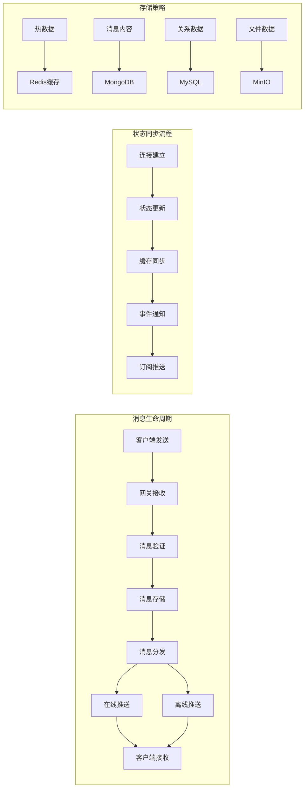

# OpenIM项目架构分析与源码拆解指南

## 项目概览

OpenIM是一个企业级即时通讯解决方案，采用微服务架构设计，支持高并发、高可用的实时通信能力。项目基于Go语言开发，使用gRPC进行服务间通信，Redis作为缓存和消息队列，支持水平扩展和集群部署。

## OpenIM企业级分层架构图

```mermaid
graph TD
    subgraph "OpenIM 企业级即时通讯系统分层架构"
        subgraph "L1: 客户端应用层"
            subgraph "移动端"
                iOS[iOS App<br/>Swift/Objective-C]
                Android[Android App<br/>Kotlin/Java]
            end
            subgraph "桌面端"
                Windows[Windows Client]
                Mac[Mac Client]
                Linux[Linux Client]
            end
            subgraph "Web端"
                WebApp[Web App<br/>React/Vue]
                H5[H5 App]
            end
            subgraph "小程序"
                WeChat[微信小程序]
                Alipay[支付宝小程序]
            end
        end

        subgraph "L2: API网关层"
            subgraph "HTTP网关"
                APIGateway[HTTP API Gateway<br/>internal/api<br/>端口: 10002]
                subgraph "API路由模块"
                    AuthAPI[认证路由<br/>auth.go]
                    UserAPI[用户路由<br/>user.go]
                    MsgAPI[消息路由<br/>msg.go]
                    GroupAPI[群组路由<br/>group.go]
                    FriendAPI[好友路由<br/>friend.go]
                    ConvAPI[会话路由<br/>conversation.go]
                    ThirdAPI[第三方路由<br/>third.go]
                end
            end
            subgraph "WebSocket网关"
                WSGateway[WebSocket Gateway<br/>internal/msggateway<br/>端口: 10001]
                subgraph "连接管理模块"
                    WSServer[WS服务器<br/>ws_server.go]
                    UserMap[用户映射<br/>user_map.go]
                    MsgHandler[消息处理<br/>message_handler.go]
                    HubServer[Hub服务<br/>hub_server.go]
                    OnlineHandler[在线管理<br/>online.go]
                    SubManager[订阅管理<br/>subscription.go]
                end
            end
        end

        subgraph "L3: 核心业务服务层"
            subgraph "认证授权服务"
                AuthService[认证服务<br/>internal/rpc/auth<br/>端口: 10160]
                TokenMgr[Token管理<br/>auth.go]
                AuthVerify[权限验证]
                MultiLogin[多端登录控制]
            end
            
            subgraph "用户管理服务"
                UserService[用户服务<br/>internal/rpc/user<br/>端口: 10110]
                UserMgr[用户管理<br/>user.go]
                OnlineMgr[在线状态<br/>online.go]
                UserStats[用户统计<br/>statistics.go]
                UserNotify[用户通知<br/>notification.go]
            end

            subgraph "消息核心服务"
                MsgService[消息服务<br/>internal/rpc/msg<br/>端口: 10130]
                MsgSend[消息发送<br/>send.go]
                MsgSync[消息同步<br/>sync_msg.go]
                MsgVerify[消息验证<br/>verify.go]
                MsgStatus[消息状态<br/>msg_status.go]
                MsgSeq[消息序号<br/>seq.go]
                MsgRevoke[消息撤回<br/>revoke.go]
                MsgDelete[消息删除<br/>delete.go]
                MsgFilter[消息过滤<br/>filter.go]
            end

            subgraph "会话管理服务"
                ConvService[会话服务<br/>internal/rpc/conversation<br/>端口: 10120]
                ConvMgr[会话管理<br/>conversation.go]
                ConvSync[会话同步<br/>sync.go]
                ConvNotify[会话通知<br/>notification.go]
            end

            subgraph "群组管理服务"
                GroupService[群组服务<br/>internal/rpc/group<br/>端口: 10150]
                GroupMgr[群组管理<br/>group.go]
                GroupSync[群组同步<br/>sync.go]
                GroupStats[群组统计<br/>statistics.go]
                GroupNotify[群组通知<br/>notification.go]
                GroupCallback[群组回调<br/>callback.go]
            end

            subgraph "好友关系服务"
                RelationService[关系服务<br/>internal/rpc/relation<br/>端口: 10140]
                FriendMgr[好友管理<br/>friend.go]
                BlackMgr[黑名单管理<br/>black.go]
                RelationSync[关系同步<br/>sync.go]
                RelationNotify[关系通知<br/>notification.go]
            end

            subgraph "第三方服务"
                ThirdService[第三方服务<br/>internal/rpc/third<br/>端口: 10170]
                S3Handler[S3存储<br/>s3.go]
                ThirdMgr[第三方管理<br/>third.go]
                ToolMgr[工具管理<br/>tool.go]
                LogMgr[日志管理<br/>log.go]
            end

            subgraph "版本增量服务"
                IncrService[增量服务<br/>internal/rpc/incrversion]
                BatchOption[批量选项<br/>batch_option.go]
                Option[选项管理<br/>option.go]
            end
        end

        subgraph "L4: 消息处理层"
            subgraph "消息传输服务"
                TransferService[消息传输<br/>internal/msgtransfer<br/>端口: 10180]
                OnlineMsg[在线消息<br/>online_msg_to_mongo_handler.go]
                HistoryMsg[历史消息<br/>online_history_msg_handler.go]
                TransferInit[传输初始化<br/>init.go]
            end

            subgraph "推送通知服务"
                PushService[推送服务<br/>internal/push<br/>端口: 10190]
                PushHandler[推送处理<br/>push_handler.go]
                OnlinePush[在线推送<br/>onlinepusher.go]
                OfflinePush[离线推送<br/>offlinepush_handler.go]
                PushCallback[推送回调<br/>callback.go]
                FCMPush[FCM推送<br/>offlinepush/fcm]
                APNSPush[APNS推送<br/>offlinepush/apns]
                JPushPush[极光推送<br/>offlinepush/jpush]
                GeTuiPush[个推推送<br/>offlinepush/getui]
            end
        end

        subgraph "L5: 数据访问层"
            subgraph "缓存层"
                RedisCluster[Redis集群<br/>端口: 6379]
                UserCache[用户缓存]
                MsgCache[消息缓存]
                OnlineCache[在线状态缓存]
                TokenCache[Token缓存]
                ConvCache[会话缓存]
                GroupCache[群组缓存]
            end
            
            subgraph "消息队列"
                KafkaCluster[Kafka集群<br/>端口: 9092]
                MsgTopic[消息主题]
                NotifyTopic[通知主题]
                CallbackTopic[回调主题]
            end
        end

        subgraph "L6: 数据存储层"
            subgraph "关系型数据库"
                MySQLCluster[MySQL集群<br/>端口: 3306]
                UserTable[用户表]
                GroupTable[群组表]
                FriendTable[好友表]
                ConvTable[会话表]
                ConfigTable[配置表]
            end

            subgraph "文档数据库"
                MongoCluster[MongoDB集群<br/>端口: 27017]
                MsgCollection[消息集合]
                LogCollection[日志集合]
                FileCollection[文件集合]
            end

            subgraph "对象存储"
                MinIOCluster[MinIO集群<br/>端口: 9000]
                ImageBucket[图片存储]
                VideoBucket[视频存储]
                FileBucket[文件存储]
                AvatarBucket[头像存储]
            end
        end

        subgraph "L7: 外部服务层"
            subgraph "推送服务"
                FCMService[Firebase FCM]
                APNSService[Apple APNS]
                HuaweiPush[华为推送]
                XiaomiPush[小米推送]
            end
            
            subgraph "云存储服务"
                AliOSS[阿里云OSS]
                AWSS3[AWS S3]
                TencentCOS[腾讯云COS]
                QiniuKODO[七牛云KODO]
            end
            
            subgraph "通信服务"
                SMSService[短信服务]
                EmailService[邮件服务]
                VoiceService[语音服务]
            end
        end
    end

    %% 简化的层级关系（向下依赖）
    iOS -.-> APIGateway
    Android -.-> WSGateway
    APIGateway -.-> AuthService
    WSGateway -.-> UserService
    AuthService -.-> TransferService
    UserService -.-> PushService
    TransferService -.-> RedisCluster
    PushService -.-> KafkaCluster
    RedisCluster -.-> MySQLCluster
    KafkaCluster -.-> MongoCluster
    MySQLCluster -.-> FCMService
    MongoCluster -.-> AliOSS

    %% 样式定义 - 按层级着色
    style iOS fill:#e3f2fd,stroke:#1976d2,stroke-width:2px
    style Android fill:#e3f2fd,stroke:#1976d2,stroke-width:2px
    style WebApp fill:#e3f2fd,stroke:#1976d2,stroke-width:2px
    
    style APIGateway fill:#e8f5e8,stroke:#4caf50,stroke-width:3px
    style WSGateway fill:#e8f5e8,stroke:#4caf50,stroke-width:3px
    
    style AuthService fill:#f3e5f5,stroke:#9c27b0,stroke-width:2px
    style UserService fill:#f3e5f5,stroke:#9c27b0,stroke-width:2px
    style MsgService fill:#f3e5f5,stroke:#9c27b0,stroke-width:2px
    style ConvService fill:#f3e5f5,stroke:#9c27b0,stroke-width:2px
    style GroupService fill:#f3e5f5,stroke:#9c27b0,stroke-width:2px
    style RelationService fill:#f3e5f5,stroke:#9c27b0,stroke-width:2px
    style ThirdService fill:#f3e5f5,stroke:#9c27b0,stroke-width:2px
    style IncrService fill:#f3e5f5,stroke:#9c27b0,stroke-width:2px
    
    style TransferService fill:#fff3e0,stroke:#ff9800,stroke-width:2px
    style PushService fill:#fff3e0,stroke:#ff9800,stroke-width:2px
    
    style RedisCluster fill:#ffebee,stroke:#f44336,stroke-width:2px
    style KafkaCluster fill:#ffebee,stroke:#f44336,stroke-width:2px
    
    style MySQLCluster fill:#e1f5fe,stroke:#03a9f4,stroke-width:2px
    style MongoCluster fill:#e1f5fe,stroke:#03a9f4,stroke-width:2px
    style MinIOCluster fill:#e1f5fe,stroke:#03a9f4,stroke-width:2px
    
    style FCMService fill:#f1f8e9,stroke:#8bc34a,stroke-width:2px
    style APNSService fill:#f1f8e9,stroke:#8bc34a,stroke-width:2px
    style AliOSS fill:#f1f8e9,stroke:#8bc34a,stroke-width:2px
```

### 分层架构说明

#### L1: 客户端应用层
- **职责**：用户界面展示，用户交互处理
- **多端支持**：iOS、Android、Web、桌面端、小程序
- **统一协议**：与后端通过HTTP API和WebSocket通信

#### L2: API网关层
- **职责**：统一入口，协议转换，路由分发
- **HTTP网关**：RESTful API处理，包含7个业务路由模块
- **WebSocket网关**：长连接管理，包含6个连接管理模块

#### L3: 核心业务服务层
- **职责**：核心业务逻辑处理，领域服务实现
- **8个微服务**：认证、用户、消息、会话、群组、关系、第三方、增量
- **gRPC通信**：服务间高性能通信

#### L4: 消息处理层
- **职责**：异步消息处理，事件驱动架构
- **消息传输**：在线消息、历史消息处理
- **推送通知**：多渠道推送，离线消息处理

#### L5: 数据访问层
- **职责**：数据缓存，消息队列
- **Redis集群**：6种类型缓存功能
- **Kafka集群**：3个消息主题

#### L6: 数据存储层
- **职责**：数据持久化存储
- **MySQL集群**：关系型数据，5个核心表
- **MongoDB集群**：文档数据，3个集合
- **MinIO集群**：对象存储，4个存储桶

#### L7: 外部服务层
- **职责**：第三方服务集成，能力扩展
- **推送服务**：Firebase FCM、Apple APNS等
- **云存储**：阿里云OSS、AWS S3等
- **通信服务**：短信、邮件、语音等

### 数据流架构

## IM系统特性驱动的源码学习路径

### 第一章：用户身份与连接管理
**核心特性**：用户认证、会话管理、多端登录
**业务价值**：确保系统安全性，支持多设备同时在线

#### 1.1 用户认证体系
- **JWT Token机制**：`internal/rpc/auth/` - 用户登录认证
- **多端登录策略**：`internal/msggateway/ws_server.go` - 设备冲突处理
- **权限验证**：`pkg/authverify/` - 接口权限控制

#### 1.2 连接生命周期管理  
- **WebSocket建立**：连接握手、参数验证、心跳保持
- **连接映射**：`internal/msggateway/user_map.go` - 用户与连接关系
- **优雅断开**：连接清理、状态同步、资源释放

### 第二章：实时消息通信
**核心特性**：消息实时传输、路由分发、顺序保证
**业务价值**：提供流畅的实时聊天体验

#### 2.1 消息接收与验证
- **消息格式解析**：protobuf协议、消息类型识别
- **内容安全检查**：敏感词过滤、格式验证
- **发送权限验证**：好友关系、群组权限检查

#### 2.2 消息路由与分发
- **接收者识别**：单聊、群聊、系统消息路由
- **在线状态查询**：实时获取用户在线状态
- **消息推送策略**：在线直推vs离线存储

#### 2.3 消息顺序与可靠性
- **消息序号管理**：确保消息有序性
- **确认机制**：发送确认、接收确认
- **重试机制**：失败重发、超时处理

### 第三章：离线消息与推送
**核心特性**：离线消息存储、多渠道推送、消息同步
**业务价值**：确保消息不丢失，提升用户体验

#### 3.1 离线消息存储
- **消息持久化**：`internal/rpc/msg/` - MongoDB存储策略
- **会话管理**：`internal/rpc/conversation/` - 未读计数、最后消息
- **存储优化**：消息压缩、过期清理、索引优化

#### 3.2 多渠道推送
- **推送策略选择**：根据用户偏好选择推送渠道
- **第三方集成**：`internal/push/` - FCM、APNS、SMS
- **推送内容优化**：消息摘要、多语言支持

#### 3.3 消息同步机制
- **增量同步**：基于时间戳的消息拉取
- **全量同步**：新设备登录时的历史消息同步
- **冲突解决**：多端消息状态一致性

### 第四章：群组与好友关系
**核心特性**：社交关系管理、群组功能、权限控制
**业务价值**：构建社交网络，支持团队协作

#### 4.1 好友关系管理
- **好友申请流程**：`internal/rpc/friend/` - 申请、同意、拒绝
- **关系状态维护**：好友列表、黑名单、特别关注
- **隐私控制**：查看权限、消息权限

#### 4.2 群组功能实现
- **群组生命周期**：`internal/rpc/group/` - 创建、解散、转让
- **成员管理**：邀请、移除、权限设置
- **群消息分发**：成员列表维护、批量推送优化

#### 4.3 权限与安全
- **角色权限体系**：群主、管理员、普通成员
- **操作权限控制**：禁言、踢人、修改群信息
- **内容审核**：群消息监管、违规处理

### 第五章：文件传输与媒体处理
**核心特性**：文件上传下载、媒体处理、CDN分发
**业务价值**：支持富媒体消息，提升沟通效率

#### 5.1 文件存储架构
- **多云存储支持**：`internal/rpc/third/` - MinIO、S3、阿里云OSS
- **文件元数据管理**：文件类型、大小、访问权限
- **存储策略**：冷热数据分离、自动清理

#### 5.2 媒体内容处理
- **图片处理**：压缩、缩略图生成、格式转换
- **音视频处理**：转码、时长提取、封面生成
- **安全检查**：病毒扫描、内容审核

### 第六章：系统监控与运维
**核心特性**：性能监控、故障预警、运维自动化
**业务价值**：保障系统稳定性，提升运维效率

#### 6.1 监控指标体系
- **业务指标**：消息量、在线用户数、响应时间
- **系统指标**：CPU、内存、网络、存储使用率
- **错误监控**：异常统计、错误日志分析

#### 6.2 故障处理机制
- **自动恢复**：服务重启、流量切换、降级策略
- **告警通知**：邮件、短信、钉钉群通知
- **应急预案**：故障分级、处理流程、恢复验证

## 学习方法建议

### 按业务场景学习
1. **从用户登录开始**：追踪一个完整的用户会话生命周期
2. **跟随消息流转**：从发送到接收的完整链路
3. **理解状态管理**：在线状态、会话状态、消息状态
4. **掌握扩展机制**：如何支持新的消息类型、新的推送渠道

### 实践导向学习
1. **搭建开发环境**：本地运行完整系统
2. **模拟业务场景**：发送消息、创建群组、文件传输
3. **性能测试**：压测关键接口，观察系统行为
4. **故障模拟**：模拟各种异常情况，验证系统鲁棒性

### 深度与广度并重
1. **核心流程深入**：消息处理、状态同步等核心逻辑
2. **边缘功能了解**：监控、运维、扩展接口
3. **架构演进思考**：为什么这样设计，还有什么改进空间

通过这种以IM特性为驱动的学习方式，你将更好地理解OpenIM的设计理念，掌握企业级IM系统的核心技术。 