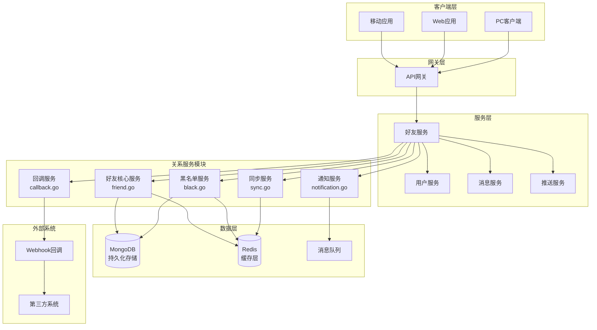
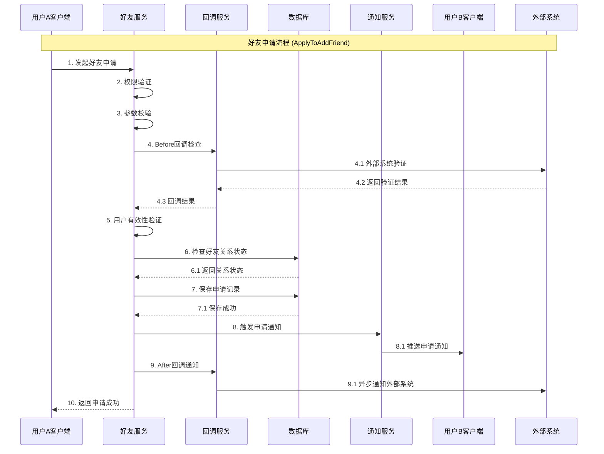
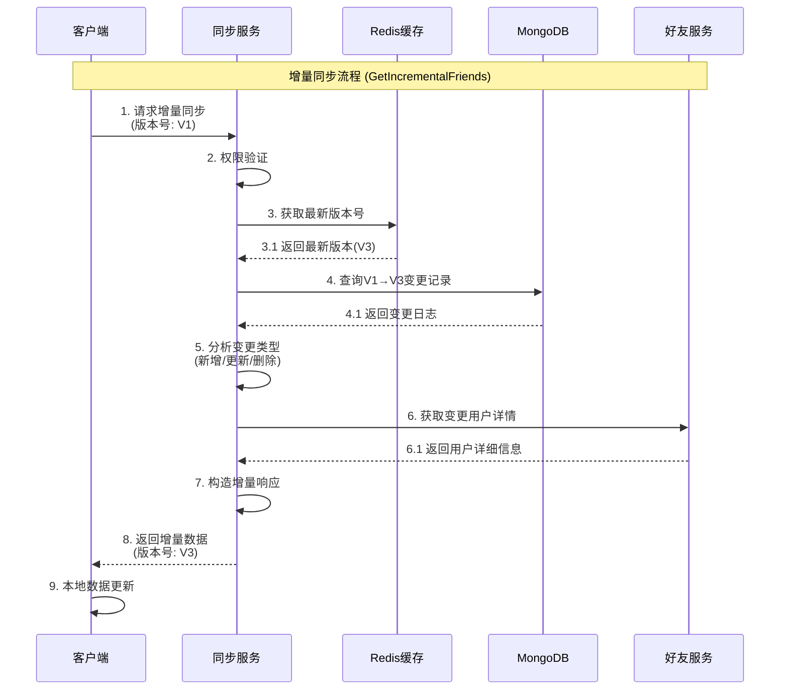
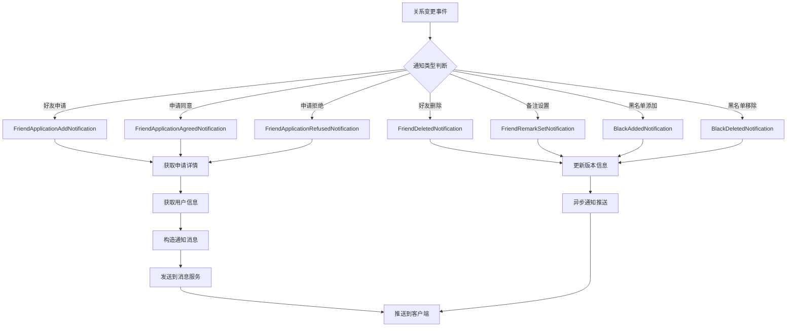
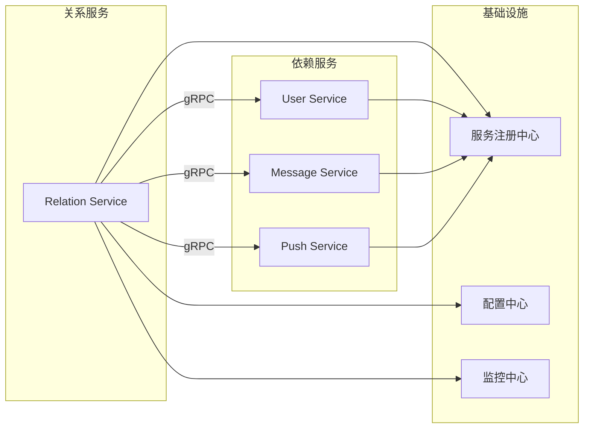
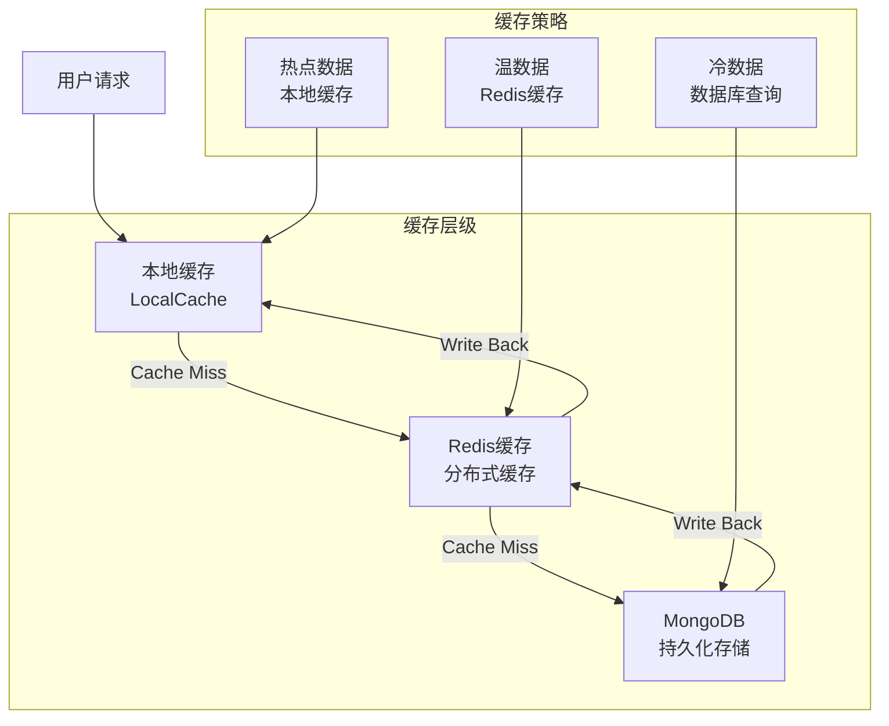

# OpenIM用户关系系统架构详解

## 📋 文档概述

本文档深入解析OpenIM用户关系系统的完整架构，基于详细的源码分析，包含：

- **核心模块**: `friend.go`、`black.go`、`notification.go`、`sync.go`、`callback.go`
- **技术特性**: 微服务架构、增量同步、Webhook回调、多端一致性
- **业务功能**: 好友管理、黑名单管理、关系通知、数据同步

**关键词**: 用户关系、好友系统、黑名单、增量同步、Webhook、微服务

---

## 🏗️ 第一部分：系统整体架构

### 1.1 用户关系系统架构图



### 1.2 核心组件职责划分

| 组件 | 文件 | 主要职责 | 关键特性 |
|------|------|----------|----------|
| **好友核心服务** | `friend.go` | 好友申请、关系管理、权限控制 | gRPC接口、事务管理、权限验证 |
| **黑名单服务** | `black.go` | 黑名单管理、关系验证 | 双向检查、权限隔离、缓存优化 |
| **通知服务** | `notification.go` | 关系变更通知、多端同步 | 异步通知、用户信息填充、版本管理 |
| **同步服务** | `sync.go` | 增量同步、版本控制 | 哈希校验、增量传输、性能优化 |
| **回调服务** | `callback.go` | Webhook集成、业务扩展 | 前后置回调、流程控制、数据修改 |

---

## 🔄 第二部分：业务流程详解

### 2.1 好友申请完整流程



### 2.2 增量同步流程详解



### 2.3 通知系统流程



---

## 📊 第三部分：技术架构分析

### 3.1 数据存储架构

#### 3.1.1 MongoDB数据模型

```yaml
# 好友关系集合 (friends)
Friend:
  _id: ObjectId
  OwnerUserID: string      # 好友关系拥有者
  FriendUserID: string     # 好友用户ID
  Remark: string           # 好友备注
  CreateTime: datetime     # 创建时间
  AddSource: int           # 添加来源
  OperatorUserID: string   # 操作者
  Ex: string               # 扩展字段

# 好友申请集合 (friend_requests)
FriendRequest:
  _id: ObjectId
  FromUserID: string       # 申请发起方
  ToUserID: string         # 申请目标方
  HandleResult: int        # 处理结果
  ReqMsg: string           # 申请消息
  CreateTime: datetime     # 创建时间
  HandlerUserID: string    # 处理者
  HandleMsg: string        # 处理消息
  HandleTime: datetime     # 处理时间
  Ex: string               # 扩展字段

# 黑名单集合 (blacks)
Black:
  _id: ObjectId
  OwnerUserID: string      # 黑名单拥有者
  BlockUserID: string      # 被屏蔽用户
  CreateTime: datetime     # 创建时间
  AddSource: int           # 添加来源
  OperatorUserID: string   # 操作者
  Ex: string               # 扩展字段

# 版本日志集合 (version_logs)
VersionLog:
  _id: ObjectId
  DID: string              # 数据标识（用户ID）
  Version: int             # 版本号
  Logs: []VersionLogElem   # 变更日志
  LogLen: int              # 日志数量
```

#### 3.1.2 Redis缓存策略

```yaml
# 好友关系缓存
friend:cache:{userID}: 
  type: hash
  fields:
    - {friendID}: {friend_info_json}
  expire: 24h

# 黑名单缓存  
black:cache:{userID}:
  type: set
  members: [blockedUserID1, blockedUserID2, ...]
  expire: 12h

# 版本信息缓存
version:friend:{userID}:
  type: string
  value: {version_number}
  expire: 7d

# 好友ID列表缓存
friend:ids:{userID}:
  type: list
  members: [friendID1, friendID2, ...]
  expire: 6h
```

### 3.2 微服务通信架构

#### 3.2.1 服务依赖关系



#### 3.2.2 gRPC接口设计

```protobuf
// 好友服务接口定义
service Friend {
  // 好友申请相关
  rpc ApplyToAddFriend(ApplyToAddFriendReq) returns (ApplyToAddFriendResp);
  rpc RespondFriendApply(RespondFriendApplyReq) returns (RespondFriendApplyResp);
  
  // 好友管理相关  
  rpc DeleteFriend(DeleteFriendReq) returns (DeleteFriendResp);
  rpc SetFriendRemark(SetFriendRemarkReq) returns (SetFriendRemarkResp);
  rpc GetPaginationFriends(GetPaginationFriendsReq) returns (GetPaginationFriendsResp);
  
  // 黑名单相关
  rpc AddBlack(AddBlackReq) returns (AddBlackResp);
  rpc RemoveBlack(RemoveBlackReq) returns (RemoveBlackResp);
  rpc GetPaginationBlacks(GetPaginationBlacksReq) returns (GetPaginationBlacksResp);
  
  // 同步相关
  rpc GetFullFriendUserIDs(GetFullFriendUserIDsReq) returns (GetFullFriendUserIDsResp);
  rpc GetIncrementalFriends(GetIncrementalFriendsReq) returns (GetIncrementalFriendsResp);
  
  // 通知相关
  rpc NotificationUserInfoUpdate(NotificationUserInfoUpdateReq) returns (NotificationUserInfoUpdateResp);
}
```

---

## ⚡ 第四部分：核心技术特性

### 4.1 增量同步机制

#### 4.1.1 版本控制原理

```go
// 版本日志元素结构
type VersionLogElem struct {
    EID     string `bson:"eid"`     // 变更实体ID（用户ID）
    Version uint   `bson:"version"` // 变更版本号
    State   uint8  `bson:"state"`   // 变更状态（增/删/改）
}

// 版本日志结构
type VersionLog struct {
    ID      primitive.ObjectID `bson:"_id"`
    DID     string            `bson:"did"`     // 数据标识
    Version uint              `bson:"version"` // 当前版本号
    Logs    []VersionLogElem  `bson:"logs"`    // 变更日志
    LogLen  int               `bson:"log_len"` // 日志长度
}
```

#### 4.1.2 增量同步算法

```go
// 增量同步核心算法
func (opt *Option[T, R]) Build() (*R, error) {
    // 1. 版本验证
    if opt.VersionNumber == 0 && opt.VersionID == "" {
        return opt.fullSync() // 全量同步
    }
    
    // 2. 获取版本变更
    versionLog, err := opt.Version(ctx, opt.VersionKey, opt.VersionNumber, limit)
    if err != nil {
        return nil, err
    }
    
    // 3. 分析变更记录
    deleteIDs, insertIDs, updateIDs := opt.analyzeChanges(versionLog.Logs)
    
    // 4. 获取变更数据
    insertList, err := opt.Find(ctx, insertIDs)
    updateList, err := opt.Find(ctx, updateIDs)
    
    // 5. 构造响应
    return opt.Resp(versionLog, deleteIDs, insertList, updateList, false), nil
}
```

### 4.2 通知推送机制

#### 4.2.1 通知类型定义

```go
// 通知类型常量
const (
    FriendApplicationNotification         = 1201 // 好友申请通知
    FriendApplicationApprovedNotification = 1202 // 申请同意通知
    FriendApplicationRejectedNotification = 1203 // 申请拒绝通知
    FriendDeletedNotification            = 1204 // 好友删除通知
    FriendRemarkSetNotification          = 1205 // 备注设置通知
    FriendsInfoUpdateNotification        = 1206 // 好友信息更新通知
    BlackAddedNotification               = 1207 // 黑名单添加通知
    BlackDeletedNotification             = 1208 // 黑名单删除通知
)
```

#### 4.2.2 通知发送流程

```go
// 通知发送核心逻辑
func (f *FriendNotificationSender) Notification(
    ctx context.Context,
    sendID, recvID string,
    contentType int32,
    content interface{}) {
    
    // 1. 构造通知消息
    tips := &sdkws.TipsComm{
        Detail: utils.StructToJsonString(content),
        DefaultTips: config.GetDefaultTips(contentType),
    }
    
    // 2. 创建消息请求
    req := &msg.SendMsgReq{
        MsgData: &sdkws.MsgData{
            SendID:      sendID,
            RecvID:      recvID,
            ContentType: contentType,
            Content:     utils.StructToJsonString(tips),
            CreateTime:  time.Now().UnixMilli(),
        },
    }
    
    // 3. 异步发送消息
    go func() {
        if _, err := f.msgClient.SendMsg(ctx, req); err != nil {
            log.ZError(ctx, "send notification failed", err)
        }
    }()
}
```

### 4.3 Webhook回调机制

#### 4.3.1 回调配置结构

```go
// 前置回调配置
type BeforeConfig struct {
    Enable      bool   `yaml:"enable"`       // 是否启用
    Timeout     int    `yaml:"timeout"`      // 超时时间
    FailedContinue bool `yaml:"failedContinue"` // 失败时是否继续
}

// 后置回调配置  
type AfterConfig struct {
    Enable  bool `yaml:"enable"`  // 是否启用
    Timeout int  `yaml:"timeout"` // 超时时间
}
```

#### 4.3.2 回调执行流程

```go
// 前置回调执行
func (w *WebhookClient) SyncPost(ctx context.Context, command string, req, resp interface{}, config *BeforeConfig) error {
    if !config.Enable {
        return nil // 未启用则跳过
    }
    
    // 1. 构造HTTP请求
    httpReq := w.buildRequest(command, req)
    
    // 2. 设置超时
    ctx, cancel := context.WithTimeout(ctx, time.Duration(config.Timeout)*time.Second)
    defer cancel()
    
    // 3. 发送请求
    httpResp, err := w.client.Do(httpReq.WithContext(ctx))
    if err != nil {
        if config.FailedContinue {
            return servererrs.ErrCallbackContinue // 继续执行
        }
        return err // 中断执行
    }
    
    // 4. 解析响应
    return w.parseResponse(httpResp, resp)
}

// 后置回调执行（异步）
func (w *WebhookClient) AsyncPost(ctx context.Context, command string, req, resp interface{}, config *AfterConfig) {
    if !config.Enable {
        return
    }
    
    go func() {
        ctx, cancel := context.WithTimeout(context.Background(), time.Duration(config.Timeout)*time.Second)
        defer cancel()
        
        httpReq := w.buildRequest(command, req)
        if _, err := w.client.Do(httpReq.WithContext(ctx)); err != nil {
            log.ZError(ctx, "async webhook failed", err, "command", command)
        }
    }()
}
```

---

## 🔧 第五部分：性能优化策略

### 5.1 缓存策略优化

#### 5.1.1 多级缓存架构



#### 5.1.2 缓存更新策略

```go
// 缓存更新策略
func (f *FriendCache) UpdateFriendCache(ctx context.Context, userID string, friends []*model.Friend) error {
    // 1. 删除旧缓存
    if err := f.DelFriendIDs(ctx, userID); err != nil {
        log.ZWarn(ctx, "delete friend ids cache failed", err)
    }
    
    // 2. 更新好友列表缓存
    friendIDs := make([]string, len(friends))
    for i, friend := range friends {
        friendIDs[i] = friend.FriendUserID
    }
    
    // 3. 设置新缓存（异步）
    go func() {
        if err := f.SetFriendIDs(context.Background(), userID, friendIDs); err != nil {
            log.ZError(ctx, "set friend ids cache failed", err)
        }
    }()
    
    return nil
}
```

### 5.2 数据库优化策略

#### 5.2.1 索引设计

```javascript
// MongoDB索引设计
db.friends.createIndex({"owner_user_id": 1, "friend_user_id": 1}, {unique: true})
db.friends.createIndex({"friend_user_id": 1})
db.friends.createIndex({"create_time": 1})

db.friend_requests.createIndex({"from_user_id": 1, "to_user_id": 1})
db.friend_requests.createIndex({"to_user_id": 1, "handle_result": 1})
db.friend_requests.createIndex({"create_time": 1})

db.blacks.createIndex({"owner_user_id": 1, "block_user_id": 1}, {unique: true})
db.blacks.createIndex({"block_user_id": 1})

db.version_logs.createIndex({"did": 1, "version": 1})
```

#### 5.2.2 查询优化

```go
// 批量查询优化
func (f *FriendMongoDB) FindFriendsByUserIDs(ctx context.Context, userID string, friendIDs []string) ([]*model.Friend, error) {
    // 使用 $in 操作符进行批量查询
    filter := bson.M{
        "owner_user_id": userID,
        "friend_user_id": bson.M{"$in": friendIDs},
    }
    
    // 投影优化，只查询需要的字段
    opts := options.Find().SetProjection(bson.M{
        "friend_user_id": 1,
        "remark": 1,
        "create_time": 1,
        "add_source": 1,
    })
    
    cursor, err := f.coll.Find(ctx, filter, opts)
    if err != nil {
        return nil, err
    }
    defer cursor.Close(ctx)
    
    var friends []*model.Friend
    return friends, cursor.All(ctx, &friends)
}
```

### 5.3 并发控制优化

#### 5.3.1 分布式锁

```go
// 分布式锁实现
func (f *FriendService) ApplyToAddFriendWithLock(ctx context.Context, req *relation.ApplyToAddFriendReq) error {
    // 1. 获取分布式锁
    lockKey := fmt.Sprintf("friend:apply:%s:%s", req.FromUserID, req.ToUserID)
    lock := f.redis.NewLock(lockKey, 30*time.Second)
    
    if err := lock.Lock(ctx); err != nil {
        return errs.ErrResourceBusy.WrapMsg("apply in progress")
    }
    defer lock.Unlock(ctx)
    
    // 2. 执行业务逻辑
    return f.applyToAddFriend(ctx, req)
}
```

#### 5.3.2 异步处理

```go
// 异步队列处理
func (f *FriendService) processNotificationAsync(ctx context.Context, userID string, friendIDs []string) {
    // 使用内存队列异步处理
    task := func() {
        for _, friendID := range friendIDs {
            if err := f.notificationSender.sendUpdate(ctx, userID, friendID); err != nil {
                log.ZError(ctx, "send notification failed", err)
            }
        }
    }
    
    // 提交到队列，非阻塞
    if err := f.queue.PushCtx(ctx, task); err != nil {
        log.ZError(ctx, "push notification task failed", err)
    }
}
```

---

## 📈 第六部分：监控与运维

### 6.1 关键指标监控

#### 6.1.1 业务指标

```yaml
# Prometheus监控指标
business_metrics:
  # 好友申请相关
  - friend_apply_total: 好友申请总数
  - friend_apply_success_rate: 申请成功率
  - friend_apply_duration: 申请处理耗时
  
  # 同步相关
  - sync_request_total: 同步请求总数
  - sync_incremental_ratio: 增量同步比例
  - sync_data_size: 同步数据大小
  
  # 缓存相关
  - cache_hit_rate: 缓存命中率
  - cache_update_frequency: 缓存更新频率
  
  # 通知相关
  - notification_send_total: 通知发送总数
  - notification_success_rate: 通知成功率
```

#### 6.1.2 技术指标

```yaml
technical_metrics:
  # 性能指标
  - request_duration_seconds: 请求耗时分布
  - request_rate: 请求速率
  - error_rate: 错误率
  
  # 资源指标
  - cpu_usage: CPU使用率
  - memory_usage: 内存使用率
  - connection_pool_usage: 连接池使用率
  
  # 依赖服务
  - mongodb_response_time: MongoDB响应时间
  - redis_response_time: Redis响应时间
  - grpc_client_duration: gRPC客户端耗时
```

### 6.2 日志管理

#### 6.2.1 结构化日志

```go
// 结构化日志示例
func (s *friendServer) ApplyToAddFriend(ctx context.Context, req *relation.ApplyToAddFriendReq) (*relation.ApplyToAddFriendResp, error) {
    log.ZInfo(ctx, "friend apply started", 
        "fromUserID", req.FromUserID,
        "toUserID", req.ToUserID,
        "reqMsg", req.ReqMsg)
    
    // 业务逻辑...
    
    if err != nil {
        log.ZError(ctx, "friend apply failed",
            err,
            "fromUserID", req.FromUserID,
            "toUserID", req.ToUserID,
            "error_code", "FRIEND_APPLY_FAILED")
        return nil, err
    }
    
    log.ZInfo(ctx, "friend apply completed",
        "fromUserID", req.FromUserID,
        "toUserID", req.ToUserID,
        "duration", time.Since(start))
    
    return resp, nil
}
```

### 6.3 故障处理

#### 6.3.1 熔断器模式

```go
// 熔断器实现
type CircuitBreaker struct {
    failureThreshold uint32
    failureCount     uint32
    lastFailureTime  time.Time
    state           State // CLOSED, OPEN, HALF_OPEN
}

func (cb *CircuitBreaker) Call(ctx context.Context, fn func() error) error {
    if cb.state == OPEN {
        if time.Since(cb.lastFailureTime) > cb.timeout {
            cb.state = HALF_OPEN
        } else {
            return ErrCircuitBreakerOpen
        }
    }
    
    err := fn()
    if err != nil {
        cb.recordFailure()
        return err
    }
    
    cb.recordSuccess()
    return nil
}
```

---

## 🎯 第七部分：最佳实践建议

### 7.1 系统设计原则

1. **单一职责原则**: 每个模块职责清晰，friend.go负责核心业务，notification.go负责通知推送
2. **开闭原则**: 通过Webhook机制支持功能扩展，无需修改核心代码
3. **依赖倒置原则**: 通过接口解耦，支持不同的存储和通信实现
4. **最小权限原则**: 严格的权限验证，用户只能操作自己的数据

### 7.2 性能优化建议

1. **缓存策略**: 
   - 热点数据使用本地缓存
   - 好友列表使用Redis缓存
   - 设置合理的过期时间

2. **数据库优化**:
   - 合理设计索引
   - 使用批量查询减少网络开销
   - 读写分离提高并发性能

3. **异步处理**:
   - 非关键业务使用异步处理
   - 通知推送异步执行
   - Webhook回调异步调用

### 7.3 安全性建议

1. **权限控制**:
   - 接口级别的权限验证
   - 用户只能操作自己的数据
   - 管理员权限严格控制

2. **数据校验**:
   - 输入参数严格校验
   - 防止SQL注入和NoSQL注入
   - 敏感信息脱敏处理

3. **访问控制**:
   - API频率限制
   - 恶意用户检测
   - 黑名单防护机制

---

## 📚 总结

OpenIM用户关系系统通过精心设计的微服务架构，实现了：

1. **完整的关系管理功能**: 好友申请、关系维护、黑名单管理
2. **高效的数据同步机制**: 增量同步、版本控制、多端一致性
3. **灵活的扩展能力**: Webhook回调、插件化设计
4. **可靠的性能保障**: 多级缓存、异步处理、监控告警

该系统在设计上充分考虑了大规模IM场景的需求，通过合理的架构设计和技术选型，为构建高性能、高可用的即时通讯系统奠定了坚实基础。 