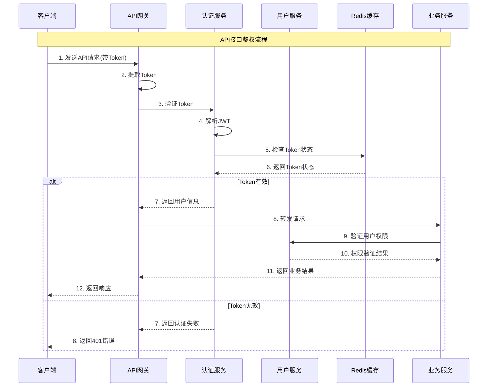
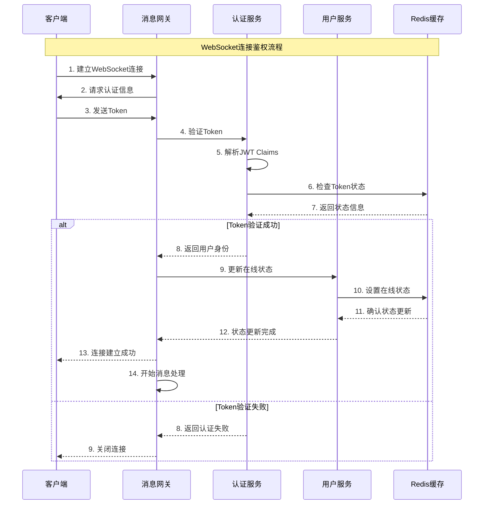
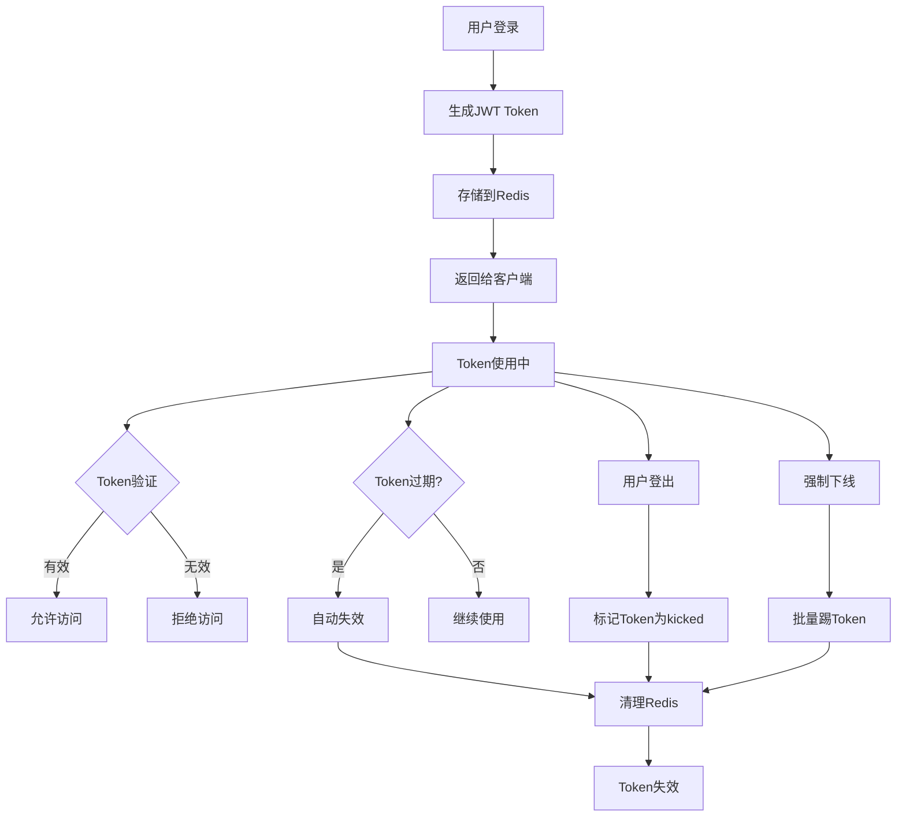
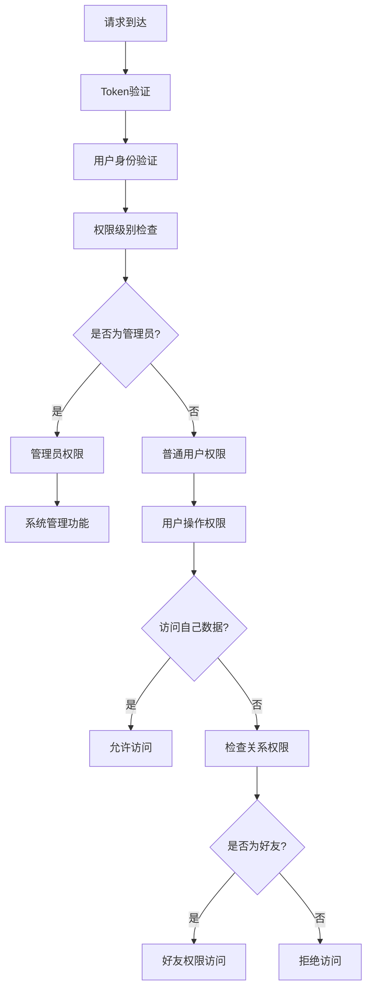
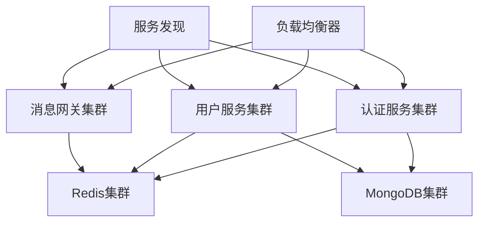

# OpenIM鉴权系统架构详解

## 概述

OpenIM采用基于JWT（JSON Web Token）的分布式鉴权系统，支持多平台、多设备的身份认证和访问控制。本文档详细介绍鉴权系统的架构设计、工作流程和实现细节。

## 系统架构概览

### 核心组件

1. **认证服务（Auth Service）**
   - JWT Token生成与验证
   - 用户身份认证
   - Token状态管理
   - 多端登录控制

2. **用户服务（User Service）**
   - 用户信息管理
   - 在线状态跟踪
   - 用户权限验证
   - 账号生命周期管理

3. **消息网关（Message Gateway）**
   - WebSocket连接管理
   - 实时消息路由
   - 连接鉴权验证
   - 在线状态同步

4. **Redis缓存层**
   - Token状态存储
   - 用户在线状态
   - 会话信息缓存
   - 分布式锁管理

### 鉴权流程分类

#### 1. API接口鉴权流程



#### 2. WebSocket连接鉴权流程



#### 3. Token生命周期管理



## 详细实现分析

### 1. JWT Token结构

```go
type Claims struct {
    UserID     string `json:"user_id"`
    PlatformID int    `json:"platform_id"`
    jwt.RegisteredClaims
}
```

**Token包含信息：**
- 用户ID：唯一标识用户
- 平台ID：区分不同客户端平台
- 过期时间：Token有效期
- 签发时间：Token创建时间

### 2. Token状态管理

Redis中的Token状态映射：
```
Key: token:{userID}:{platformID}
Value: {
    "token1": "normal",    // 正常状态
    "token2": "kicked",    // 被踢状态
    "token3": "expired"    // 过期状态
}
```

### 3. 多端登录策略

```go
// 多端登录配置
type MultiLoginPolicy struct {
    Enable       bool  `json:"enable"`        // 是否允许多端登录
    MaxDevices   int   `json:"max_devices"`   // 最大设备数量
    KickStrategy int   `json:"kick_strategy"` // 踢人策略
}
```

**踢人策略类型：**
- 不踢人：允许无限设备登录
- 踢最早：踢掉最早登录的设备
- 踢所有：新登录踢掉所有旧登录

### 4. 权限验证层级



## 安全机制

### 1. JWT签名验证

```go
// Token签名密钥
func Secret(secret string) jwt.Keyfunc {
    return func(token *jwt.Token) (interface{}, error) {
        return []byte(secret), nil
    }
}
```

### 2. Token状态检查

```go
// Token状态类型
const (
    NormalToken = iota + 1  // 正常Token
    KickedToken            // 被踢Token
    ExpiredToken           // 过期Token
)
```

### 3. 防重放攻击

- Token唯一性：每个Token都有唯一标识
- 时间戳验证：检查Token的时间有效性
- 状态追踪：实时追踪Token的使用状态
- 异常检测：检测异常的Token使用模式

### 4. 会话管理

```go
type SessionManager struct {
    userSessions   map[string]*UserSession  // 用户会话映射
    deviceSessions map[string]*DeviceSession // 设备会话映射
    onlineUsers    *OnlineUserCache         // 在线用户缓存
}
```

## 性能优化

### 1. 缓存策略

**多层缓存架构：**
- L1缓存：本地内存缓存（最热数据）
- L2缓存：Redis缓存（用户状态和Token）
- L3缓存：数据库（持久化存储）

### 2. 连接池管理

```go
type ConnectionPool struct {
    RedisPool    *redis.Pool      // Redis连接池
    DBPool       *sql.DB          // 数据库连接池
    GRPCPool     *grpc.ClientPool // gRPC连接池
}
```

### 3. 批量操作优化

```go
// 批量Token验证
func (s *authServer) BatchValidateTokens(tokens []string) ([]TokenResult, error) {
    // 批量从Redis获取Token状态
    // 减少网络往返次数
}
```

## 监控与日志

### 1. 关键指标监控

- Token生成速率
- Token验证成功率
- 用户在线数量
- 异常登录检测
- 系统响应时间

### 2. 审计日志

```go
type AuditLog struct {
    UserID    string    `json:"user_id"`
    Action    string    `json:"action"`
    IP        string    `json:"ip"`
    UserAgent string    `json:"user_agent"`
    Timestamp time.Time `json:"timestamp"`
    Result    string    `json:"result"`
}
```

### 3. 安全事件告警

- 异常登录地点
- 频繁Token生成
- 暴力破解尝试
- 权限提升攻击
- Token泄露检测

## 部署架构

### 1. 高可用部署



### 2. 数据一致性

- Redis主从复制
- MongoDB副本集
- 分布式锁机制
- 事务处理保证

### 3. 容灾备份

- 多地域部署
- 数据定期备份
- 故障自动切换
- 灾难恢复预案

## 最佳实践

### 1. Token设计原则

- 最小权限原则
- 短期有效期
- 定期轮换密钥
- 避免敏感信息

### 2. 安全编码规范

- 输入验证
- 输出编码
- 错误处理
- 日志记录

### 3. 运维建议

- 定期安全审计
- 监控异常行为
- 及时更新补丁
- 备份恢复测试

## 总结

OpenIM的鉴权系统通过JWT Token、Redis缓存、多层验证等技术，构建了一个安全、高效、可扩展的身份认证和访问控制体系。该系统不仅满足了即时通讯场景的高并发、低延迟要求，还提供了完善的安全保障和灵活的扩展能力。

通过合理的架构设计和优化策略，系统能够支撑大规模用户的并发访问，同时确保数据安全和用户隐私保护。 