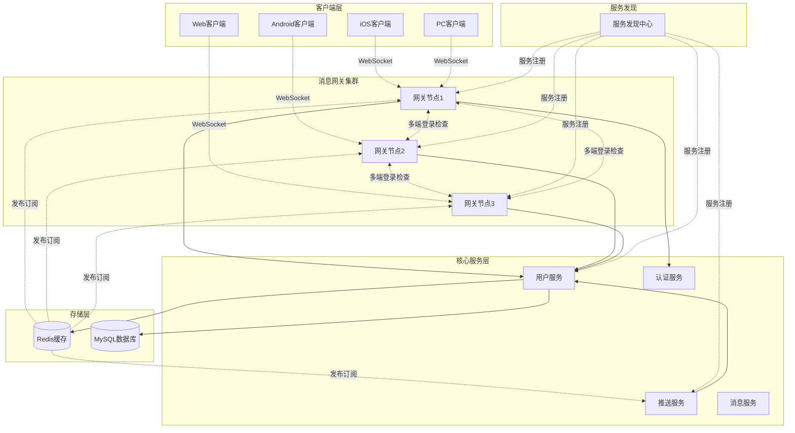
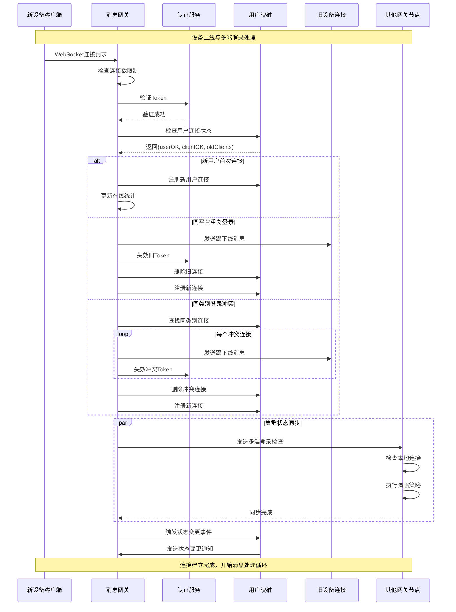
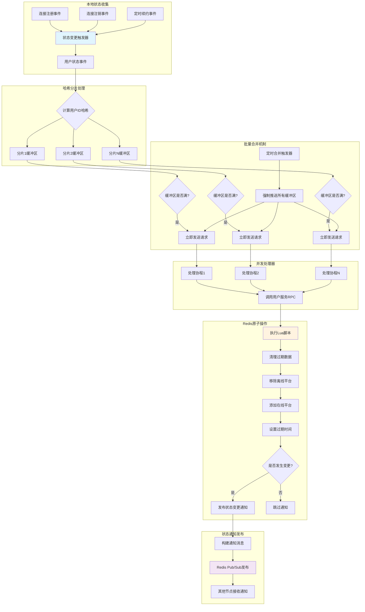
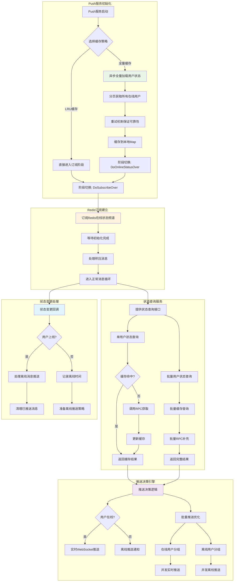
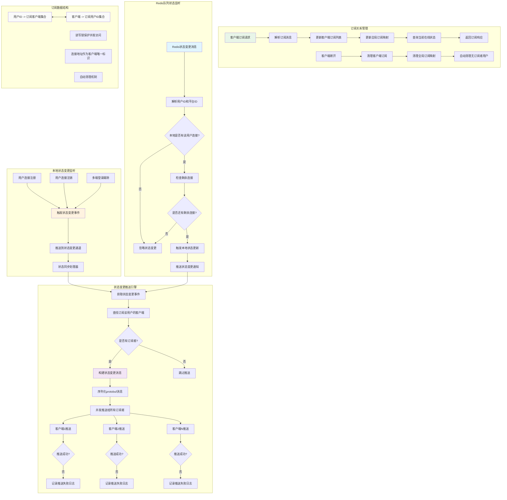
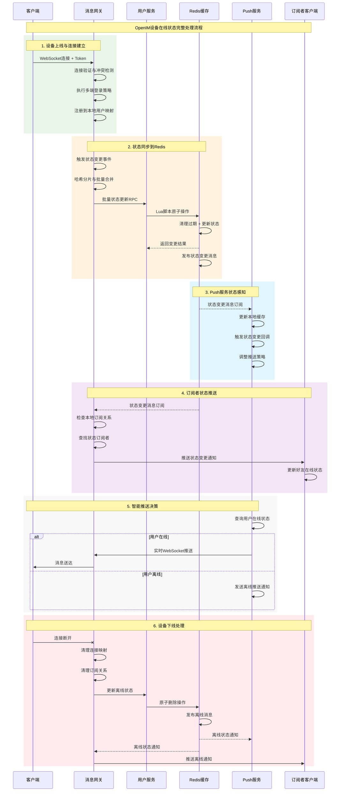
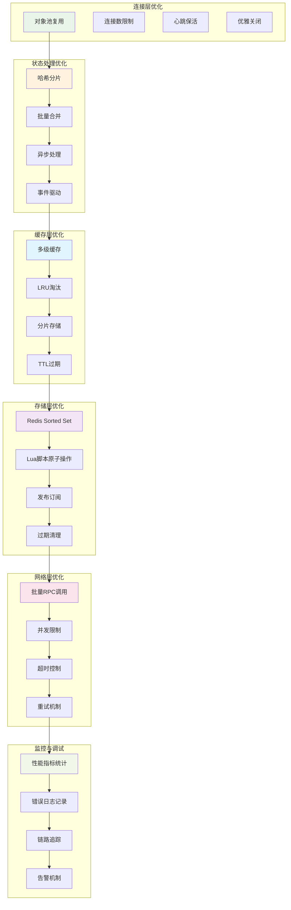
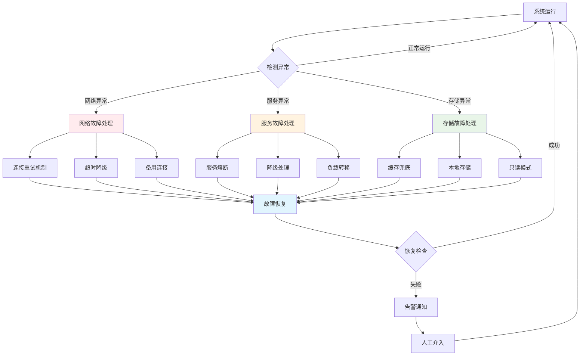

# OpenIM设备在线状态系统流程图

## 系统概览架构图

## 1. 设备上线剔除流程图

## 2. Redis状态同步流程图

## 3. Push服务状态感知流程图

## 4. 消息网关订阅管理流程图

## 5. 完整系统时序图

## 6. 系统性能优化架构图

## 7. 故障处理与容错机制

## 总结

OpenIM的设备在线状态系统通过四个核心流程的协调配合，实现了高效、可靠、可扩展的在线状态管理：

1. **设备上线剔除流程**：处理多端登录冲突，保证用户体验
2. **Redis状态同步机制**：实现分布式状态存储和通知
3. **Push服务状态感知**：提供智能推送决策能力
4. **消息网关订阅管理**：实现实时状态推送和通知

整个系统采用事件驱动架构，通过精心设计的缓存策略、批量处理、原子操作和容错机制，在保证数据一致性的同时，实现了优秀的性能表现和系统可靠性。 