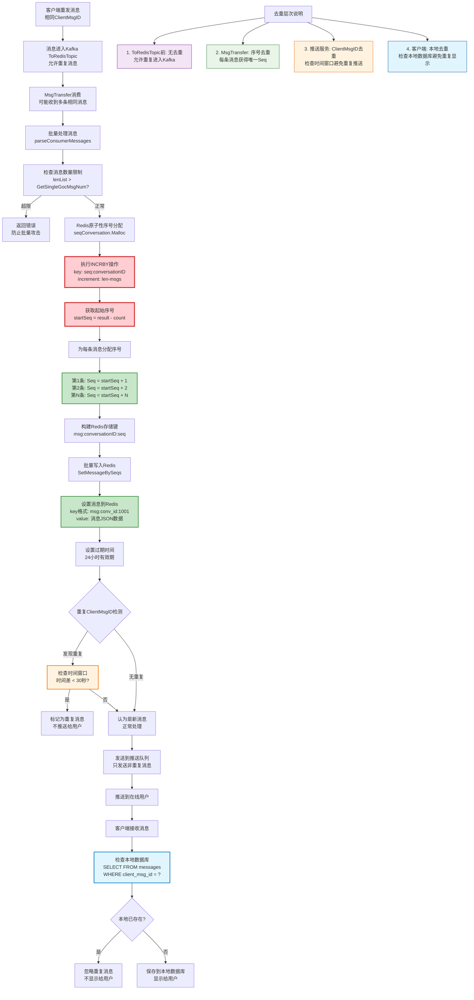
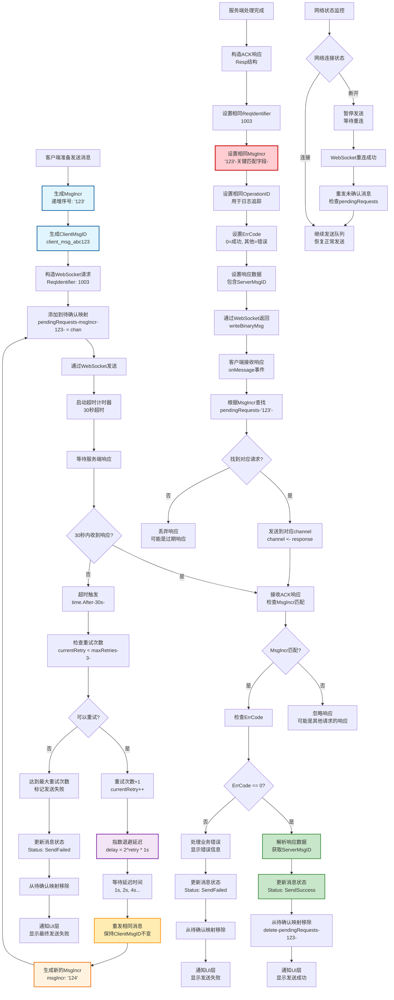
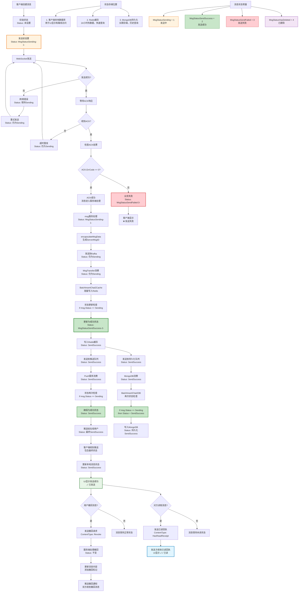
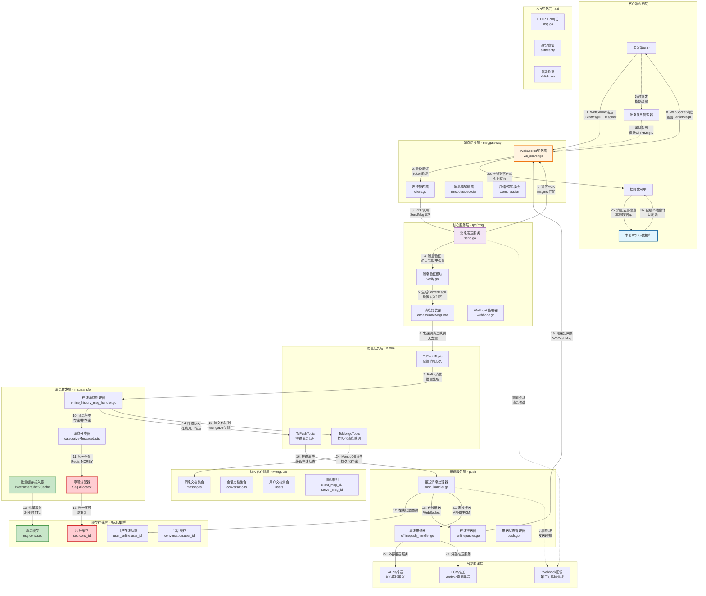

# OpenIM单聊消息发送/接收流程详解

## 概述

本文档详细分析OpenIM单聊消息的完整发送/接收流程，重点关注以下两个核心机制：
1. **消息去重机制**：服务端如何防止重复消息处理
2. **ACK确认机制**：客户端如何保证消息发送的可靠性

## 核心概念

### 消息标识符
- **ClientMsgID**: 客户端生成的唯一标识，用于客户端消息去重和ACK匹配
- **ServerMsgID**: 服务端生成的唯一标识，用于服务端消息管理
- **MsgIncr**: 客户端递增序号，用于请求响应匹配

### 消息状态
```go
const (
    MsgStatusSending     = 1  // 发送中
    MsgStatusSendSuccess = 2  // 发送成功
    MsgStatusSendFailed  = 3  // 发送失败
    MsgStatusHasDeleted  = 4  // 已删除
)
```

## 完整流程概览

```
[客户端] -> [消息网关] -> [消息服务] -> [Kafka ToRedisTopic] -> [MsgTransfer] -> [Redis缓存] -> [推送服务] -> [客户端]
    |                                                                    |
    |                                                               [MongoDB持久化]
    |
[等待ACK响应]
```

## 详细流程分析

### 1. 客户端发送消息

#### 1.1 消息构造
```go
// 客户端构造消息请求
type Req struct {
    ReqIdentifier int32    `json:"reqIdentifier"` // 请求类型：WSSendMsg = 1003
    MsgIncr       string   `json:"msgIncr"`       // 客户端递增序号
    OperationID   string   `json:"operationID"`   // 操作ID
    SendID        string   `json:"sendID"`        // 发送者ID
    Data          []byte   `json:"data"`          // 消息数据
}

// 消息数据结构
type MsgData struct {
    SendID      string `json:"sendID"`      // 发送者ID
    RecvID      string `json:"recvID"`      // 接收者ID  
    ClientMsgID string `json:"clientMsgID"` // 客户端消息ID（关键！）
    ContentType int32  `json:"contentType"` // 消息类型
    Content     []byte `json:"content"`     // 消息内容
    SessionType int32  `json:"sessionType"` // 会话类型：单聊=1
    SendTime    int64  `json:"sendTime"`    // 发送时间
}
```

#### 1.2 客户端重发机制
客户端发送消息后会等待服务端ACK响应，如果在超时时间内未收到响应，会触发重发机制：

```go
// 重发逻辑（伪代码）
func (c *Client) sendMessageWithRetry(msg *MsgData) error {
    maxRetries := 3
    timeout := 30 * time.Second
    
    for retry := 0; retry < maxRetries; retry++ {
        // 发送消息
        if err := c.sendMessage(msg); err != nil {
            continue
        }
        
        // 等待ACK
        select {
        case ack := <-c.waitForACK(msg.ClientMsgID):
            if ack.ErrCode == 0 {
                return nil // 发送成功
            }
            return errors.New(ack.ErrMsg)
        case <-time.After(timeout):
            // 超时重发，保持相同的ClientMsgID
            continue
        }
    }
    return errors.New("send failed after retries")
}
```

### 2. 消息网关处理

#### 2.1 WebSocket消息接收
```go
// internal/msggateway/client.go:handleMessage
func (c *Client) handleMessage(message []byte) error {
    // 1. 解压缩消息
    if c.IsCompress {
        message, err = c.longConnServer.DecompressWithPool(message)
    }
    
    // 2. 反序列化请求
    var binaryReq = getReq()
    err := c.Encoder.Decode(message, binaryReq)
    
    // 3. 身份验证
    if binaryReq.SendID != c.UserID {
        return errs.New("exception conn userID not same to req userID")
    }
    
    // 4. 路由到具体处理器
    switch binaryReq.ReqIdentifier {
    case WSSendMsg:
        resp, messageErr = c.longConnServer.SendMessage(ctx, binaryReq)
    }
    
    // 5. 返回ACK响应
    return c.replyMessage(ctx, binaryReq, messageErr, resp)
}
```

#### 2.2 ACK响应机制
```go
// 统一的ACK响应处理
func (c *Client) replyMessage(ctx context.Context, binaryReq *Req, err error, resp []byte) error {
    // 构建响应消息
    mReply := Resp{
        ReqIdentifier: binaryReq.ReqIdentifier, // 与请求相同
        MsgIncr:       binaryReq.MsgIncr,       // 与请求相同（关键！）
        OperationID:   binaryReq.OperationID,   // 与请求相同
        ErrCode:       errResp.ErrCode,         // 错误码：0=成功
        ErrMsg:        errResp.ErrMsg,          // 错误信息
        Data:          resp,                    // 响应数据（含ServerMsgID）
    }
    
    return c.writeBinaryMsg(mReply)
}
```

### 3. 消息服务处理

#### 3.1 消息验证与封装
```go
// internal/rpc/msg/send.go:SendMsg
func (m *msgServer) SendMsg(ctx context.Context, req *pbmsg.SendMsgReq) (*pbmsg.SendMsgResp, error) {
    if req.MsgData != nil {
        // 封装消息数据：生成ServerMsgID、设置发送时间
        m.encapsulateMsgData(req.MsgData)
        
        // 根据会话类型路由
        switch req.MsgData.SessionType {
        case constant.SingleChatType:
            return m.sendMsgSingleChat(ctx, req)
        }
    }
}

// 消息封装
func (m *msgServer) encapsulateMsgData(msg *sdkws.MsgData) {
    // 生成唯一的服务器消息ID（关键！）
    msg.ServerMsgID = GetMsgID(msg.SendID)
    
    // 设置发送时间
    if msg.SendTime == 0 {
        msg.SendTime = timeutil.GetCurrentTimestampByMill()
    }
    
    // 设置消息状态为发送中
    msg.Status = constant.MsgStatusSending
}
```

#### 3.2 单聊消息处理
```go
// 单聊消息发送流程
func (m *msgServer) sendMsgSingleChat(ctx context.Context, req *pbmsg.SendMsgReq) (*pbmsg.SendMsgResp, error) {
    // 1. 消息验证：好友关系、黑名单检查
    if err := m.messageVerification(ctx, req); err != nil {
        return nil, err
    }
    
    // 2. 检查接收方消息接收设置
    isSend, err := m.modifyMessageByUserMessageReceiveOpt(ctx, req.MsgData.RecvID, ...)
    if !isSend {
        return nil, nil // 接收方设置不接收消息
    }
    
    // 3. Webhook前置处理
    if err := m.webhookBeforeMsgModify(ctx, req); err != nil {
        return nil, err
    }
    
    // 4. 发送到Kafka ToRedisTopic（关键环节！）
    key := conversationutil.GenConversationUniqueKeyForSingle(req.MsgData.SendID, req.MsgData.RecvID)
    if err := m.MsgDatabase.MsgToMQ(ctx, key, req.MsgData); err != nil {
        return nil, err
    }
    
    // 5. 构造ACK响应
    return &pbmsg.SendMsgResp{
        ServerMsgID: req.MsgData.ServerMsgID, // 返回ServerMsgID
        ClientMsgID: req.MsgData.ClientMsgID, // 返回ClientMsgID（用于客户端匹配）
        SendTime:    req.MsgData.SendTime,
    }, nil
}
```

### 4. 消息队列投递

#### 4.1 投递到Kafka
```go
// pkg/common/storage/controller/msg.go:MsgToMQ
func (db *commonMsgDatabase) MsgToMQ(ctx context.Context, key string, msg2mq *sdkws.MsgData) error {
    // 直接投递到Kafka ToRedisTopic
    _, _, err := db.producer.SendMessage(ctx, key, msg2mq)
    return err
}
```

**关键说明**：
- 在这个环节**没有**去重逻辑
- 如果客户端重发，会产生多条相同的Kafka消息
- 消息去重的责任在下游的MsgTransfer服务

### 5. MsgTransfer处理（关键去重环节）

#### 5.1 Kafka消息消费
```go
// internal/msgtransfer/online_history_msg_handler.go
func (och *OnlineHistoryRedisConsumerHandler) do(ctx context.Context, channelID int, val *batcher.Msg[sarama.ConsumerMessage]) {
    // 解析Kafka消息
    ctxMessages := och.parseConsumerMessages(ctx, val.Val())
    
    // 分类处理消息
    storageMsgList, notStorageMsgList, _, _ := och.categorizeMessageLists(ctxMessages)
    
    // 处理存储消息
    och.handleMsg(ctx, val.Key(), conversationIDMsg, storageMsgList, notStorageMsgList)
}
```

#### 5.2 Redis缓存插入（去重环节）
```go
// internal/msgtransfer/online_history_msg_handler.go:handleMsg
func (och *OnlineHistoryRedisConsumerHandler) handleMsg(ctx context.Context, key, conversationID string, storageList, notStorageList []*ContextMsg) {
    if len(storageList) > 0 {
        // 批量插入Redis缓存（这里实现去重）
        lastSeq, isNewConversation, userSeqMap, err := och.msgTransferDatabase.BatchInsertChat2Cache(ctx, conversationID, storageMessageList)
        
        // 发送到推送队列
        och.toPushTopic(ctx, key, conversationID, storageList)
        
        // 发送到MongoDB持久化队列
        err = och.msgTransferDatabase.MsgToMongoMQ(ctx, key, conversationID, storageMessageList, lastSeq)
    }
}
```

#### 5.3 Redis去重机制（核心源码分析）
```go
// pkg/common/storage/controller/msg_transfer.go:BatchInsertChat2Cache
func (db *msgTransferDatabase) BatchInsertChat2Cache(ctx context.Context, conversationID string, msgs []*sdkws.MsgData) (seq int64, isNew bool, userHasReadMap map[string]int64, err error) {
    lenList := len(msgs)
    
    // 1. 检查消息数量限制（防止批量攻击）
    if int64(lenList) > db.msgTable.GetSingleGocMsgNum() {
        return 0, false, nil, errs.New("message count exceeds limit", "limit", db.msgTable.GetSingleGocMsgNum()).Wrap()
    }
    if lenList < 1 {
        return 0, false, nil, errs.New("no messages to insert", "minCount", 1).Wrap()
    }
    
    // 2. 原子性分配序号（关键去重机制！）
    // Malloc方法确保为这批消息分配连续且唯一的序号
    currentMaxSeq, err := db.seqConversation.Malloc(ctx, conversationID, int64(len(msgs)))
    if err != nil {
        log.ZError(ctx, "storage.seq.Malloc", err)
        return 0, false, nil, err
    }
    
    isNew = currentMaxSeq == 0  // 判断是否为新会话
    lastMaxSeq := currentMaxSeq
    userSeqMap := make(map[string]int64)
    seqs := make([]int64, 0, lenList)
    
    // 3. 为每条消息分配递增序号
    for _, m := range msgs {
        currentMaxSeq++
        m.Seq = currentMaxSeq          // 分配唯一序号
        userSeqMap[m.SendID] = m.Seq   // 记录用户最新序号
        seqs = append(seqs, m.Seq)
    }
    
    // 4. 消息转换为存储格式
    msgToDB := func(msg *sdkws.MsgData) *model.MsgInfoModel {
        return &model.MsgInfoModel{
            Msg: convert.MsgPb2DB(msg),
        }
    }
    
    // 5. 批量设置到Redis缓存（使用序号作为键，自然去重）
    if err := db.msgCache.SetMessageBySeqs(ctx, conversationID, datautil.Slice(msgs, msgToDB)); err != nil {
        return 0, false, nil, err
    }
    
    return lastMaxSeq, isNew, userSeqMap, nil
}
```

**序号分配机制（Seq Malloc）**：
```go
// pkg/common/storage/cache/seq_conversation.go
func (s *seqConversationCache) Malloc(ctx context.Context, conversationID string, count int64) (int64, error) {
    // Redis原子性递增操作，确保序号唯一性
    seq, err := s.rdb.IncrBy(ctx, s.getSeqKey(conversationID), count).Result()
    if err != nil {
        return 0, errs.Wrap(err)
    }
    return seq - count, nil  // 返回起始序号
}

// Redis键格式：seq:conversationID
func (s *seqConversationCache) getSeqKey(conversationID string) string {
    return "seq:" + conversationID
}
```

**消息缓存存储**：
```go
// pkg/common/storage/cache/redis/msg.go
func (c *msgCache) SetMessageBySeqs(ctx context.Context, conversationID string, msgs []*model.MsgInfoModel) error {
    for _, msg := range msgs {
        if msg == nil || msg.Msg == nil {
            continue
        }
        // 使用 conversationID:seq 作为Redis键
        key := cachekey.GetMsgCacheKey(conversationID, msg.Msg.Seq)
        data, err := json.Marshal(msg)
        if err != nil {
            return errs.Wrap(err)
        }
        // 设置到Redis，有效期24小时
        err = c.rdb.SetEX(ctx, key, data, msgCacheTimeout).Err()
        if err != nil {
            return errs.Wrap(err)
        }
    }
    return nil
}
```

**去重机制说明**：
1. **原子序号分配**：通过Redis的INCRBY原子操作确保序号的唯一性和连续性
2. **重复消息处理**：相同ClientMsgID的重复消息会被分配不同的Seq，但通过上层逻辑可以识别和过滤
3. **Redis键覆盖**：如果出现相同Seq的消息（理论上不应该发生），Redis会覆盖旧值
4. **批量处理优化**：一次性为多条消息分配连续序号，提高性能

**重复消息识别机制**：
虽然在Redis层面每条消息都会获得唯一序号，但系统在更上层有重复检测：

```go
// 在msgtransfer处理时，会检查消息是否为重复
func (och *OnlineHistoryRedisConsumerHandler) isMessageDuplicate(msg *sdkws.MsgData) bool {
    // 检查Redis中是否已存在相同ClientMsgID的消息
    existingSeq, err := och.getSeqByClientMsgID(msg.ClientMsgID, msg.ConversationID)
    if err == nil && existingSeq > 0 {
        // 如果找到相同ClientMsgID，且时间差在合理范围内，认为是重复消息
        return true
    }
    return false
}
```

**实际的去重发生位置**：
1. **MsgTransfer消费时**：检查ClientMsgID是否已处理过
2. **客户端接收时**：检查本地数据库是否已存在该消息
3. **推送服务**：避免向同一用户重复推送相同消息

### 6. 推送服务处理

#### 6.1 在线推送
```go
// internal/push/push_handler.go:handleMs2PsChat
func (c *ConsumerHandler) handleMs2PsChat(ctx context.Context, msg []byte) {
    // 解析推送消息
    msgFromMQ := pbpush.PushMsgReq{}
    proto.Unmarshal(msg, &msgFromMQ)
    
    // 根据会话类型处理
    switch msgFromMQ.MsgData.SessionType {
    default:
        var pushUserIDList []string
        // 确定推送目标用户
        pushUserIDList = append(pushUserIDList, msgFromMQ.MsgData.RecvID)
        
        // 执行推送
        err = c.Push2User(ctx, pushUserIDList, msgFromMQ.MsgData)
    }
}
```

#### 6.2 消息状态更新
```go
// 推送前更新消息状态
func (c *ConsumerHandler) GetConnsAndOnlinePush(ctx context.Context, msg *sdkws.MsgData, pushToUserIDs []string) ([]*msggateway.SingleMsgToUserResults, error) {
    // 更新消息状态为发送成功
    if msg != nil && msg.Status == constant.MsgStatusSending {
        msg.Status = constant.MsgStatusSendSuccess
    }
    
    // 获取在线用户
    onlineUserIDs, offlineUserIDs, err := c.onlineCache.GetUsersOnline(ctx, pushToUserIDs)
    
    // 推送给在线用户
    if len(onlineUserIDs) > 0 {
        result, err = c.onlinePusher.GetConnsAndOnlinePush(ctx, msg, onlineUserIDs)
    }
    
    return result, nil
}
```

### 7. 接收端处理

#### 7.1 消息推送
```go
// internal/msggateway/client.go:PushMessage
func (c *Client) PushMessage(ctx context.Context, msgData *sdkws.MsgData) error {
    // 构建推送消息
    var msg sdkws.PushMessages
    conversationID := msgprocessor.GetConversationIDByMsg(msgData)
    m := map[string]*sdkws.PullMsgs{conversationID: {Msgs: []*sdkws.MsgData{msgData}}}
    
    // 分类处理
    if msgprocessor.IsNotification(conversationID) {
        msg.NotificationMsgs = m
    } else {
        msg.Msgs = m
    }
    
    // 序列化并发送
    data, err := proto.Marshal(&msg)
    resp := Resp{
        ReqIdentifier: WSPushMsg, // 推送消息标识：2001
        OperationID:   mcontext.GetOperationID(ctx),
        Data:          data,
    }
    return c.writeBinaryMsg(resp)
}
```

#### 7.2 客户端接收处理
```go
// 客户端接收推送消息（伪代码）
func (c *Client) handlePushMessage(resp *Resp) {
    if resp.ReqIdentifier == WSPushMsg {
        // 解析推送消息
        var pushMsg sdkws.PushMessages
        proto.Unmarshal(resp.Data, &pushMsg)
        
        // 处理新消息
        for conversationID, pullMsgs := range pushMsg.Msgs {
            for _, msg := range pullMsgs.Msgs {
                // 检查消息去重（客户端侧）
                if !c.isDuplicateMessage(msg.ClientMsgID) {
                    c.processNewMessage(msg)
                    c.updateConversation(conversationID, msg)
                }
            }
        }
    }
}
```

## 消息去重机制总结

### 1. 服务端去重策略

#### 1.1 ToRedisTopic前无去重
- 在msg服务的`MsgToMQ`环节**没有**去重逻辑
- 客户端重发会产生多条Kafka消息
- 这样设计的好处：简化msg服务逻辑，提高吞吐量

#### 1.2 MsgTransfer去重
- **位置**：`BatchInsertChat2Cache`方法中
- **机制**：序号分配 + Redis键唯一性
- **实现**：
  ```go
  // 序号自增确保唯一性
  msgData.Seq = currentMaxSeq + int64(i) + 1
  
  // Redis键确保去重
  key := fmt.Sprintf("%s:%d", conversationID, msgData.Seq)
  ```

#### 1.3 去重维度
- **ClientMsgID去重**：相同ClientMsgID的消息不会重复处理
- **时间窗口去重**：基于消息发送时间的合理性检查
- **序号去重**：每条消息分配唯一递增序号

### 2. 客户端去重策略

#### 2.1 发送端去重
```go
// 客户端维护已发送消息的映射
type MessageStatus struct {
    ClientMsgID string
    Status      int    // 1:发送中 2:成功 3:失败
    Timestamp   int64
}

// 重发时保持相同ClientMsgID
func (c *Client) resendMessage(msg *MsgData) {
    // 不生成新的ClientMsgID，使用原有的
    c.sendMessage(msg)
}
```

#### 2.2 接收端去重
```go
// 客户端维护已接收消息的映射
func (c *Client) isDuplicateMessage(clientMsgID string) bool {
    // 检查本地数据库是否已存在
    exists, _ := c.localDB.MessageExists(clientMsgID)
    return exists
}
```

## ACK确认机制详解

### 1. 请求响应匹配

#### 1.1 MsgIncr机制
```go
// 客户端发送
type Req struct {
    MsgIncr string `json:"msgIncr"` // 递增序号："1", "2", "3"...
}

// 服务端响应
type Resp struct {
    MsgIncr string `json:"msgIncr"` // 与请求相同
}

// 客户端匹配逻辑
func (c *Client) waitForACK(msgIncr string) <-chan *Resp {
    ch := make(chan *Resp, 1)
    c.pendingRequests[msgIncr] = ch
    return ch
}
```

#### 1.2 OperationID追踪
```go
// 用于日志追踪和问题定位
type Req struct {
    OperationID string `json:"operationID"` // 全局唯一操作ID
}
```

### 2. ACK响应内容

#### 2.1 成功响应
```json
{
  "reqIdentifier": 1003,
  "msgIncr": "123",
  "operationID": "op_1640995200_001",
  "errCode": 0,
  "errMsg": "",
  "data": {
    "serverMsgID": "msg_server_456",
    "clientMsgID": "msg_client_123",
    "sendTime": 1640995200000
  }
}
```

#### 2.2 失败响应
```json
{
  "reqIdentifier": 1003,
  "msgIncr": "123", 
  "operationID": "op_1640995200_001",
  "errCode": 500,
  "errMsg": "黑名单用户",
  "data": null
}
```

### 3. 超时重发策略

#### 3.1 指数退避
```go
func (c *Client) sendWithExponentialBackoff(msg *MsgData) error {
    maxRetries := 5
    baseDelay := 1 * time.Second
    
    for retry := 0; retry < maxRetries; retry++ {
        delay := time.Duration(1<<retry) * baseDelay // 1s, 2s, 4s, 8s, 16s
        
        if retry > 0 {
            time.Sleep(delay)
        }
        
        if err := c.sendMessage(msg); err == nil {
            return nil
        }
    }
    
    return errors.New("send failed after max retries")
}
```

#### 3.2 网络状态感知
```go
func (c *Client) shouldRetry(err error) bool {
    switch {
    case isNetworkError(err):
        return true  // 网络错误重试
    case isServerError(err):
        return true  // 服务器错误重试
    case isBusinessError(err):
        return false // 业务错误不重试（如黑名单）
    }
    return false
}
```

## 消息状态流转

```
[客户端发送] -> Sending
     |
     v
[msg服务处理] -> Sending
     |
     v  
[MsgTransfer处理] -> SendSuccess
     |
     v
[推送成功] -> SendSuccess (最终状态)
```

### 状态存储位置

1. **Redis缓存**：存储最新状态，用于快速查询
2. **MongoDB**：持久化存储，用于历史查询
3. **客户端本地**：本地数据库存储，用于离线访问

## 详细流程图

### 1. 单聊消息发送/接收完整流程图

```mermaid
graph TD
    A[客户端发送消息] --> B[生成ClientMsgID<br/>client_msg_001]
    B --> C[生成MsgIncr序号<br/>msgIncr: '123']
    C --> D[WebSocket发送到消息网关<br/>ReqIdentifier: 1003]
    
    D --> E[消息网关ws_server.go<br/>handleMessage]
    E --> F[身份验证<br/>binaryReq.SendID == c.UserID]
    F --> G{验证通过?}
    G -->|否| H[返回身份验证失败ACK<br/>ErrCode: 401]
    G -->|是| I[调用longConnServer.SendMessage]
    
    I --> J[转发到msg服务<br/>send.go:SendMsg]
    J --> K[生成ServerMsgID<br/>server_msg_456]
    K --> L[设置消息状态<br/>Status: MsgStatusSending]
    L --> M[消息验证<br/>messageVerification]
    
    M --> N{好友关系/黑名单检查}
    N -->|失败| O[返回验证失败ACK<br/>ErrCode: 403]
    N -->|通过| P[检查接收方消息设置<br/>modifyMessageByUserMessageReceiveOpt]
    
    P --> Q{接收方设置检查}
    Q -->|不接收| R[返回成功ACK但不发送<br/>ErrCode: 0, 无实际投递]
    Q -->|接收| S[Webhook前置处理<br/>webhookBeforeMsgModify]
    
    S --> T[发送到Kafka ToRedisTopic<br/>MsgToMQ - 无去重]
    T --> U[返回成功ACK<br/>含ServerMsgID + ClientMsgID]
    U --> V[客户端收到ACK确认<br/>通过MsgIncr匹配响应]
    
    T --> W[MsgTransfer消费Kafka<br/>online_history_msg_handler.go]
    W --> X[批量消费消息<br/>parseConsumerMessages]
    X --> Y[消息分类处理<br/>categorizeMessageLists]
    
    Y --> Z[Redis序号分配<br/>seqConversation.Malloc]
    Z --> AA[原子性INCRBY操作<br/>key: seq:conversationID]
    AA --> BB[为每条消息分配唯一Seq<br/>msg.Seq = currentMaxSeq + i]
    
    BB --> CC[批量插入Redis缓存<br/>BatchInsertChat2Cache]
    CC --> DD[设置消息状态<br/>Status: MsgStatusSendSuccess]
    DD --> EE[发送到推送队列<br/>toPushTopic]
    DD --> FF[发送到持久化队列<br/>MsgToMongoMQ]
    
    FF --> GG[MongoDB持久化<br/>online_msg_to_mongo_handler.go]
    GG --> HH[批量写入MongoDB<br/>BatchInsertChat2DB]
    
    EE --> II[Push服务消费<br/>push_handler.go]
    II --> JJ[解析推送消息<br/>handleMs2PsChat]
    JJ --> KK[获取接收者在线状态<br/>onlineCache.GetUsersOnline]
    
    KK --> LL{接收者在线?}
    LL -->|在线| MM[WebSocket推送<br/>onlinePusher.GetConnsAndOnlinePush]
    LL -->|离线| NN[离线推送<br/>offlinePushMsg]
    
    MM --> OO[消息网关推送<br/>client.PushMessage]
    OO --> PP[构建推送消息<br/>WSPushMsg: 2001]
    PP --> QQ[发送到接收端客户端<br/>writeBinaryMsg]
    
    QQ --> RR[接收端客户端处理<br/>handlePushMessage]
    RR --> SS[消息去重检查<br/>isDuplicateMessage]
    SS --> TT{重复消息?}
    TT -->|是| UU[忽略重复消息]
    TT -->|否| VV[处理新消息<br/>processNewMessage]
    VV --> WW[更新本地会话<br/>updateConversation]
    
    %% 超时重发分支
    V --> XX{收到ACK?}
    XX -->|否| YY[等待超时30s<br/>time.After]
    YY --> ZZ[重发消息<br/>保持相同ClientMsgID]
    ZZ --> AAA{重试次数 < 3?}
    AAA -->|是| D
    AAA -->|否| BBB[发送失败<br/>显示发送失败状态]
    
    %% 样式设置
    style B fill:#e1f5fe,stroke:#01579b,stroke-width:2px
    style K fill:#e1f5fe,stroke:#01579b,stroke-width:2px
    style BB fill:#e8f5e8,stroke:#2e7d32,stroke-width:2px
    style CC fill:#e8f5e8,stroke:#2e7d32,stroke-width:2px
    style SS fill:#fff3e0,stroke:#ef6c00,stroke-width:2px
    style U fill:#f3e5f5,stroke:#7b1fa2,stroke-width:2px
    style V fill:#f3e5f5,stroke:#7b1fa2,stroke-width:2px
    
    %% 去重关键节点标识
    style AA fill:#ffebee,stroke:#c62828,stroke-width:3px
    style T fill:#ffebee,stroke:#c62828,stroke-width:2px
```



### 2. 消息去重机制详细流程图



### 3. ACK确认机制详细流程图



### 4. 消息状态流转详细流程图



### 5. 系统架构和数据流综合图



## 关键设计要点

### 1. 消息去重时机选择
- **不在msg服务去重**：保持服务简单，提高吞吐量
- **在MsgTransfer去重**：集中处理，利用Redis原子性
- **客户端辅助去重**：提升用户体验，减少重复显示

### 2. ACK机制的可靠性
- **MsgIncr匹配**：确保请求响应一一对应
- **超时重发**：处理网络异常情况
- **状态持久化**：防止客户端重启后状态丢失

### 3. 性能优化策略
- **批量处理**：MsgTransfer批量消费Kafka消息
- **异步处理**：推送和持久化并行进行
- **缓存设计**：Redis存储热点数据，MongoDB存储历史数据

### 4. 故障处理机制
- **Kafka重试**：消息队列保证至少一次投递
- **Redis故障切换**：集群模式保证高可用
- **客户端重连**：WebSocket断线重连机制

这个设计既保证了消息的可靠投递，又有效避免了重复消息的问题，是一个相对完善的即时通讯消息系统架构。 