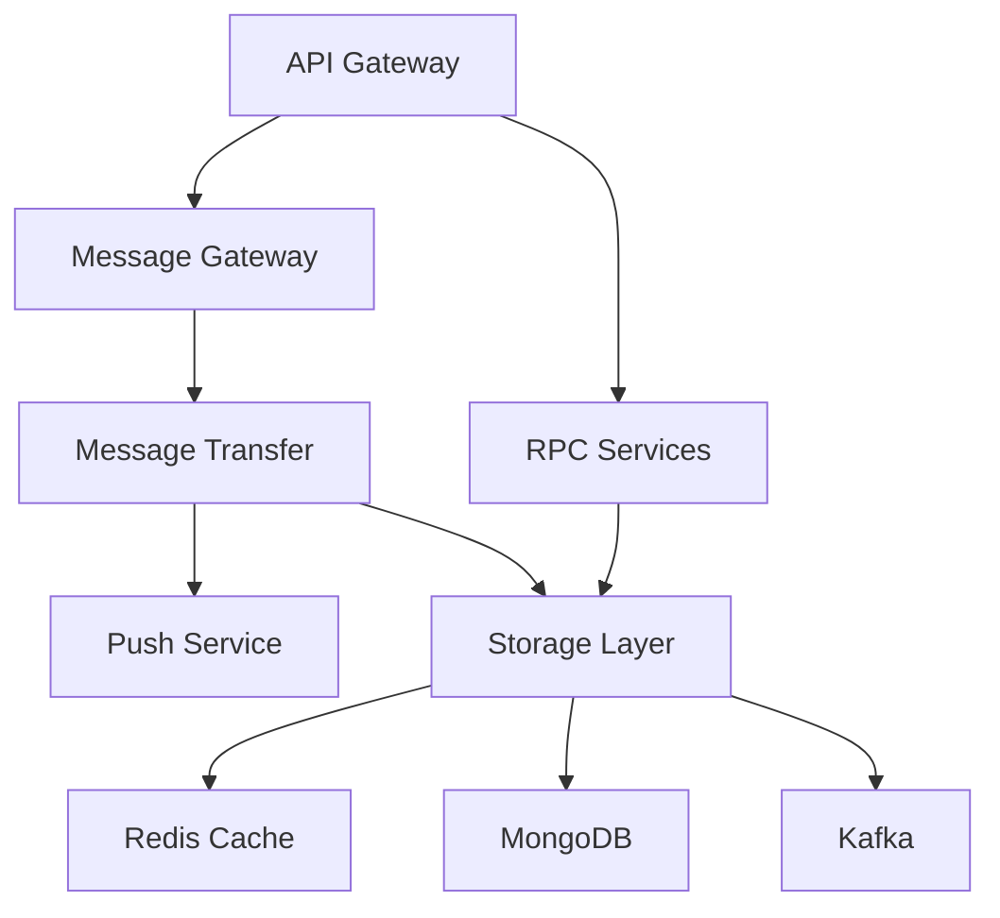

# OpenIM项目目录结构详细分析

## 📋 概述

OpenIM是一个开源的即时通讯解决方案，采用微服务架构设计。本文档详细分析项目的目录结构，精确到每个文件，说明其作用和职责。

## 🏗️ 整体架构

OpenIM项目遵循Go语言的标准项目布局，主要包含以下目录：

- **`/pkg`**: 可供外部应用程序使用的库代码
- **`/internal`**: 私有应用程序和库代码
- **`/cmd`**: 应用程序的主要入口点
- **`/version`**: 版本信息管理

---

## 📁 详细目录结构

### 1. `/pkg` 目录 - 公共库和工具包

```
pkg/
├── apistruct/                    # API结构体定义
│   ├── doc.go                   # 包文档说明
│   ├── manage.go                # 管理相关API结构体(用户管理、群组管理等)
│   ├── msg.go                   # 消息相关API结构体(发送、接收、撤回等)
│   ├── msg_test.go              # 消息结构体单元测试
│   └── public.go                # 公共API结构体(通用响应格式等)
├── authverify/                   # 身份验证工具
│   ├── doc.go                   # 包文档说明
│   └── token.go                 # JWT令牌验证实现(解析、验证、生成)
├── callbackstruct/               # 回调结构体定义
│   ├── black.go                 # 黑名单回调结构体
│   ├── common.go                # 通用回调结构体
│   ├── constant.go              # 回调常量定义(所有回调事件名称)
│   ├── doc.go                   # 包文档说明
│   ├── friend.go                # 好友关系回调结构体
│   ├── group.go                 # 群组操作回调结构体
│   ├── message.go               # 消息回调结构体
│   ├── msg_gateway.go           # 消息网关回调结构体
│   ├── push.go                  # 推送回调结构体
│   ├── revoke.go                # 消息撤回回调结构体
│   └── user.go                  # 用户操作回调结构体
├── common/                       # 通用组件
│   ├── cmd/                     # 命令行工具(启动参数解析等)
│   │   ├── api.go              # API服务命令行工具
│   │   ├── auth.go             # 认证服务命令行工具
│   │   ├── constant.go         # 命令行常量定义(端口、配置路径等)
│   │   ├── conversation.go     # 会话服务命令行工具
│   │   ├── cron_task.go        # 定时任务命令行工具
│   │   ├── doc.go              # 包文档说明
│   │   ├── friend.go           # 好友服务命令行工具
│   │   ├── group.go            # 群组服务命令行工具
│   │   ├── msg.go              # 消息服务命令行工具
│   │   ├── msg_gateway.go      # 消息网关命令行工具
│   │   ├── msg_gateway_test.go # 消息网关测试工具
│   │   ├── msg_transfer.go     # 消息传输命令行工具
│   │   ├── msg_utils.go        # 消息工具函数(参数解析、配置加载)
│   │   ├── push.go             # 推送服务命令行工具
│   │   ├── root.go             # 根命令定义(Cobra CLI框架)
│   │   ├── third.go            # 第三方服务命令行工具
│   │   └── user.go             # 用户服务命令行工具
│   ├── config/                  # 配置管理
│   │   ├── config.go           # 主配置结构体定义(数据库、Redis、Kafka等)
│   │   ├── constant.go         # 配置常量定义
│   │   ├── doc.go              # 包文档说明
│   │   ├── env.go              # 环境变量处理
│   │   ├── load_config.go      # 配置加载逻辑
│   │   ├── load_config_test.go # 配置加载测试
│   │   └── parse.go            # 配置解析工具
│   ├── convert/                 # 数据转换工具
│   │   ├── black.go            # 黑名单数据转换
│   │   ├── conversation.go     # 会话数据转换
│   │   ├── doc.go              # 包文档说明
│   │   ├── friend.go           # 好友数据转换
│   │   ├── group.go            # 群组数据转换
│   │   ├── msg.go              # 消息数据转换
│   │   ├── user.go             # 用户数据转换
│   │   └── user_test.go        # 用户转换测试
│   ├── discoveryregister/       # 服务发现与注册
│   │   ├── direct/             # 直连模式
│   │   │   ├── direct_resolver.go  # 直连解析器
│   │   │   ├── directconn.go       # 直连实现
│   │   │   └── doc.go              # 包文档说明
│   │   ├── etcd/               # etcd服务发现
│   │   │   └── doc.go          # 包文档说明
│   │   ├── zookeeper/          # ZooKeeper服务发现
│   │   │   └── doc.go          # 包文档说明
│   │   ├── discoveryregister.go    # 服务发现注册接口
│   │   ├── discoveryregister_test.go # 服务发现测试
│   │   └── doc.go              # 包文档说明
│   ├── ginprometheus/           # Gin框架Prometheus集成
│   │   ├── doc.go              # 包文档说明
│   │   └── ginprometheus.go    # Gin中间件Prometheus指标收集
│   ├── prommetrics/             # Prometheus指标定义
│   │   ├── api.go              # API服务指标
│   │   ├── discovery.go        # 服务发现指标
│   │   ├── doc.go              # 包文档说明
│   │   ├── grpc_auth.go        # 认证RPC指标
│   │   ├── grpc_msg.go         # 消息RPC指标
│   │   ├── grpc_msggateway.go  # 消息网关RPC指标
│   │   ├── grpc_push.go        # 推送RPC指标
│   │   ├── grpc_user.go        # 用户RPC指标
│   │   ├── prommetrics.go      # 指标定义基础
│   │   ├── prommetrics_test.go # 指标测试
│   │   ├── rpc.go              # RPC通用指标
│   │   └── transfer.go         # 传输服务指标
│   ├── redispubsub/             # Redis发布订阅
│   │   ├── doc.go              # 包文档说明
│   │   ├── redispubliser.go    # Redis发布者
│   │   └── redissubscriber.go  # Redis订阅者
│   ├── servererrs/              # 服务器错误定义
│   │   ├── code.go             # 错误码定义
│   │   ├── doc.go              # 包文档说明
│   │   ├── predefine.go        # 预定义错误
│   │   └── relation.go         # 关系相关错误
│   ├── startrpc/                # RPC服务启动工具
│   │   ├── doc.go              # 包文档说明
│   │   └── start.go            # RPC服务启动逻辑
│   ├── storage/                 # 存储层抽象
│   │   ├── cache/              # 缓存接口定义
│   │   │   ├── cachekey/       # 缓存键定义
│   │   │   │   ├── black.go    # 黑名单缓存键
│   │   │   │   ├── conversation.go # 会话缓存键
│   │   │   │   ├── doc.go      # 包文档说明
│   │   │   │   ├── friend.go   # 好友缓存键
│   │   │   │   ├── group.go    # 群组缓存键
│   │   │   │   ├── msg.go      # 消息缓存键
│   │   │   │   ├── online.go   # 在线状态缓存键
│   │   │   │   ├── s3.go       # S3缓存键
│   │   │   │   ├── seq.go      # 序列号缓存键
│   │   │   │   ├── third.go    # 第三方服务缓存键
│   │   │   │   ├── token.go    # 令牌缓存键
│   │   │   │   └── user.go     # 用户缓存键
│   │   │   ├── redis/          # Redis缓存实现
│   │   │   │   ├── batch.go    # 批量操作
│   │   │   │   ├── batch_handler.go # 批量处理器
│   │   │   │   ├── batch_test.go    # 批量操作测试
│   │   │   │   ├── black.go    # 黑名单缓存
│   │   │   │   ├── conversation.go # 会话缓存
│   │   │   │   ├── doc.go      # 包文档说明
│   │   │   │   ├── friend.go   # 好友缓存
│   │   │   │   ├── group.go    # 群组缓存
│   │   │   │   ├── lua_script.go    # Lua脚本
│   │   │   │   ├── lua_script_test.go # Lua脚本测试
│   │   │   │   ├── msg.go      # 消息缓存
│   │   │   │   ├── online.go   # 在线状态缓存
│   │   │   │   ├── online_test.go   # 在线状态测试
│   │   │   │   ├── redis_shard_manager.go # Redis分片管理
│   │   │   │   ├── s3.go       # S3缓存
│   │   │   │   ├── seq_conversation.go # 会话序列号缓存
│   │   │   │   ├── seq_conversation_test.go # 会话序列号测试
│   │   │   │   ├── seq_user.go # 用户序列号缓存
│   │   │   │   ├── seq_user_test.go # 用户序列号测试
│   │   │   │   ├── third.go    # 第三方服务缓存
│   │   │   │   ├── token.go    # 令牌缓存
│   │   │   │   └── user.go     # 用户缓存
│   │   │   ├── batch_handler.go # 批量处理器接口
│   │   │   ├── black.go        # 黑名单缓存接口
│   │   │   ├── conversation.go # 会话缓存接口
│   │   │   ├── doc.go          # 包文档说明
│   │   │   ├── friend.go       # 好友缓存接口
│   │   │   ├── group.go        # 群组缓存接口
│   │   │   ├── msg.go          # 消息缓存接口
│   │   │   ├── online.go       # 在线状态缓存接口
│   │   │   ├── s3.go           # S3缓存接口
│   │   │   ├── seq_conversation.go # 会话序列号缓存接口
│   │   │   ├── seq_user.go     # 用户序列号缓存接口
│   │   │   ├── third.go        # 第三方服务缓存接口
│   │   │   ├── token.go        # 令牌缓存接口
│   │   │   └── user.go         # 用户缓存接口
│   │   ├── common/             # 存储通用工具
│   │   │   └── types.go        # 通用类型定义
│   │   ├── controller/         # 存储控制器
│   │   │   ├── auth.go         # 认证控制器
│   │   │   ├── black.go        # 黑名单控制器
│   │   │   ├── conversation.go # 会话控制器
│   │   │   ├── doc.go          # 包文档说明
│   │   │   ├── friend.go       # 好友控制器
│   │   │   ├── group.go        # 群组控制器
│   │   │   ├── msg.go          # 消息控制器
│   │   │   ├── msg_transfer.go # 消息传输控制器
│   │   │   ├── push.go         # 推送控制器
│   │   │   ├── s3.go           # S3控制器
│   │   │   ├── third.go        # 第三方服务控制器
│   │   │   └── user.go         # 用户控制器
│   │   ├── database/           # 数据库接口定义
│   │   │   ├── mgo/            # MongoDB实现
│   │   │   │   ├── black.go    # 黑名单数据库操作
│   │   │   │   ├── conversation.go # 会话数据库操作
│   │   │   │   ├── doc.go      # 包文档说明
│   │   │   │   ├── friend.go   # 好友数据库操作
│   │   │   │   ├── friend_request.go # 好友请求数据库操作
│   │   │   │   ├── group.go    # 群组数据库操作
│   │   │   │   ├── group_member.go # 群成员数据库操作
│   │   │   │   ├── group_request.go # 群组请求数据库操作
│   │   │   │   ├── helpers.go  # 数据库辅助函数
│   │   │   │   ├── log.go      # 日志数据库操作
│   │   │   │   ├── msg.go      # 消息数据库操作
│   │   │   │   ├── msg_test.go # 消息数据库测试
│   │   │   │   ├── object.go   # 对象存储数据库操作
│   │   │   │   ├── seq_conversation.go # 会话序列号数据库操作
│   │   │   │   ├── seq_conversation_test.go # 会话序列号测试
│   │   │   │   ├── seq_user.go # 用户序列号数据库操作
│   │   │   │   ├── user.go     # 用户数据库操作
│   │   │   │   ├── version_log.go # 版本日志数据库操作
│   │   │   │   └── version_test.go # 版本测试
│   │   │   ├── black.go        # 黑名单数据库接口
│   │   │   ├── conversation.go # 会话数据库接口
│   │   │   ├── doc.go          # 包文档说明
│   │   │   ├── friend.go       # 好友数据库接口
│   │   │   ├── friend_request.go # 好友请求数据库接口
│   │   │   ├── group.go        # 群组数据库接口
│   │   │   ├── group_member.go # 群成员数据库接口
│   │   │   ├── group_request.go # 群组请求数据库接口
│   │   │   ├── log.go          # 日志数据库接口
│   │   │   ├── msg.go          # 消息数据库接口
│   │   │   ├── name.go         # 数据库名称定义
│   │   │   ├── object.go       # 对象存储数据库接口
│   │   │   ├── seq.go          # 序列号数据库接口
│   │   │   ├── seq_user.go     # 用户序列号数据库接口
│   │   │   ├── user.go         # 用户数据库接口
│   │   │   └── version_log.go  # 版本日志数据库接口
│   │   ├── kafka/              # Kafka消息队列
│   │   │   ├── config.go       # Kafka配置
│   │   │   ├── consumer_group.go # 消费者组
│   │   │   ├── producer.go     # 生产者
│   │   │   ├── sarama.go       # Sarama客户端封装
│   │   │   ├── tls.go          # TLS配置
│   │   │   ├── util.go         # 工具函数
│   │   │   └── verify.go       # 验证工具
│   │   ├── model/              # 数据模型定义
│   │   │   ├── application.go  # 应用模型
│   │   │   ├── black.go        # 黑名单模型
│   │   │   ├── conversation.go # 会话模型
│   │   │   ├── doc.go          # 包文档说明
│   │   │   ├── friend.go       # 好友模型
│   │   │   ├── friend_request.go # 好友请求模型
│   │   │   ├── group.go        # 群组模型
│   │   │   ├── group_member.go # 群成员模型
│   │   │   ├── group_request.go # 群组请求模型
│   │   │   ├── log.go          # 日志模型
│   │   │   ├── msg.go          # 消息模型
│   │   │   ├── object.go       # 对象存储模型
│   │   │   ├── seq.go          # 序列号模型
│   │   │   ├── seq_user.go     # 用户序列号模型
│   │   │   ├── subscribe.go    # 订阅模型
│   │   │   ├── user.go         # 用户模型
│   │   │   └── version_log.go  # 版本日志模型
│   │   └── versionctx/         # 版本上下文
│   │       ├── rpc.go          # RPC版本上下文
│   │       └── version.go      # 版本上下文实现
│   └── webhook/                 # Webhook处理
│       ├── condition.go        # 条件判断
│       ├── doc.go              # 包文档说明
│       ├── http_client.go      # HTTP客户端
│       └── http_client_test.go # HTTP客户端测试
├── localcache/                   # 本地缓存实现
│   ├── link/                    # 链表实现
│   │   ├── doc.go              # 包文档说明
│   │   ├── link.go             # 双向链表实现
│   │   └── link_test.go        # 链表测试
│   ├── lru/                     # LRU缓存实现
│   │   ├── doc.go              # 包文档说明
│   │   ├── lru.go              # LRU缓存基础实现
│   │   ├── lru_expiration.go   # 带过期时间的LRU缓存
│   │   ├── lru_lazy.go         # 懒加载LRU缓存
│   │   ├── lru_lazy_test.go    # 懒加载LRU测试
│   │   └── lru_slot.go         # 分槽LRU缓存
│   ├── cache.go                 # 缓存接口定义
│   ├── cache_test.go            # 缓存测试
│   ├── doc.go                   # 包文档说明
│   ├── init.go                  # 缓存初始化
│   ├── option.go                # 缓存选项配置
│   └── tool.go                  # 缓存工具函数
├── msgprocessor/                 # 消息处理器
│   ├── conversation.go          # 会话处理逻辑
│   ├── doc.go                   # 包文档说明
│   └── options.go               # 处理选项配置
├── notification/                 # 通知处理
│   ├── common_user/             # 通用用户通知
│   │   └── common.go           # 通用通知逻辑
│   ├── grouphash/               # 群组哈希通知
│   │   └── grouphash.go        # 群组哈希计算
│   └── msg.go                   # 消息通知处理
├── rpccache/                     # RPC缓存
│   ├── common.go                # 通用RPC缓存
│   ├── conversation.go          # 会话RPC缓存
│   ├── doc.go                   # 包文档说明
│   ├── friend.go                # 好友RPC缓存
│   ├── group.go                 # 群组RPC缓存
│   ├── online.go                # 在线状态RPC缓存
│   ├── subscriber.go            # 订阅者RPC缓存
│   └── user.go                  # 用户RPC缓存
├── rpcli/                        # RPC客户端
│   ├── auth.go                  # 认证RPC客户端
│   ├── conversation.go          # 会话RPC客户端
│   ├── group.go                 # 群组RPC客户端
│   ├── msg.go                   # 消息RPC客户端
│   ├── push.go                  # 推送RPC客户端
│   ├── relation.go              # 关系RPC客户端
│   ├── rtc.go                   # RTC RPC客户端
│   ├── third.go                 # 第三方RPC客户端
│   ├── tool.go                  # RPC工具函数
│   └── user.go                  # 用户RPC客户端
├── statistics/                   # 统计数据处理
│   ├── doc.go                   # 包文档说明
│   └── statistics.go            # 统计数据收集和处理
├── tools/                        # 工具库
│   └── batcher/                 # 批处理器
│       ├── batcher.go          # 批处理器实现
│       └── batcher_test.go     # 批处理器测试
└── util/                         # 实用工具
    ├── conversationutil/        # 会话工具
    │   ├── conversationutil.go # 会话ID生成和解析
    │   └── doc.go              # 包文档说明
    ├── hashutil/                # 哈希工具
    │   └── id.go               # ID哈希计算
    └── useronline/              # 用户在线状态工具
        └── split.go            # 在线状态分割处理
```

### 2. `/internal` 目录 - 内部实现

```
internal/
├── api/                          # API服务实现
│   ├── jssdk/                   # JavaScript SDK相关
│   │   ├── jssdk.go            # JS SDK接口实现
│   │   ├── sort.go             # 排序工具
│   │   └── tools.go            # JS SDK工具函数
│   ├── auth.go                  # 身份认证API(登录、注册、令牌验证)
│   ├── config_manager.go        # 配置管理API(动态配置更新)
│   ├── conversation.go          # 会话管理API(创建、查询、更新会话)
│   ├── custom_validator.go      # 自定义验证器(参数校验规则)
│   ├── friend.go                # 好友管理API(添加、删除、查询好友)
│   ├── group.go                 # 群组管理API(创建、加入、退出群组)
│   ├── init.go                  # API服务初始化(路由注册、中间件配置)
│   ├── msg.go                   # 消息处理API(发送、接收、查询消息)
│   ├── prometheus_discovery.go  # Prometheus服务发现(指标暴露)
│   ├── router.go                # 路由配置(HTTP路由定义)
│   ├── third.go                 # 第三方服务API(对象存储、推送服务)
│   └── user.go                  # 用户管理API(用户信息CRUD)
├── msggateway/                   # 消息网关服务
│   ├── callback.go              # 回调处理(Webhook回调)
│   ├── client.go                # 客户端连接管理
│   ├── compressor.go            # 消息压缩器
│   ├── compressor_test.go       # 压缩器测试
│   ├── constant.go              # 常量定义(消息类型、状态码等)
│   ├── context.go               # 上下文管理(连接上下文)
│   ├── encoder.go               # 消息编码器
│   ├── hub_server.go            # 消息中心服务器
│   ├── http_error.go            # HTTP错误处理
│   ├── init.go                  # 网关初始化
│   ├── long_conn.go             # 长连接管理
│   ├── message_handler.go       # 消息处理器
│   ├── online.go                # 在线状态管理
│   ├── options.go               # 配置选项
│   ├── subscription.go          # 订阅管理
│   ├── user_map.go              # 用户映射管理
│   └── ws_server.go             # WebSocket服务器
├── msgtransfer/                  # 消息传输服务
│   ├── init.go                  # 服务初始化和配置
│   ├── online_history_msg_handler.go  # 在线历史消息处理器
│   └── online_msg_to_mongo_handler.go # MongoDB消息处理器
├── push/                         # 推送服务
│   ├── offlinepush/             # 离线推送
│   │   ├── dummy/              # 虚拟推送实现
│   │   ├── fcm/                # Firebase Cloud Messaging
│   │   │   └── push.go         # FCM推送实现
│   │   ├── getui/              # 个推推送
│   │   │   ├── body.go         # 推送消息体
│   │   │   └── push.go         # 个推推送实现
│   │   ├── jpush/              # 极光推送
│   │   │   ├── body/           # 推送消息体结构
│   │   │   └── push.go         # 极光推送实现
│   │   ├── options/            # 推送选项配置
│   │   └── offlinepusher.go    # 离线推送器接口
│   ├── callback.go              # 推送回调处理
│   ├── offlinepush_handler.go   # 离线推送处理器
│   ├── onlinepusher.go          # 在线推送器
│   ├── push.go                  # 推送服务主逻辑
│   └── push_handler.go          # 推送处理器
├── rpc/                          # RPC服务实现
│   ├── auth/                    # 认证RPC服务
│   │   └── auth.go             # 认证服务实现(令牌管理、权限验证)
│   ├── conversation/            # 会话RPC服务
│   │   ├── conversation.go     # 会话服务实现
│   │   ├── notification.go     # 会话通知
│   │   └── sync.go             # 会话同步
│   ├── group/                   # 群组RPC服务
│   │   ├── cache.go            # 群组缓存
│   │   ├── callback.go         # 群组回调
│   │   ├── convert.go          # 数据转换
│   │   ├── db_map.go           # 数据库映射
│   │   ├── fill.go             # 数据填充
│   │   ├── group.go            # 群组服务实现
│   │   ├── notification.go     # 群组通知
│   │   ├── statistics.go       # 群组统计
│   │   └── sync.go             # 群组同步
│   ├── incrversion/             # 增量版本RPC服务
│   │   ├── batch_option.go     # 批量选项
│   │   └── option.go           # 版本选项
│   ├── msg/                     # 消息RPC服务
│   │   ├── as_read.go          # 消息已读处理
│   │   ├── callback.go         # 消息回调
│   │   ├── clear.go            # 消息清理
│   │   ├── delete.go           # 消息删除
│   │   ├── filter.go           # 消息过滤
│   │   ├── msg_status.go       # 消息状态
│   │   ├── notification.go     # 消息通知
│   │   ├── revoke.go           # 消息撤回
│   │   ├── send.go             # 消息发送
│   │   ├── seq.go              # 序列号管理
│   │   ├── server.go           # 消息服务器
│   │   ├── statistics.go       # 消息统计
│   │   ├── sync_msg.go         # 消息同步
│   │   ├── utils.go            # 工具函数
│   │   └── verify.go           # 消息验证
│   ├── relation/                # 关系RPC服务
│   │   ├── black.go            # 黑名单管理
│   │   ├── callback.go         # 关系回调
│   │   ├── friend.go           # 好友关系管理
│   │   ├── notification.go     # 关系通知
│   │   └── sync.go             # 关系同步
│   ├── third/                   # 第三方RPC服务
│   │   ├── log.go              # 日志服务
│   │   ├── s3.go               # S3对象存储服务
│   │   ├── third.go            # 第三方服务实现
│   │   └── tool.go             # 工具函数
│   └── user/                    # 用户RPC服务
│       ├── callback.go         # 用户回调
│       ├── notification.go     # 用户通知
│       ├── online.go           # 用户在线状态
│       ├── statistics.go       # 用户统计
│       └── user.go             # 用户服务实现
└── tools/                        # 内部工具
    ├── cron_task.go             # 定时任务
    ├── cron_test.go             # 定时任务测试
    ├── msg.go                   # 消息工具
    ├── s3.go                    # S3工具
    └── user_msg.go              # 用户消息工具
```

### 3. `/cmd` 目录 - 应用程序入口

```
cmd/
├── openim-api/                   # API服务启动程序
│   └── main.go                  # API服务主入口(HTTP REST API服务器)
├── openim-cmdutils/              # 命令行工具
│   └── main.go                  # 命令行工具主入口(数据库初始化、配置检查等)
├── openim-crontask/              # 定时任务服务
│   └── main.go                  # 定时任务主入口(清理过期数据、统计任务等)
├── openim-msggateway/            # 消息网关启动程序
│   ├── __debug_bin677080916.exe # 调试二进制文件(开发环境)
│   └── main.go                  # 消息网关主入口(WebSocket服务器)
├── openim-msgtransfer/           # 消息传输服务启动程序
│   └── main.go                  # 消息传输主入口(消息路由和传输)
├── openim-push/                  # 推送服务启动程序
│   └── main.go                  # 推送服务主入口(消息推送处理)
└── openim-rpc/                   # RPC服务启动程序
    ├── openim-rpc-auth/         # 认证RPC服务启动
    │   └── main.go             # 认证RPC服务主入口
    ├── openim-rpc-conversation/ # 会话RPC服务启动
    │   └── main.go             # 会话RPC服务主入口
    ├── openim-rpc-friend/       # 好友RPC服务启动
    │   └── main.go             # 好友RPC服务主入口
    ├── openim-rpc-group/        # 群组RPC服务启动
    │   └── main.go             # 群组RPC服务主入口
    ├── openim-rpc-msg/          # 消息RPC服务启动
    │   └── main.go             # 消息RPC服务主入口
    ├── openim-rpc-third/        # 第三方RPC服务启动
    │   └── main.go             # 第三方RPC服务主入口
    └── openim-rpc-user/         # 用户RPC服务启动
        └── main.go             # 用户RPC服务主入口
```

### 4. `/version` 目录 - 版本管理

```
version/
├── version              # 版本号文件(当前版本: v3.8.3-patch.5)
└── version.go          # 版本信息代码(通过embed嵌入版本号)
```

---

## 🔧 关键组件分析

### **存储层架构** (`pkg/common/storage/`)

- **cache/**: Redis缓存接口抽象
- **database/**: MongoDB数据库接口抽象  
- **controller/**: 存储控制器，整合缓存和数据库操作
- **kafka/**: Kafka消息队列封装
- **model/**: 数据模型定义

### **微服务架构** (`internal/`)

1. **API网关** (`api/`): HTTP REST API接口
2. **消息网关** (`msggateway/`): WebSocket连接管理
3. **消息传输** (`msgtransfer/`): 消息路由和传输
4. **推送服务** (`push/`): 消息推送处理
5. **RPC服务群** (`rpc/`): 各业务域的RPC服务

### **批处理器** (`pkg/tools/batcher/`)

高性能的泛型批处理器，支持：
- 数据聚合和分片处理
- 并发执行和负载均衡
- 配置化的批处理策略

### **消息处理器** (`pkg/msgprocessor/`)

提供消息处理的核心逻辑：
- 会话类型判断和处理
- 消息选项配置
- 消息路由规则

### **命令行工具** (`pkg/common/cmd/`)

统一的命令行接口框架，基于Cobra CLI：
- 各服务的启动命令定义(API、RPC、网关等)
- 配置文件路径和端口参数解析
- 服务启动前的环境检查和初始化
- 测试和调试工具集成

---

## 📊 服务依赖关系



## 🔄 数据流向

1. **客户端请求** → API Gateway → RPC Services
2. **实时消息** → Message Gateway → Message Transfer → Push Service
3. **消息存储** → Storage Controller → Cache/Database
4. **消息队列** → Kafka → Message Transfer → MongoDB

---

## 🛠️ 技术栈特性

### **微服务特性**
- **服务拆分**: 按业务域拆分为独立的RPC服务
- **服务发现**: 基于etcd的服务注册与发现
- **负载均衡**: gRPC内置负载均衡
- **监控观测**: Prometheus + 链路追踪

### **存储特性**
- **缓存策略**: Redis多级缓存
- **数据持久化**: MongoDB分片存储
- **消息队列**: Kafka异步解耦
- **一致性保证**: 最终一致性模型

### **性能特性**
- **批处理**: 自研批处理器优化性能
- **连接池**: 数据库和缓存连接池
- **异步处理**: 消息队列异步处理
- **分片存储**: 按会话ID分片存储

---

## 🎯 设计原则

1. **单一职责**: 每个服务专注单一业务领域
2. **接口隔离**: 通过接口抽象依赖关系
3. **依赖倒置**: 面向接口编程，降低耦合
4. **开闭原则**: 易于扩展，对修改封闭
5. **DRY原则**: 公共组件复用，避免重复

---

## 📊 项目规模统计

### **文件数量统计**
- **总计**: 约300+个Go源文件
- **pkg目录**: 约200+个文件(公共库和工具)
- **internal目录**: 约80+个文件(内部实现)
- **cmd目录**: 15个main.go文件(服务入口)
- **测试文件**: 约30+个测试文件

### **核心模块文件分布**
- **存储层**: 80+个文件(缓存、数据库、模型)
- **RPC服务**: 40+个文件(8个业务域服务)
- **消息处理**: 30+个文件(网关、传输、推送)
- **工具库**: 20+个文件(批处理、缓存、工具)
- **配置管理**: 15+个文件(配置、错误、常量)

### **代码行数估算**
- **总代码行数**: 约50,000+行Go代码
- **核心业务逻辑**: 约30,000行
- **存储和缓存**: 约15,000行
- **工具和配置**: 约5,000行

---

## 📝 总结

OpenIM项目采用了标准的Go项目布局和微服务架构，具有以下特点：

### **架构优势**
- **清晰的分层架构**: pkg(公共库) → internal(私有实现) → cmd(启动入口)
- **完善的存储抽象**: 缓存、数据库、消息队列的统一抽象
- **高性能设计**: 批处理器、连接池、异步处理等性能优化
- **可扩展架构**: 微服务拆分、接口抽象、配置化设计
- **运维友好**: 监控指标、服务发现、健康检查等完善的运维支持

### **技术亮点**
- **自研批处理器**: 高性能泛型批处理，支持并发和负载均衡
- **多级缓存策略**: Redis缓存 + 本地LRU缓存，提升访问性能
- **序列号管理**: 分布式环境下的消息序列号一致性保证
- **推送服务集成**: 支持FCM、极光推送、个推等多种推送平台
- **WebSocket网关**: 高并发长连接管理，支持消息压缩和编码

### **业务覆盖**
- **用户管理**: 注册、登录、信息管理、在线状态
- **好友关系**: 添加、删除、黑名单、好友请求
- **群组功能**: 创建、加入、退出、成员管理、权限控制
- **消息系统**: 单聊、群聊、消息撤回、已读状态、历史消息
- **推送通知**: 在线推送、离线推送、多平台支持

这种架构设计使得OpenIM既能处理大规模的并发连接，又能保证系统的可维护性和可扩展性，是一个成熟的企业级即时通讯解决方案。 