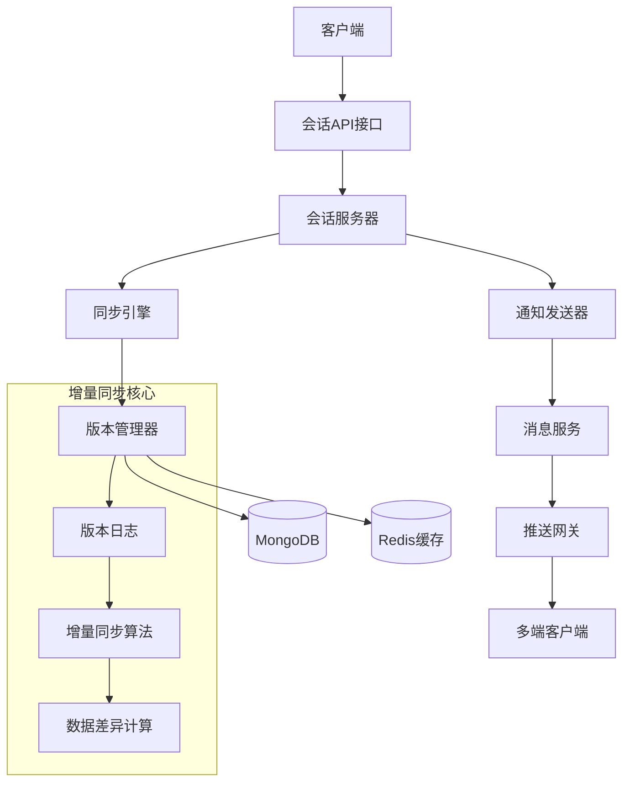
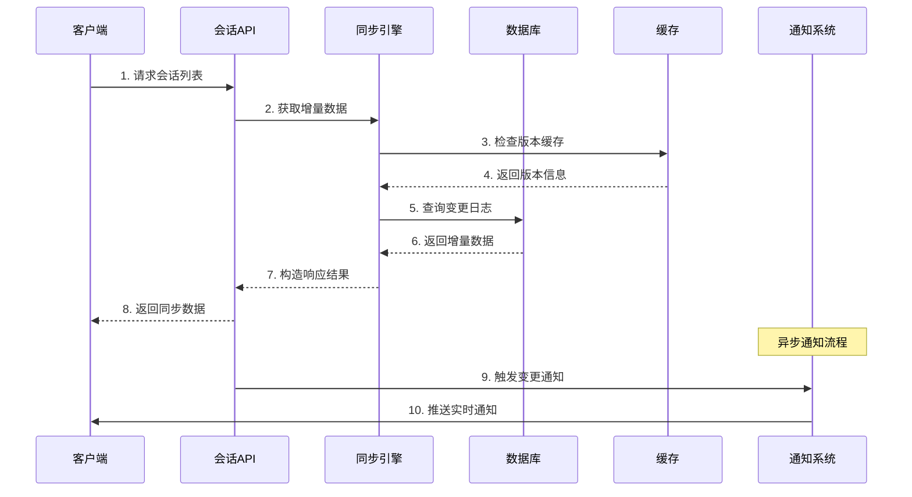
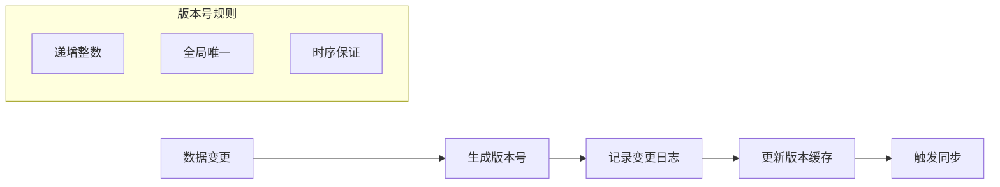
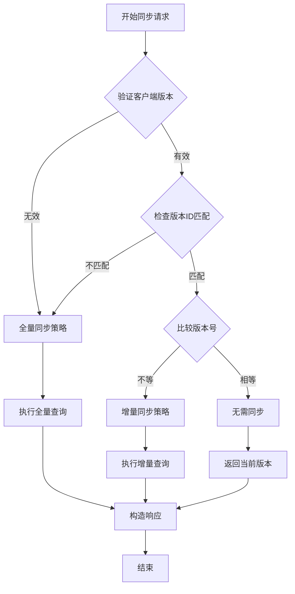
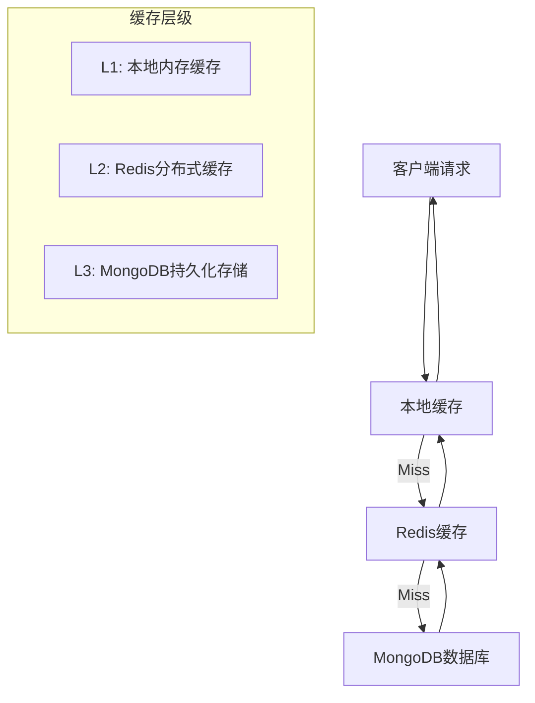

# OpenIM会话同步机制源码详解

## 📋 文档概述

本文档深入解析OpenIM会话同步机制的技术实现，基于以下核心源码文件：
- `internal/rpc/conversation/conversation.go` - 会话服务核心
- `internal/rpc/conversation/sync.go` - 会话同步接口  
- `internal/rpc/conversation/notification.go` - 会话通知系统
- `internal/rpc/incrversion/option.go` - 单目标增量同步
- `internal/rpc/incrversion/batch_option.go` - 批量增量同步

**技术关键词**: 增量同步、版本控制、数据一致性、多端同步、MongoDB、Redis

---

## 🏗️ 第一部分：系统架构概览

### 1.1 会话同步系统整体架构



### 1.2 核心技术组件

| 组件 | 文件路径 | 主要职责 |
|------|----------|----------|
| **会话服务器** | `conversation.go` | 会话CRUD、列表排序、业务逻辑 |
| **同步接口** | `sync.go` | 增量同步API、版本比较 |
| **通知系统** | `notification.go` | 实时通知、多端同步 |
| **单目标同步** | `option.go` | 单用户增量同步算法 |
| **批量同步** | `batch_option.go` | 多用户批量同步优化 |

### 1.3 数据流向图



---

## 🔄 第二部分：增量同步核心机制

### 2.1 版本控制原理

#### 2.1.1 版本数据结构

```go
// 版本日志结构 - 记录数据变更历史
type VersionLog struct {
    ID      primitive.ObjectID `bson:"_id"`           // 版本唯一ID
    DID     string            `bson:"did"`           // 数据标识(如用户ID)
    Version uint              `bson:"version"`       // 版本号(递增)
    LogLen  int              `bson:"log_len"`       // 日志长度
    Logs    []VersionLogElem `bson:"logs"`          // 变更日志列表
}

// 版本日志元素 - 单个数据变更记录
type VersionLogElem struct {
    ID     string `bson:"id"`     // 数据ID(如会话ID)
    Action uint8  `bson:"action"` // 操作类型: 1-插入 2-更新 3-删除
}
```

#### 2.1.2 版本号生成策略



### 2.2 同步策略决策算法

#### 2.2.1 同步策略类型

```go
// 同步策略常量定义
const (
    tagQuery = iota + 1 // 增量查询：客户端版本有效，需要增量同步
    tagFull             // 全量同步：版本无效或差异过大，返回所有数据  
    tagEqual            // 版本相等：无需同步，直接返回
)
```

#### 2.2.2 策略决策流程



### 2.3 数据变更追踪机制

#### 2.3.1 变更日志记录

```go
// 从版本日志提取变更ID的核心算法
func (v *VersionLog) DeleteAndChangeIDs() (insertIDs, deleteIDs, updateIDs []string) {
    for _, log := range v.Logs {
        switch log.Action {
        case 1: // 插入操作
            insertIDs = append(insertIDs, log.ID)
        case 2: // 更新操作  
            updateIDs = append(updateIDs, log.ID)
        case 3: // 删除操作
            deleteIDs = append(deleteIDs, log.ID)
        }
    }
    return insertIDs, deleteIDs, updateIDs
}
```

#### 2.3.2 变更类型分析

| 变更类型 | Action值 | 处理逻辑 | 客户端操作 |
|----------|----------|----------|------------|
| **插入** | 1 | 查询完整数据返回 | 添加到本地存储 |
| **更新** | 2 | 查询最新数据返回 | 更新本地数据 |
| **删除** | 3 | 只返回ID，不查询数据 | 从本地删除 |

---

## 🚀 第三部分：详细交互流程分析

### 3.1 会话列表获取完整流程

#### 步骤1：客户端发起请求
```go
// 客户端请求获取会话列表
req := &pbconversation.GetSortedConversationListReq{
    UserID:          "user123",
    ConversationIDs: []string{}, // 空表示获取所有会话
    Pagination: &sdkws.RequestPagination{
        PageNumber: 1,
        ShowNumber: 20,
    },
}
```

#### 步骤2：服务端处理请求 
```go
// conversation.go - GetSortedConversationList方法
func (c *conversationServer) GetSortedConversationList(ctx context.Context, req *pbconversation.GetSortedConversationListReq) (*pbconversation.GetSortedConversationListResp, error) {
    // 2.1 获取用户所有会话ID
    conversationIDs, err := c.conversationDatabase.GetConversationIDs(ctx, req.UserID)
    
    // 2.2 批量查询会话详细信息
    conversations, err := c.conversationDatabase.FindConversations(ctx, req.UserID, conversationIDs)
    
    // 2.3 获取每个会话的最大序列号
    maxSeqs, err := c.msgClient.GetMaxSeqs(ctx, conversationIDs)
    
    // 2.4 获取每个会话的最新消息
    chatLogs, err := c.msgClient.GetMsgByConversationIDs(ctx, conversationIDs, maxSeqs)
    
    // 2.5 计算未读数
    hasReadSeqs, err := c.msgClient.GetHasReadSeqs(ctx, conversationIDs, req.UserID)
    
    // 2.6 会话排序和分页
    // ... 排序逻辑
    
    return resp, nil
}
```

#### 步骤3：会话信息聚合
```go
// 获取会话显示信息的详细流程
func (c *conversationServer) getConversationInfo(ctx context.Context, chatLogs map[string]*sdkws.MsgData, userID string) (map[string]*pbconversation.ConversationElem, error) {
    // 3.1 收集需要查询的用户ID和群组ID
    var sendIDs []string
    var groupIDs []string
    
    for _, chatLog := range chatLogs {
        switch chatLog.SessionType {
        case constant.SingleChatType:
            // 单聊：需要对方用户信息
            if chatLog.SendID == userID {
                sendIDs = append(sendIDs, chatLog.RecvID)
            }
            sendIDs = append(sendIDs, chatLog.SendID)
        case constant.ReadGroupChatType:
            // 群聊：需要群组信息和发送者信息
            groupIDs = append(groupIDs, chatLog.GroupID)
            sendIDs = append(sendIDs, chatLog.SendID)
        }
    }
    
    // 3.2 批量查询用户信息
    sendInfos, err := c.userClient.GetUsersInfo(ctx, sendIDs)
    
    // 3.3 批量查询群组信息  
    groupInfos, err := c.groupClient.GetGroupsInfo(ctx, groupIDs)
    
    // 3.4 组装会话显示信息
    // ... 组装逻辑
    
    return conversationMsg, nil
}
```

#### 步骤4：会话排序机制
```go
// 会话排序的核心逻辑
func (c *conversationServer) conversationSort(conversations map[int64]string, resp *pbconversation.GetSortedConversationListResp, conversation_unreadCount map[string]int64, conversationMsg map[string]*pbconversation.ConversationElem) {
    // 4.1 提取时间戳作为排序键
    keys := []int64{}
    for key := range conversations {
        keys = append(keys, key)
    }
    
    // 4.2 按时间戳降序排序（最新消息在前）
    sort.Slice(keys, func(i, j int) bool {
        return keys[i] > keys[j]
    })
    
    // 4.3 构造排序后的会话列表
    cons := make([]*pbconversation.ConversationElem, len(conversations))
    for index, timestamp := range keys {
        conversationID := conversations[timestamp]
        conversationElem := conversationMsg[conversationID]
        conversationElem.UnreadCount = conversation_unreadCount[conversationID]
        cons[index] = conversationElem
    }
    
    // 4.4 追加到响应结果（置顶会话优先）
    resp.ConversationElems = append(resp.ConversationElems, cons...)
}
```

### 3.2 增量同步详细流程

#### 步骤5：客户端请求增量同步
```go
// sync.go - GetIncrementalConversation方法调用
req := &conversation.GetIncrementalConversationReq{
    UserID:    "user123",
    VersionID: "507f1f77bcf86cd799439011", // 客户端当前版本ID
    Version:   156,                        // 客户端当前版本号
}
```

#### 步骤6：构建增量同步选项
```go
// sync.go - 构建Option结构
opt := incrversion.Option[*conversation.Conversation, conversation.GetIncrementalConversationResp]{
    Ctx:           ctx,
    VersionKey:    req.UserID,    // 用户ID作为版本键
    VersionID:     req.VersionID, // 客户端版本ID
    VersionNumber: req.Version,   // 客户端版本号
    
    // 版本查询回调
    Version: c.conversationDatabase.FindConversationUserVersion,
    
    // 缓存版本查询回调  
    CacheMaxVersion: c.conversationDatabase.FindMaxConversationUserVersionCache,
    
    // 数据查询回调
    Find: func(ctx context.Context, conversationIDs []string) ([]*conversation.Conversation, error) {
        return c.getConversations(ctx, req.UserID, conversationIDs)
    },
    
    // 响应构造回调
    Resp: func(version *model.VersionLog, delIDs []string, insertList, updateList []*conversation.Conversation, full bool) *conversation.GetIncrementalConversationResp {
        return &conversation.GetIncrementalConversationResp{
            VersionID: version.ID.Hex(),
            Version:   uint64(version.Version),
            Full:      full,
            Delete:    delIDs,
            Insert:    insertList,
            Update:    updateList,
        }
    },
}
```

#### 步骤7：执行增量同步算法
```go
// option.go - Build方法的核心逻辑
func (o *Option[A, B]) Build() (*B, error) {
    // 7.1 参数验证
    if err := o.check(); err != nil {
        return nil, err
    }
    
    // 7.2 获取版本日志并确定同步策略
    var tag int
    version, err := o.getVersion(&tag)
    
    // 7.3 根据策略确定是否全量同步
    var full bool
    switch tag {
    case tagQuery:
        // 检查版本日志完整性
        full = version.ID.Hex() != o.VersionID || 
               uint64(version.Version) < o.VersionNumber || 
               len(version.Logs) != version.LogLen
    case tagFull:
        full = true
    case tagEqual:
        full = false
    }
    
    // 7.4 解析版本日志获取变更ID
    var insertIds, deleteIds, updateIds []string
    if !full {
        insertIds, deleteIds, updateIds = version.DeleteAndChangeIDs()
    }
    
    // 7.5 查询变更的具体数据
    var insertList, updateList []A
    if len(insertIds) > 0 {
        insertList, err = o.Find(o.Ctx, insertIds)
    }
    if len(updateIds) > 0 {
        updateList, err = o.Find(o.Ctx, updateIds)
    }
    
    // 7.6 构造响应结果
    return o.Resp(version, deleteIds, insertList, updateList, full), nil
}
```

#### 步骤8：版本策略决策详解
```go
// option.go - getVersion方法的决策逻辑
func (o *Option[A, B]) getVersion(tag *int) (*model.VersionLog, error) {
    if o.CacheMaxVersion == nil {
        // 无缓存情况：直接查询数据库
        if o.validVersion() {
            *tag = tagQuery // 增量查询
            return o.Version(o.Ctx, o.VersionKey, uint(o.VersionNumber), syncLimit)
        }
        *tag = tagFull // 全量同步
        return o.Version(o.Ctx, o.VersionKey, 0, 0)
    } else {
        // 有缓存情况：先比较缓存版本
        cache, err := o.CacheMaxVersion(o.Ctx, o.VersionKey)
        
        if !o.validVersion() {
            *tag = tagFull // 版本无效，全量同步
            return cache, nil
        }
        
        if !o.equalID(cache.ID) {
            *tag = tagFull // 版本ID不匹配，全量同步
            return cache, nil
        }
        
        if o.VersionNumber == uint64(cache.Version) {
            *tag = tagEqual // 版本相等，无需同步
            return cache, nil
        }
        
        *tag = tagQuery // 增量查询
        return o.Version(o.Ctx, o.VersionKey, uint(o.VersionNumber), syncLimit)
    }
}
```

### 3.3 批量同步优化流程

#### 步骤9：批量同步的应用场景
```go
// batch_option.go - 适用于多用户批量同步
opt := incrversion.BatchOption[A, B]{
    Ctx:            ctx,
    TargetKeys:     []string{"user1", "user2", "user3"}, // 多个用户
    VersionIDs:     []string{"id1", "id2", "id3"},       // 对应的版本ID
    VersionNumbers: []uint64{100, 150, 200},             // 对应的版本号
    
    // 批量版本查询回调
    Versions: func(ctx context.Context, dIds []string, versions []uint64, limits []int) (map[string]*model.VersionLog, error) {
        return batchQueryVersionLogs(ctx, dIds, versions, limits)
    },
    
    // 批量数据查询回调
    Find: func(ctx context.Context, dId string, ids []string) (A, error) {
        return queryUserData(ctx, dId, ids)
    },
}
```

#### 步骤10：批量同步的性能优化
```go
// batch_option.go - getVersions方法的优化逻辑
func (o *BatchOption[A, B]) getVersions(tags *[]int) (map[string]*model.VersionLog, error) {
    // 10.1 批量验证版本有效性
    valids := o.validVersions()
    
    if o.CacheMaxVersions != nil {
        // 10.2 批量获取缓存版本
        caches, err := o.CacheMaxVersions(o.Ctx, o.TargetKeys)
        
        // 10.3 批量比较版本，减少数据库查询
        var needQueryTargets []string
        for i, valid := range valids {
            if !valid || !equals[i] {
                (*tags)[i] = tagFull
            } else if o.VersionNumbers[i] == uint64(caches[o.TargetKeys[i]].Version) {
                (*tags)[i] = tagEqual
            } else {
                (*tags)[i] = tagQuery
                needQueryTargets = append(needQueryTargets, o.TargetKeys[i])
            }
        }
        
        // 10.4 只查询需要的版本日志
        if len(needQueryTargets) > 0 {
            versionMap, err := o.Versions(o.Ctx, needQueryTargets, versionNums, limits)
            // 合并查询结果到缓存
            for k, v := range versionMap {
                caches[k] = v
            }
        }
        
        return caches, nil
    }
    
    // 10.5 无缓存时的批量查询优化
    // ... 批量处理逻辑
}
```

### 3.4 通知系统交互流程

#### 步骤11：会话变更通知
```go
// notification.go - 会话变更时的通知流程
func (c *ConversationNotificationSender) ConversationChangeNotification(ctx context.Context, userID string, conversationIDs []string) {
    // 11.1 构造通知数据
    tips := &sdkws.ConversationUpdateTips{
        UserID:             userID,
        ConversationIDList: conversationIDs,
    }
    
    // 11.2 发送通知（自己给自己发，用于多端同步）
    c.Notification(ctx, userID, userID, constant.ConversationChangeNotification, tips)
}
```

#### 步骤12：未读数变更通知  
```go
// notification.go - 未读数变更通知
func (c *ConversationNotificationSender) ConversationUnreadChangeNotification(ctx context.Context, userID, conversationID string, unreadCountTime, hasReadSeq int64) {
    // 12.1 构造未读数通知
    tips := &sdkws.ConversationHasReadTips{
        UserID:          userID,
        ConversationID:  conversationID,
        HasReadSeq:      hasReadSeq,
        UnreadCountTime: unreadCountTime,
    }
    
    // 12.2 推送未读数变更通知
    c.Notification(ctx, userID, userID, constant.ConversationUnreadNotification, tips)
}
```

#### 步骤13：隐私设置通知
```go
// notification.go - 隐私设置变更通知
func (c *ConversationNotificationSender) ConversationSetPrivateNotification(ctx context.Context, sendID, recvID string, isPrivateChat bool, conversationID string) {
    // 13.1 构造隐私设置通知
    tips := &sdkws.ConversationSetPrivateTips{
        RecvID:         recvID,
        SendID:         sendID,
        IsPrivate:      isPrivateChat,
        ConversationID: conversationID,
    }
    
    // 13.2 向对方发送隐私设置变更通知
    c.Notification(ctx, sendID, recvID, constant.ConversationPrivateChatNotification, tips)
}
```

---

## 🔧 第四部分：技术实现细节

### 4.1 版本校验机制

#### 4.1.1 版本ID有效性检查
```go
// option.go - validVersion方法
func (o *Option[A, B]) validVersion() bool {
    // 检查版本ID是否为有效的MongoDB ObjectID
    objID, err := primitive.ObjectIDFromHex(o.VersionID)
    return err == nil &&           // 格式正确
           (!objID.IsZero()) &&    // 不是零值
           o.VersionNumber > 0     // 版本号大于0
}
```

#### 4.1.2 版本ID匹配检查
```go
// option.go - equalID方法  
func (o *Option[A, B]) equalID(objID primitive.ObjectID) bool {
    // 检查客户端版本ID是否与服务端版本ID一致
    return o.VersionID == objID.Hex()
}
```

### 4.2 缓存优化策略

#### 4.2.1 多级缓存架构


#### 4.2.2 缓存更新策略
```go
// 缓存更新的时机和策略
func updateVersionCache(ctx context.Context, userID string, version *model.VersionLog) {
    // 1. 更新Redis缓存
    err := redis.SetVersionCache(ctx, userID, version, time.Hour*24)
    
    // 2. 更新本地缓存
    localcache.Set(fmt.Sprintf("version:%s", userID), version, time.Minute*10)
    
    // 3. 异步更新数据库
    go func() {
        mongodb.UpdateVersionLog(context.Background(), userID, version)
    }()
}
```

### 4.3 数据一致性保证

#### 4.3.1 事务管理
```go
// conversation.go - 使用MongoDB事务确保数据一致性
func (c *conversationServer) SetConversations(ctx context.Context, req *pbconversation.SetConversationsReq) (*pbconversation.SetConversationsResp, error) {
    // 开启MongoDB事务
    return c.conversationDatabase.(*controller.ConversationDatabase).WithTx(ctx, func(ctx context.Context) error {
        // 1. 更新会话数据
        err := c.conversationDatabase.SetUsersConversationFieldTx(ctx, userIDs, conversation, updateFields)
        if err != nil {
            return err // 事务自动回滚
        }
        
        // 2. 更新版本日志
        err = c.conversationDatabase.IncrConversationUserVersion(ctx, userIDs, conversationIDs)
        if err != nil {
            return err // 事务自动回滚
        }
        
        // 3. 发送通知（事务提交后）
        for _, userID := range userIDs {
            c.conversationNotificationSender.ConversationChangeNotification(ctx, userID, conversationIDs)
        }
        
        return nil // 事务提交
    })
}
```

#### 4.3.2 版本冲突处理
```go
// 版本冲突的检测和处理
func handleVersionConflict(clientVersion, serverVersion *model.VersionLog) SyncStrategy {
    // 检查版本分支
    if clientVersion.ID.Hex() != serverVersion.ID.Hex() {
        // 版本分支不同，需要全量同步
        return FullSync
    }
    
    // 检查版本连续性
    if serverVersion.Version - clientVersion.Version > syncLimit {
        // 版本差距过大，日志可能被清理，执行全量同步
        return FullSync
    }
    
    // 检查日志完整性
    if len(serverVersion.Logs) != serverVersion.LogLen {
        // 日志不完整，执行全量同步
        return FullSync
    }
    
    // 可以执行增量同步
    return IncrementalSync
}
```

### 4.4 性能优化技术

#### 4.4.1 批量操作优化
```go
// batch_option.go - 批量查询优化
func (o *BatchOption[A, B]) optimizedBatchQuery(targetKeys []string) (map[string]A, error) {
    // 1. 分批处理，避免单次查询过多数据
    const batchSize = 100
    results := make(map[string]A)
    
    for i := 0; i < len(targetKeys); i += batchSize {
        end := i + batchSize
        if end > len(targetKeys) {
            end = len(targetKeys)
        }
        
        batch := targetKeys[i:end]
        
        // 2. 并发查询提升性能
        batchResults, err := o.concurrentBatchQuery(batch)
        if err != nil {
            return nil, err
        }
        
        // 3. 合并结果
        for k, v := range batchResults {
            results[k] = v
        }
    }
    
    return results, nil
}

// 并发查询实现
func (o *BatchOption[A, B]) concurrentBatchQuery(keys []string) (map[string]A, error) {
    results := make(map[string]A)
    var mutex sync.Mutex
    var wg sync.WaitGroup
    
    // 使用工作池模式控制并发数
    const maxConcurrency = 10
    semaphore := make(chan struct{}, maxConcurrency)
    
    for _, key := range keys {
        wg.Add(1)
        go func(k string) {
            defer wg.Done()
            semaphore <- struct{}{} // 获取信号量
            defer func() { <-semaphore }() // 释放信号量
            
            result, err := o.Find(o.Ctx, k, []string{k})
            if err == nil {
                mutex.Lock()
                results[k] = result
                mutex.Unlock()
            }
        }(key)
    }
    
    wg.Wait()
    return results, nil
}
```

#### 4.4.2 内存优化策略
```go
// 对象池模式减少GC压力
var versionLogPool = sync.Pool{
    New: func() interface{} {
        return &model.VersionLog{
            Logs: make([]model.VersionLogElem, 0, syncLimit),
        }
    },
}

// 获取版本日志对象
func getVersionLog() *model.VersionLog {
    return versionLogPool.Get().(*model.VersionLog)
}

// 释放版本日志对象
func putVersionLog(vl *model.VersionLog) {
    // 重置对象状态
    vl.ID = primitive.NilObjectID
    vl.DID = ""
    vl.Version = 0
    vl.LogLen = 0
    vl.Logs = vl.Logs[:0] // 保留底层数组，只重置长度
    
    versionLogPool.Put(vl)
}
```

---

## 📊 第五部分：性能分析与监控

### 5.1 性能指标体系

#### 5.1.1 核心性能指标
```go
// 性能监控指标定义
type SyncMetrics struct {
    // 同步延迟指标
    SyncLatency       prometheus.Histogram // 同步请求延迟
    CacheHitRate      prometheus.Gauge     // 缓存命中率
    
    // 数据量指标  
    SyncDataSize      prometheus.Histogram // 同步数据大小
    VersionLogSize    prometheus.Gauge     // 版本日志大小
    
    // 操作计数指标
    FullSyncCount     prometheus.Counter   // 全量同步次数
    IncrSyncCount     prometheus.Counter   // 增量同步次数
    NoSyncCount       prometheus.Counter   // 无需同步次数
    
    // 错误指标
    SyncErrorCount    prometheus.Counter   // 同步错误次数
    VersionConflict   prometheus.Counter   // 版本冲突次数
}
```

#### 5.1.2 性能监控实现
```go
// 监控埋点示例
func (o *Option[A, B]) Build() (*B, error) {
    start := time.Now()
    defer func() {
        // 记录同步延迟
        syncMetrics.SyncLatency.Observe(time.Since(start).Seconds())
    }()
    
    // 检查缓存命中
    if o.CacheMaxVersion != nil {
        cache, err := o.CacheMaxVersion(o.Ctx, o.VersionKey)
        if err == nil {
            syncMetrics.CacheHitRate.Inc() // 缓存命中
        }
    }
    
    // ... 同步逻辑
    
    // 记录同步类型
    switch tag {
    case tagFull:
        syncMetrics.FullSyncCount.Inc()
    case tagQuery:
        syncMetrics.IncrSyncCount.Inc()
    case tagEqual:
        syncMetrics.NoSyncCount.Inc()
    }
    
    return result, nil
}
```

### 5.2 性能优化建议

#### 5.2.1 数据库优化
```javascript
// MongoDB索引优化建议
db.conversation_version_logs.createIndex(
    { "did": 1, "version": 1 },
    { name: "idx_did_version", background: true }
)

db.conversations.createIndex(
    { "owner_user_id": 1, "conversation_id": 1 },
    { name: "idx_owner_conv", background: true }
)

// Redis缓存键设计
// 版本缓存键：version:user:{userID}
// 会话列表缓存键：conv_list:user:{userID}
// 过期时间设置：版本缓存24小时，会话列表1小时
```

#### 5.2.2 网络优化
```go
// gRPC连接池优化
func newGRPCConnPool(target string, poolSize int) (*grpc.ClientConn, error) {
    return grpc.Dial(target,
        grpc.WithTransportCredentials(insecure.NewCredentials()),
        grpc.WithDefaultCallOptions(
            grpc.MaxCallRecvMsgSize(4*1024*1024), // 4MB
            grpc.MaxCallSendMsgSize(4*1024*1024), // 4MB
        ),
        grpc.WithKeepaliveParams(keepalive.ClientParameters{
            Time:                10 * time.Second, // 心跳间隔
            Timeout:             3 * time.Second,  // 心跳超时
            PermitWithoutStream: true,
        }),
    )
}
```

---

## 🎯 第六部分：最佳实践与总结

### 6.1 设计模式应用

#### 6.1.1 策略模式
```go
// 同步策略的策略模式实现
type SyncStrategy interface {
    Execute(ctx context.Context, option *Option) (*SyncResult, error)
}

type FullSyncStrategy struct{}
func (f *FullSyncStrategy) Execute(ctx context.Context, option *Option) (*SyncResult, error) {
    // 全量同步逻辑
}

type IncrementalSyncStrategy struct{}
func (i *IncrementalSyncStrategy) Execute(ctx context.Context, option *Option) (*SyncResult, error) {
    // 增量同步逻辑
}

type NoSyncStrategy struct{}
func (n *NoSyncStrategy) Execute(ctx context.Context, option *Option) (*SyncResult, error) {
    // 无需同步逻辑
}
```

#### 6.1.2 观察者模式
```go
// 会话变更事件的观察者模式
type ConversationObserver interface {
    OnConversationChanged(ctx context.Context, userID string, conversationIDs []string)
}

type NotificationObserver struct {
    sender *ConversationNotificationSender
}

func (n *NotificationObserver) OnConversationChanged(ctx context.Context, userID string, conversationIDs []string) {
    n.sender.ConversationChangeNotification(ctx, userID, conversationIDs)
}

// 事件发布
func (c *conversationServer) publishConversationChangedEvent(ctx context.Context, userID string, conversationIDs []string) {
    for _, observer := range c.observers {
        go observer.OnConversationChanged(ctx, userID, conversationIDs)
    }
}
```

### 6.2 核心技术亮点

#### 6.2.1 增量同步算法优势
1. **带宽节省**: 只传输变更数据，大幅减少网络流量
2. **性能提升**: 避免重复传输，提升同步效率  
3. **一致性保证**: 基于版本号的强一致性机制
4. **可扩展性**: 支持海量用户的并发同步需求

#### 6.2.2 缓存策略优势
1. **多级缓存**: 本地缓存 + Redis + MongoDB的三级存储
2. **智能失效**: 基于版本变更的缓存失效机制
3. **预加载优化**: 批量预加载热点数据
4. **容错机制**: 缓存失效时的降级策略

#### 6.2.3 通知系统优势
1. **实时性**: 基于消息队列的异步通知机制
2. **可靠性**: 支持重试和失败处理
3. **扩展性**: 支持多种通知类型的扩展
4. **多端同步**: 确保所有端的数据一致性

### 6.3 生产环境建议

#### 6.3.1 容量规划
```yaml
# 容量规划参考指标
database:
  mongodb:
    connections: 1000        # 连接池大小
    query_timeout: 30s       # 查询超时
    batch_size: 1000        # 批量操作大小
  
  redis:
    connections: 500         # 连接池大小  
    memory: 8GB             # 内存容量
    eviction: allkeys-lru   # 淘汰策略

sync:
  version_log_retention: 7d  # 版本日志保留时间
  sync_limit: 200           # 单次同步限制
  cache_ttl: 24h            # 缓存过期时间
  
concurrency:
  max_concurrent_sync: 1000  # 最大并发同步数
  worker_pool_size: 100     # 工作池大小
  queue_buffer_size: 10000  # 队列缓冲区大小
```

#### 6.3.2 监控告警
```yaml
# 监控告警规则
alerts:
  - name: SyncLatencyHigh
    condition: sync_latency_p99 > 1s
    message: "同步延迟过高"
    
  - name: CacheHitRateLow  
    condition: cache_hit_rate < 0.8
    message: "缓存命中率过低"
    
  - name: SyncErrorRateHigh
    condition: sync_error_rate > 0.05
    message: "同步错误率过高"
    
  - name: VersionConflictHigh
    condition: version_conflict_rate > 0.01
    message: "版本冲突率过高"
```

### 6.4 技术总结

OpenIM的会话同步机制体现了以下技术精髓：

1. **版本化数据管理**: 通过版本号和版本日志实现精确的数据变更追踪
2. **智能同步策略**: 根据版本差异自动选择最优的同步方式
3. **高性能缓存**: 多级缓存架构显著提升系统性能
4. **可靠通知机制**: 确保多端数据的实时同步
5. **优雅的错误处理**: 完善的降级和恢复机制

这套同步机制不仅解决了IM系统的核心技术难题，也为其他需要数据同步的分布式系统提供了优秀的参考实现。通过深入理解这些源码，我们可以掌握构建高性能、高可靠性数据同步系统的核心技术。

---

## 📚 参考资源

- [OpenIM官方文档](https://docs.openim.io/)
- [MongoDB版本控制最佳实践](https://docs.mongodb.com/)
- [Redis缓存设计模式](https://redis.io/docs/manual/patterns/)
- [gRPC性能优化指南](https://grpc.io/docs/guides/performance/)
- [分布式系统数据一致性](https://en.wikipedia.org/wiki/Eventual_consistency)

*本文档基于OpenIM v3.x版本源码分析，如有疑问请参考最新版本源码实现。*