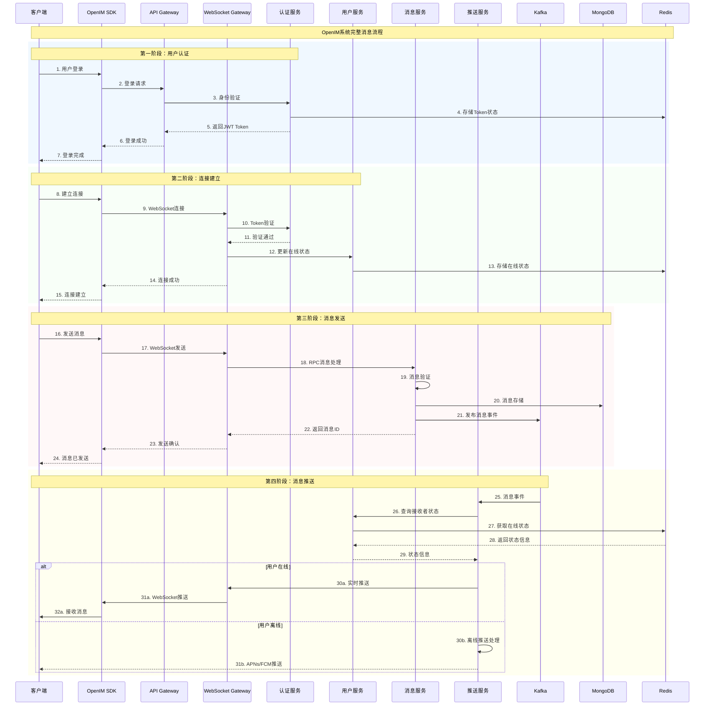
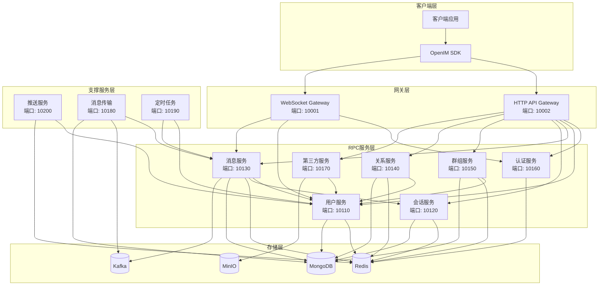
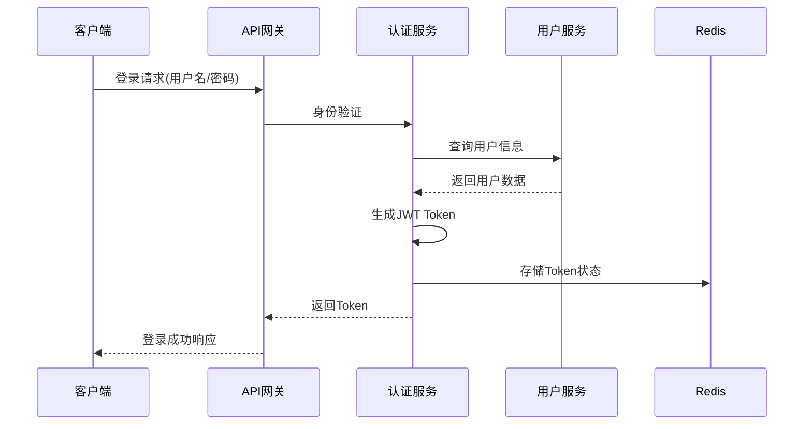
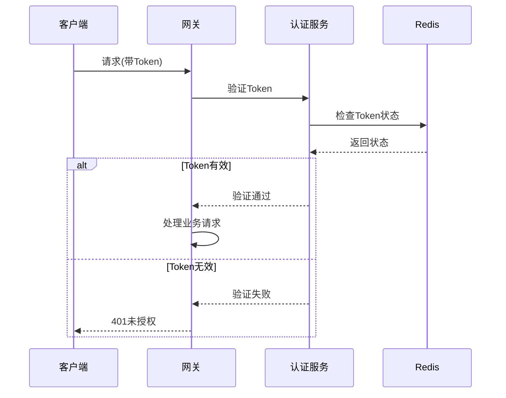
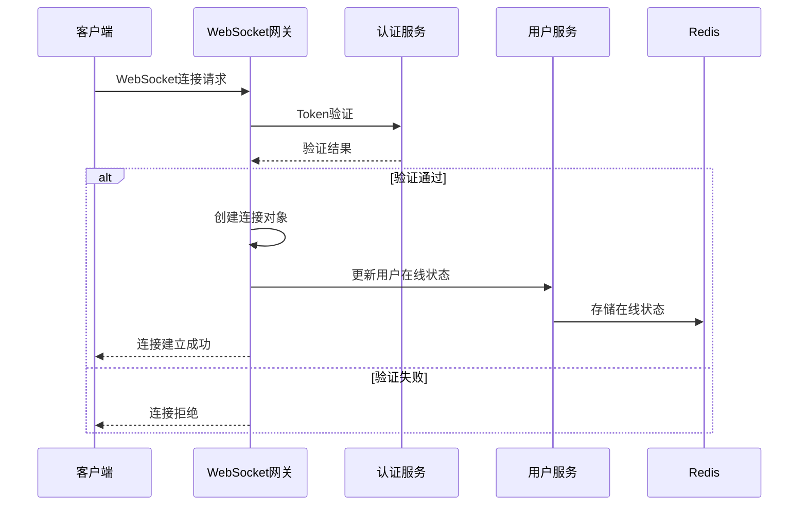
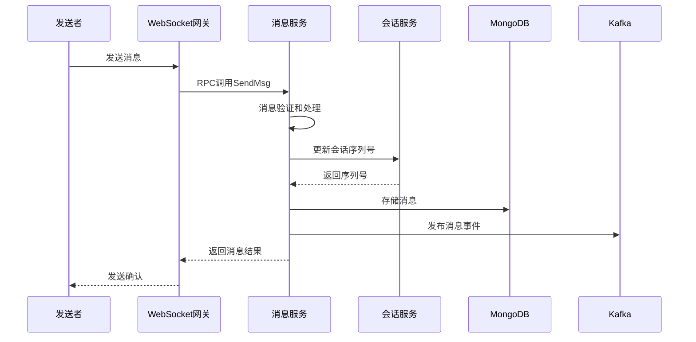
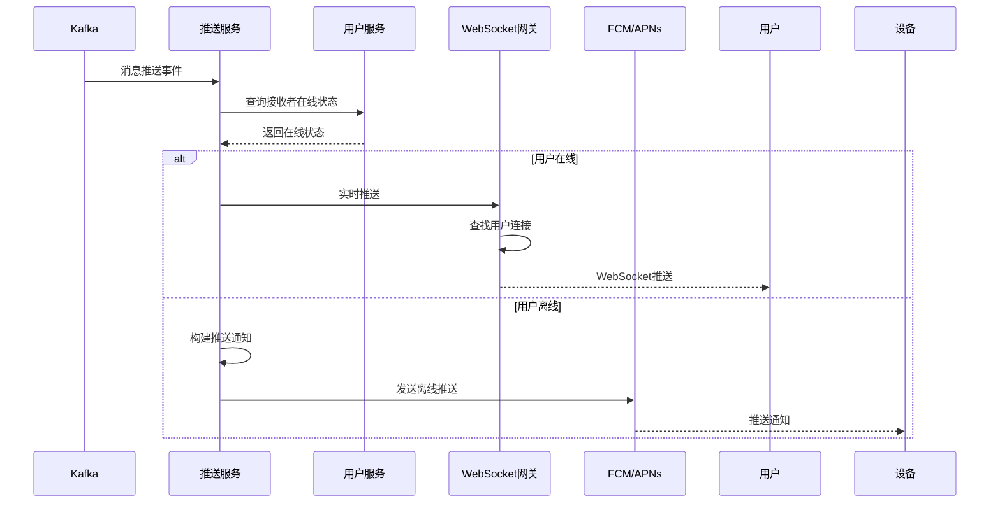
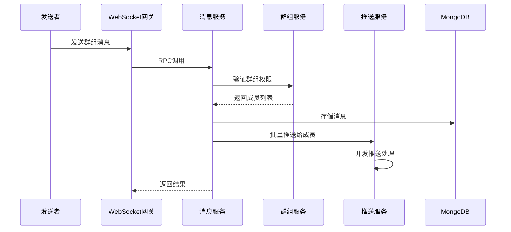

# OpenIM服务交互流程详解

## 📋 概述

本文档详细解析OpenIM系统中各个服务之间的交互流程，包括用户认证、连接建立、消息传输、推送通知等核心业务流程的完整时序图和技术实现细节。

---

## 🔄 完整消息流程时序图



---

## 🏗️ 服务架构交互图

### 微服务间调用关系



---

## 📱 详细业务流程分析

### 1. 用户认证流程

#### 1.1 登录认证时序


#### 1.2 Token验证流程


### 2. WebSocket连接管理

#### 2.1 连接建立流程


#### 2.2 连接管理机制
- **连接池管理**: 管理所有活跃的WebSocket连接
- **心跳检测**: 定期发送心跳包检测连接状态
- **自动重连**: 连接断开时的自动重连机制
- **负载均衡**: 多个网关实例的负载均衡

### 3. 消息处理流程

#### 3.1 消息发送完整流程


#### 3.2 消息验证机制
- **权限验证**: 检查发送者是否有权限发送消息
- **内容过滤**: 敏感词过滤和内容审核
- **频率限制**: 防止消息轰炸的频率控制
- **格式检查**: 消息格式和大小限制

### 4. 推送服务流程

#### 4.1 推送决策流程


#### 4.2 推送策略
- **在线推送**: 实时WebSocket推送
- **离线推送**: FCM/APNs推送通知
- **智能推送**: 基于用户活跃度的推送策略
- **推送聚合**: 多条消息的聚合推送

### 5. 群组消息流程

#### 5.1 群组消息处理


#### 5.2 群组权限验证
- **成员验证**: 检查发送者是否为群成员
- **禁言检查**: 检查用户和群组禁言状态
- **权限控制**: 基于角色的消息发送权限

---

## 🔧 关键技术实现

### 1. 服务发现机制

#### 1.1 服务注册
```go
// 服务注册示例
type ServiceRegistry struct {
    consul *consul.Client
    config *RegistryConfig
}

func (r *ServiceRegistry) RegisterService(service *ServiceInfo) error {
    registration := &consul.AgentServiceRegistration{
        ID:      service.ID,
        Name:    service.Name,
        Address: service.Address,
        Port:    service.Port,
        Check: &consul.AgentServiceCheck{
            HTTP:     fmt.Sprintf("http://%s:%d/health", service.Address, service.Port),
            Interval: "10s",
        },
    }
    return r.consul.Agent().ServiceRegister(registration)
}
```

#### 1.2 负载均衡
```go
// 负载均衡选择器
type LoadBalancer struct {
    services []ServiceEndpoint
    current  int64
}

func (lb *LoadBalancer) NextService() ServiceEndpoint {
    next := atomic.AddInt64(&lb.current, 1)
    return lb.services[next%int64(len(lb.services))]
}
```

### 2. 连接管理实现

#### 2.1 连接池管理
```go
// WebSocket连接管理
type ConnectionManager struct {
    connections sync.Map // map[userID]*Connection
    mu         sync.RWMutex
}

func (cm *ConnectionManager) AddConnection(userID string, conn *Connection) {
    cm.connections.Store(userID, conn)
}

func (cm *ConnectionManager) RemoveConnection(userID string) {
    cm.connections.Delete(userID)
}

func (cm *ConnectionManager) GetConnection(userID string) (*Connection, bool) {
    if conn, ok := cm.connections.Load(userID); ok {
        return conn.(*Connection), true
    }
    return nil, false
}
```

#### 2.2 消息路由
```go
// 消息路由器
type MessageRouter struct {
    connManager *ConnectionManager
    rpcClients  map[string]RPCClient
}

func (mr *MessageRouter) RouteMessage(msg *Message) error {
    if conn, ok := mr.connManager.GetConnection(msg.ReceiverID); ok {
        // 直接推送给在线用户
        return conn.SendMessage(msg)
    } else {
        // 通过推送服务处理离线用户
        return mr.rpcClients["push"].PushMessage(msg)
    }
}
```

### 3. 缓存策略

#### 3.1 多级缓存架构
```go
// 多级缓存实现
type MultiLevelCache struct {
    l1Cache localcache.Cache  // 本地缓存
    l2Cache redis.Client      // Redis缓存
}

func (mlc *MultiLevelCache) Get(key string) (interface{}, error) {
    // 先从本地缓存获取
    if value, ok := mlc.l1Cache.Get(key); ok {
        return value, nil
    }
    
    // 从Redis获取
    value, err := mlc.l2Cache.Get(key).Result()
    if err == nil {
        // 回写到本地缓存
        mlc.l1Cache.Set(key, value, time.Minute*5)
        return value, nil
    }
    
    return nil, err
}
```

#### 3.2 缓存一致性
- **写入策略**: 先写数据库，再删除缓存
- **读取策略**: 缓存未命中时从数据库加载
- **过期策略**: 设置合理的TTL时间
- **更新策略**: 数据变更时主动清理相关缓存

### 4. 消息持久化

#### 4.1 MongoDB存储模型
```go
// 消息文档结构
type MessageDoc struct {
    ID           primitive.ObjectID `bson:"_id,omitempty"`
    ClientMsgID  string            `bson:"client_msg_id"`
    ServerMsgID  string            `bson:"server_msg_id"`
    SenderID     string            `bson:"sender_id"`
    ReceiverID   string            `bson:"receiver_id"`
    SessionType  int32             `bson:"session_type"`
    MsgType      int32             `bson:"msg_type"`
    Content      string            `bson:"content"`
    Timestamp    int64             `bson:"timestamp"`
    Status       int32             `bson:"status"`
}
```

#### 4.2 分片策略
- **水平分片**: 按用户ID或时间分片
- **索引优化**: 创建复合索引提高查询性能
- **数据归档**: 定期归档历史消息数据

---

## 📊 性能优化策略

### 1. 并发处理优化

#### 1.1 协程池
```go
// 协程池实现
type WorkerPool struct {
    workerCount int
    jobQueue    chan Job
    workers     []Worker
}

func (wp *WorkerPool) Start() {
    for i := 0; i < wp.workerCount; i++ {
        worker := NewWorker(wp.jobQueue)
        wp.workers = append(wp.workers, worker)
        go worker.Start()
    }
}
```

#### 1.2 批量处理
```go
// 批量消息处理
type BatchProcessor struct {
    batchSize int
    interval  time.Duration
    buffer    []Message
    mu        sync.Mutex
}

func (bp *BatchProcessor) ProcessBatch() {
    bp.mu.Lock()
    defer bp.mu.Unlock()
    
    if len(bp.buffer) > 0 {
        // 批量处理消息
        bp.processBatchMessages(bp.buffer)
        bp.buffer = bp.buffer[:0]
    }
}
```

### 2. 数据库优化

#### 2.1 连接池配置
```yaml
mongodb:
  uri: "mongodb://localhost:27017/openim"
  maxPoolSize: 100
  minPoolSize: 10
  maxIdleTimeMS: 300000
  maxConnIdleTime: 30000
```

#### 2.2 查询优化
- **索引策略**: 为常用查询字段创建索引
- **查询限制**: 限制查询结果集大小
- **分页查询**: 使用游标分页避免深度分页
- **聚合优化**: 使用MongoDB聚合管道优化复杂查询

### 3. 网络优化

#### 3.1 消息压缩
```go
// 消息压缩实现
type MessageCompressor struct {
    compressThreshold int
}

func (mc *MessageCompressor) Compress(data []byte) []byte {
    if len(data) > mc.compressThreshold {
        var buf bytes.Buffer
        writer := gzip.NewWriter(&buf)
        writer.Write(data)
        writer.Close()
        return buf.Bytes()
    }
    return data
}
```

#### 3.2 连接复用
- **HTTP/2**: 使用HTTP/2的多路复用特性
- **gRPC连接池**: 复用gRPC连接减少建连开销
- **WebSocket保活**: 合理的心跳间隔维持连接

---

## 🛡️ 安全机制

### 1. 身份认证安全

#### 1.1 JWT安全实践
- **签名算法**: 使用RS256或HS256算法
- **Token过期**: 设置合理的过期时间
- **Refresh Token**: 实现Token刷新机制
- **黑名单机制**: 支持Token主动失效

#### 1.2 API安全
- **请求签名**: 对关键API请求进行签名验证
- **频率限制**: 基于用户和IP的频率限制
- **参数验证**: 严格的参数格式和范围验证

### 2. 数据传输安全

#### 2.1 加密传输
- **TLS/SSL**: 所有网络传输使用TLS加密
- **WebSocket Secure**: WSS协议保证WebSocket安全
- **端到端加密**: 可选的消息端到端加密

#### 2.2 数据存储安全
- **敏感数据加密**: 对敏感信息进行加密存储
- **访问控制**: 数据库层面的访问权限控制
- **审计日志**: 记录所有数据访问和修改操作

---

## 📈 监控和运维

### 1. 性能监控

#### 1.1 关键指标
- **QPS**: 每秒请求数
- **响应时间**: 接口平均响应时间
- **连接数**: 当前WebSocket连接数
- **消息吞吐**: 每秒处理的消息数量

#### 1.2 监控实现
```go
// 性能指标收集
type MetricsCollector struct {
    requestCount    prometheus.Counter
    responseTime    prometheus.Histogram
    connectionCount prometheus.Gauge
}

func (mc *MetricsCollector) RecordRequest(duration time.Duration) {
    mc.requestCount.Inc()
    mc.responseTime.Observe(duration.Seconds())
}
```

### 2. 日志管理

#### 2.1 结构化日志
```go
// 结构化日志记录
func LogMessage(userID, msgID string, action string, err error) {
    logger.WithFields(logrus.Fields{
        "user_id": userID,
        "msg_id":  msgID,
        "action":  action,
        "error":   err,
    }).Info("Message processing")
}
```

#### 2.2 日志聚合
- **ELK Stack**: Elasticsearch + Logstash + Kibana
- **日志级别**: DEBUG/INFO/WARN/ERROR分级
- **日志轮转**: 定期轮转日志文件
- **日志采样**: 高并发下的日志采样策略

---

## 🔗 总结

OpenIM的服务交互流程体现了现代微服务架构的最佳实践：

1. **清晰的服务边界**: 每个服务职责单一，边界清晰
2. **异步处理机制**: 通过消息队列实现服务解耦
3. **完善的监控体系**: 全链路的性能监控和日志追踪
4. **高可用设计**: 多层次的容错和恢复机制
5. **安全防护**: 多维度的安全防护策略

这种架构设计不仅保证了系统的高性能和高可用性，还为业务的快速迭代和扩展提供了坚实的技术基础。

---

*本文档基于OpenIM v3.8.3版本编写，详细展示了系统各组件间的交互关系和技术实现细节。*