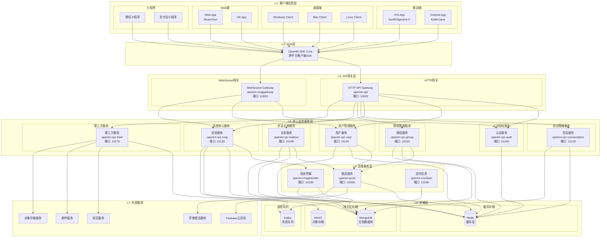
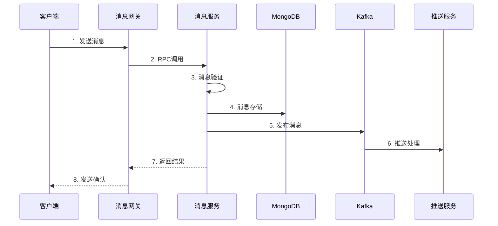
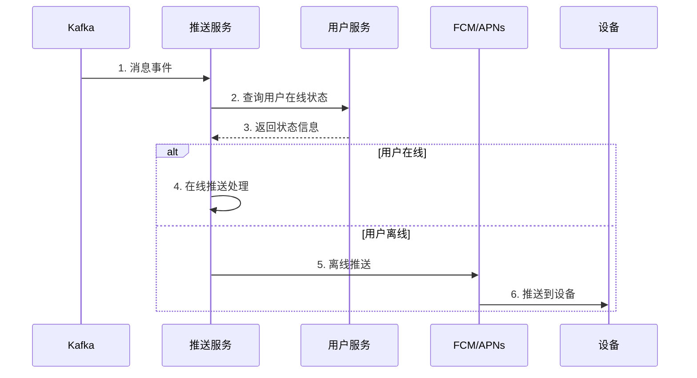

# OpenIM项目全面解析文档

## 📋 项目概述

OpenIM是一个开源的企业级即时通讯解决方案，专为开发者设计。与Telegram、Signal等独立聊天应用不同，OpenIM提供了完整的IM集成工具链，由OpenIM SDK和OpenIM Server两大核心部分组成，采用微服务架构，支持高并发、高可用的实时通信能力。

### 🎯 核心价值主张

- **开发者友好**: 提供完整的SDK和Server端解决方案
- **微服务架构**: 模块化设计，支持独立部署和水平扩展
- **高性能**: 支持百万级用户，千万级群组，百亿级消息
- **多平台支持**: iOS、Android、Web、PC、小程序全平台覆盖
- **灵活扩展**: 基于Webhook的业务逻辑扩展机制

---

## 🏗️ 整体架构设计

### 系统分层架构图



### 🔧 架构层次详解

#### L1: 客户端应用层
- **移动端**: iOS/Android原生应用
- **桌面端**: Windows/Mac/Linux桌面客户端
- **Web端**: 基于React/Vue的Web应用和H5应用
- **小程序**: 微信小程序、支付宝小程序等

#### L2: SDK层
- **OpenIM SDK Core**: 跨平台的客户端SDK，提供统一的API接口
- 支持多种开发语言和平台
- 本地存储、连接管理、消息处理等核心功能

#### L3: API网关层
- **HTTP API Gateway**: REST API接口服务，端口10002
- **WebSocket Gateway**: 实时通信网关，端口10001
- 负载均衡、请求路由、身份认证

#### L4: 核心业务服务层
8个独立的微服务，各自负责特定的业务域：
- **认证服务**: JWT令牌管理、多端登录控制
- **用户服务**: 用户信息管理、在线状态跟踪
- **消息服务**: 消息发送、接收、同步、存储
- **会话服务**: 会话管理、消息序列号管理
- **群组服务**: 群组生命周期管理、成员管理
- **关系服务**: 好友关系、黑名单管理
- **第三方服务**: 对象存储、短信、邮件集成

#### L5: 支撑服务层
- **推送服务**: 离线消息推送、多平台推送
- **消息传输**: 消息路由、Kafka消费处理
- **定时任务**: 数据清理、统计任务

#### L6: 存储层
- **Redis**: 缓存、会话状态、在线状态
- **MongoDB**: 消息、用户、群组数据持久化
- **MinIO**: 文件、图片、视频对象存储
- **Kafka**: 异步消息队列

#### L7: 外部服务
- **FCM/APNs**: 移动端推送服务
- **SMS/Email**: 通知服务
- **OSS**: 云存储服务

---

## 🌟 OpenIM核心特性

### 1. 📱 多平台支持
- **全平台覆盖**: iOS、Android、Web、PC、小程序
- **统一SDK**: 一套SDK适配所有平台
- **原生性能**: 基于Golang构建，性能优异

### 2. 🔧 微服务架构
- **服务拆分**: 8个独立的RPC服务
- **独立部署**: 每个服务可独立部署和扩展
- **高可用**: 支持集群模式和故障转移

### 3. 📊 海量并发支持
- **百万级用户**: 支持百万级并发用户
- **千万级群组**: 支持超大规模群组
- **百亿级消息**: 海量消息处理能力

### 4. 🚀 实时通信
- **WebSocket**: 基于WebSocket的实时通信
- **毫秒级延迟**: 优化的消息传输路径
- **多端同步**: 消息在所有设备实时同步

### 5. 💾 消息存储
- **持久化**: MongoDB文档数据库存储
- **缓存优化**: Redis多级缓存加速
- **消息索引**: 高效的消息检索机制

### 6. 🔐 安全认证
- **JWT令牌**: 基于JWT的身份认证
- **多端登录**: 支持多设备同时在线
- **权限控制**: 细粒度的权限管理

### 7. 🔄 消息同步
- **增量同步**: 基于序列号的增量同步
- **离线消息**: 离线消息的完整保存和推送
- **消息状态**: 已读/未读状态管理

### 8. 🌐 Webhook集成
- **事件回调**: 消息前后的回调机制
- **业务扩展**: 灵活的业务逻辑集成
- **第三方集成**: 与外部系统的无缝集成

---

## 🏢 核心业务模块详解

### 1. 认证授权模块 (openim-rpc-auth)

#### 核心功能
- **JWT令牌管理**: 生成、验证、刷新、撤销
- **多平台认证**: 不同客户端平台的独立Token管理
- **权限分级**: 系统管理员、普通用户、应用账号
- **会话管理**: 在线状态、强制下线、会话超时

#### 技术实现
```go
// JWT令牌生成和验证
type AuthService struct {
    tokenManager *jwt.TokenManager
    userCache    cache.UserCache
    config       *config.AuthConfig
}

func (s *AuthService) UserToken(ctx context.Context, req *pbauth.UserTokenReq) (*pbauth.UserTokenResp, error) {
    // 1. 用户身份验证
    // 2. 多端登录检查
    // 3. JWT令牌生成
    // 4. 会话状态存储
}
```

### 2. 用户管理模块 (openim-rpc-user)

#### 核心功能
- **用户生命周期**: 注册、信息管理、状态跟踪、注销
- **在线状态管理**: 多设备在线状态聚合
- **权限管理**: 用户权限验证和控制
- **批量操作**: 支持批量用户查询和更新

#### 关键特性
- **多端在线**: 支持用户多设备同时在线
- **状态聚合**: 任一平台在线，整体状态为在线
- **实时同步**: 跨设备的状态信息同步

### 3. 消息核心模块 (openim-rpc-msg)

#### 核心功能
- **消息发送**: 单聊、群聊消息的发送处理
- **消息同步**: 基于序列号的增量消息同步
- **消息存储**: MongoDB的消息持久化存储
- **消息验证**: 权限验证、内容过滤、安全检查

#### 消息流程


### 4. 群组管理模块 (openim-rpc-group)

#### 核心功能
- **群组生命周期**: 创建、解散、信息维护
- **成员管理**: 邀请、踢出、角色管理
- **权限控制**: 分级权限、操作权限、禁言管理
- **申请处理**: 加群申请、审批流程

#### 权限体系
- **群主**: 最高权限，管理群组和所有成员
- **管理员**: 管理成员、消息管理权限
- **普通成员**: 基础聊天和查看权限

### 5. 好友关系模块 (openim-rpc-relation)

#### 核心功能
- **好友管理**: 添加、删除、查询好友关系
- **黑名单管理**: 用户黑名单的增删改查
- **关系同步**: 好友关系的增量同步
- **申请处理**: 好友申请的处理流程

### 6. 会话管理模块 (openim-rpc-conversation)

#### 核心功能
- **会话创建**: 单聊、群聊会话的创建
- **序列号管理**: 消息序列号的分配和管理
- **会话同步**: 会话信息的跨设备同步
- **未读消息**: 未读消息计数和状态管理

### 7. 第三方服务模块 (openim-rpc-third)

#### 核心功能
- **对象存储**: MinIO文件上传和管理
- **短信服务**: 短信验证码发送
- **邮件服务**: 邮件通知发送
- **回调管理**: Webhook回调的配置和执行

---

## 🔄 支撑服务详解

### 1. 消息网关 (openim-msggateway)

#### 核心职责
- **连接管理**: WebSocket连接的生命周期管理
- **消息转发**: 实时消息的接收和转发
- **状态管理**: 用户在线状态的实时同步
- **负载均衡**: 支持多实例部署和负载均衡

#### 技术架构
```go
type WsServer struct {
    connManager    *ConnectionManager
    userMap        *UserMap
    messageHandler *MessageHandler
    hubServer      *HubServer
}
```

### 2. 消息传输 (openim-msgtransfer)

#### 核心职责
- **Kafka消费**: 消费Kafka中的消息事件
- **消息路由**: 根据用户在线状态路由消息
- **批量处理**: 批量处理消息以提高性能
- **MongoDB存储**: 消息的最终持久化存储

### 3. 推送服务 (openim-push)

#### 核心职责
- **在线推送**: 实时在线用户的消息推送
- **离线推送**: 离线用户的推送通知
- **多平台推送**: FCM、APNs等推送平台集成
- **推送策略**: 智能推送策略和频率控制

#### 推送流程


### 4. 定时任务 (openim-crontask)

#### 核心职责
- **数据清理**: 过期消息和文件的清理
- **统计任务**: 用户活跃度、消息量统计
- **系统维护**: 数据库索引优化、缓存预热
- **监控报告**: 系统健康状态检查和报告

---

## 📁 项目结构详解

### 根目录结构
```
open-im-server/
├── cmd/                    # 应用程序入口
│   ├── openim-api/        # HTTP API服务入口
│   ├── openim-msggateway/ # WebSocket网关入口
│   ├── openim-push/       # 推送服务入口
│   ├── openim-msgtransfer/# 消息传输服务入口
│   ├── openim-crontask/   # 定时任务入口
│   ├── openim-cmdutils/   # 命令行工具
│   └── openim-rpc/        # RPC服务入口目录
├── internal/              # 私有应用程序代码
│   ├── api/              # HTTP API实现
│   ├── msggateway/       # WebSocket网关实现
│   ├── push/            # 推送服务实现
│   ├── msgtransfer/     # 消息传输实现
│   ├── tools/           # 内部工具
│   └── rpc/             # RPC服务实现
├── pkg/                  # 外部应用程序可以使用的库代码
│   ├── common/          # 公共组件
│   ├── apistruct/       # API结构体定义
│   ├── authverify/      # 身份验证工具
│   ├── callbackstruct/ # 回调结构体
│   ├── localcache/     # 本地缓存
│   ├── msgprocessor/   # 消息处理器
│   ├── notification/   # 通知组件
│   ├── rpccache/       # RPC缓存
│   ├── rpcli/          # RPC客户端
│   ├── statistics/     # 统计组件
│   ├── tools/          # 工具包
│   └── util/           # 工具函数
├── config/              # 配置文件
├── deployments/         # 部署相关文件
├── docs/               # 文档
├── scripts/            # 脚本文件
├── test/               # 测试文件
├── tools/              # 工具和辅助程序
└── version/            # 版本信息
```

### 核心模块目录

#### 1. `/cmd` - 应用入口
```
cmd/
├── openim-api/
│   └── main.go              # HTTP API服务启动入口
├── openim-msggateway/
│   └── main.go              # WebSocket网关启动入口
├── openim-push/
│   └── main.go              # 推送服务启动入口
├── openim-msgtransfer/
│   └── main.go              # 消息传输服务启动入口
├── openim-crontask/
│   └── main.go              # 定时任务启动入口
├── openim-cmdutils/
│   └── main.go              # 命令行工具入口
└── openim-rpc/
    ├── openim-rpc-auth/     # 认证RPC服务
    ├── openim-rpc-user/     # 用户RPC服务
    ├── openim-rpc-msg/      # 消息RPC服务
    ├── openim-rpc-conversation/ # 会话RPC服务
    ├── openim-rpc-group/    # 群组RPC服务
    ├── openim-rpc-relation/ # 关系RPC服务
    └── openim-rpc-third/    # 第三方RPC服务
```

#### 2. `/internal` - 核心业务实现
```
internal/
├── api/                     # HTTP API实现
│   ├── auth.go             # 认证相关API
│   ├── user.go             # 用户管理API
│   ├── msg.go              # 消息相关API
│   ├── conversation.go     # 会话管理API
│   ├── group.go            # 群组管理API
│   ├── friend.go           # 好友关系API
│   └── third.go            # 第三方服务API
├── msggateway/             # WebSocket网关
│   ├── ws_server.go        # WebSocket服务器
│   ├── client.go           # 客户端连接管理
│   ├── hub_server.go       # 消息分发中心
│   ├── message_handler.go  # 消息处理器
│   ├── user_map.go         # 用户映射管理
│   ├── online.go           # 在线状态管理
│   └── subscription.go     # 订阅管理
├── push/                   # 推送服务
│   ├── push.go             # 推送服务主逻辑
│   ├── push_handler.go     # 推送处理器
│   ├── onlinepusher.go     # 在线推送器
│   ├── offlinepush_handler.go # 离线推送处理
│   └── callback.go         # 推送回调
├── msgtransfer/            # 消息传输
│   ├── init.go             # 服务初始化
│   ├── online_history_msg_handler.go # 在线历史消息处理
│   └── online_msg_to_mongo_handler.go # MongoDB消息处理
└── rpc/                    # RPC服务实现
    ├── auth/               # 认证服务
    ├── user/               # 用户服务
    ├── msg/                # 消息服务
    ├── conversation/       # 会话服务
    ├── group/              # 群组服务
    ├── relation/           # 关系服务
    └── third/              # 第三方服务
```

#### 3. `/pkg` - 公共库组件
```
pkg/
├── common/                 # 公共组件
│   ├── config/            # 配置管理
│   ├── storage/           # 存储抽象层
│   │   ├── cache/         # 缓存接口
│   │   ├── database/      # 数据库接口
│   │   ├── controller/    # 存储控制器
│   │   └── model/         # 数据模型
│   ├── webhook/           # Webhook组件
│   └── convert/           # 数据转换工具
├── apistruct/             # API结构体定义
├── authverify/            # 身份验证工具
├── callbackstruct/        # 回调结构体定义
├── localcache/            # 本地缓存组件
├── msgprocessor/          # 消息处理器
├── notification/          # 通知组件
├── rpccache/              # RPC缓存组件
├── rpcli/                 # RPC客户端
├── statistics/            # 统计组件
├── tools/                 # 工具包
│   ├── batcher/           # 批处理器
│   ├── checker/           # 检查工具
│   └── discovery/         # 服务发现
└── util/                  # 工具函数
```

---

## 🚀 核心服务启动配置

### 服务配置文件 (start-config.yml)
```yaml
serviceBinaries:
  openim-api: 1              # HTTP API网关
  openim-crontask: 1         # 定时任务服务
  openim-rpc-user: 1         # 用户RPC服务
  openim-msggateway: 1       # WebSocket网关
  openim-push: 1             # 推送服务
  openim-msgtransfer: 1      # 消息传输服务
  openim-rpc-conversation: 1 # 会话RPC服务
  openim-rpc-auth: 1         # 认证RPC服务
  openim-rpc-group: 1        # 群组RPC服务
  openim-rpc-friend: 1       # 好友RPC服务
  openim-rpc-msg: 1          # 消息RPC服务
  openim-rpc-third: 1        # 第三方RPC服务

toolBinaries:
  - check-free-memory        # 内存检查工具
  - check-component          # 组件检查工具
  - seq                      # 序列号工具

maxFileDescriptors: 10000    # 最大文件描述符数
```

### 端口分配

| 服务 | 端口 | 说明 |
|------|------|------|
| openim-api | 10002 | HTTP API网关 |
| openim-msggateway | 10001 | WebSocket网关 |
| openim-rpc-user | 10110 | 用户RPC服务 |
| openim-rpc-conversation | 10120 | 会话RPC服务 |
| openim-rpc-msg | 10130 | 消息RPC服务 |
| openim-rpc-relation | 10140 | 关系RPC服务 |
| openim-rpc-group | 10150 | 群组RPC服务 |
| openim-rpc-auth | 10160 | 认证RPC服务 |
| openim-rpc-third | 10170 | 第三方RPC服务 |
| openim-msgtransfer | 10180 | 消息传输服务 |
| openim-crontask | 10190 | 定时任务服务 |
| openim-push | 10200 | 推送服务 |

---

## 🔧 技术栈总结

### 核心技术
- **开发语言**: Go 1.19+
- **通信协议**: gRPC、WebSocket、HTTP/HTTPS
- **消息队列**: Apache Kafka
- **数据库**: MongoDB
- **缓存**: Redis
- **对象存储**: MinIO
- **身份认证**: JWT

### 部署支持
- **容器化**: Docker、Docker Compose
- **编排**: Kubernetes
- **系统支持**: Linux、Windows、macOS
- **架构支持**: AMD64、ARM64

### 监控运维
- **日志**: 结构化日志记录
- **监控**: Prometheus指标
- **链路追踪**: OpenTelemetry
- **健康检查**: HTTP健康检查端点

---

## 📊 性能特性

### 性能指标
- **并发连接**: 支持百万级WebSocket连接
- **消息吞吐**: 支持每秒百万级消息处理
- **响应延迟**: 消息端到端延迟 < 100ms
- **存储容量**: 支持PB级消息存储

### 扩展能力
- **水平扩展**: 所有服务支持水平扩展
- **负载均衡**: 自动负载均衡和故障转移
- **缓存优化**: 多级缓存提升性能
- **批量处理**: 批量操作优化数据库性能

---

## 🌐 集成生态

### OpenIM SDK
- **多语言支持**: Go、JavaScript、Swift、Java、C++
- **跨平台**: iOS、Android、Windows、macOS、Linux、Web
- **功能完整**: 完整的IM功能SDK

### 管理后台
- **OpenIM Admin**: Web管理后台
- **用户管理**: 用户生命周期管理
- **群组管理**: 群组创建和管理
- **消息管理**: 消息监控和管理
- **统计分析**: 使用统计和分析

### 第三方集成
- **推送服务**: FCM、APNs、华为推送、小米推送
- **对象存储**: 阿里云OSS、腾讯云COS、AWS S3
- **短信服务**: 阿里云短信、腾讯云短信
- **邮件服务**: SMTP邮件服务

---

## 📈 应用场景

### 1. 企业即时通讯
- 内部沟通协作
- 团队项目管理
- 视频会议集成
- 文件共享

### 2. 社交应用
- 社交聊天应用
- 兴趣社区
- 直播互动
- 游戏内聊天

### 3. 客服系统
- 在线客服
- 智能机器人
- 工单系统
- 客户管理

### 4. 教育平台
- 在线教学
- 师生互动
- 作业提交
- 家校沟通

### 5. 电商平台
- 买家卖家沟通
- 订单协商
- 售后服务
- 商品咨询

---

## 🔗 相关资源

### 官方资源
- **官网**: https://www.openim.io
- **GitHub**: https://github.com/openimsdk/open-im-server
- **文档**: https://docs.openim.io
- **演示**: https://www.openim.io/en/commercial

### 社区支持
- **Slack**: [加入Slack社区](https://join.slack.com/t/openimsdk/shared_invite/zt-22720d66b-o_FvKxMTGXtcnnnHiMqe9Q)
- **微信群**: 扫码加入技术交流群
- **论坛**: 技术讨论和问题解答

### 学习资源
- **快速开始指南**: 5分钟快速部署
- **开发者文档**: 完整的API文档
- **最佳实践**: 生产环境部署指南
- **视频教程**: 从入门到精通

---

## 📝 总结

OpenIM作为一个开源的企业级即时通讯解决方案，具有以下显著优势：

1. **架构先进**: 微服务架构设计，支持高并发和高可用
2. **功能完整**: 涵盖IM系统的所有核心功能
3. **性能优异**: 支持百万级用户和海量消息处理
4. **易于集成**: 提供完整的SDK和API
5. **扩展灵活**: 基于Webhook的业务扩展机制
6. **部署简单**: 支持多种部署方式
7. **社区活跃**: 持续的技术支持和功能更新

OpenIM为开发者提供了构建现代化即时通讯应用的完整解决方案，无论是企业内部沟通、社交应用还是客服系统，都能够快速集成和部署。通过其模块化的架构设计和丰富的功能特性，开发者可以专注于业务逻辑的实现，而不需要从零开始构建复杂的IM系统。

---

*本文档基于OpenIM v3.8.3版本编写，持续更新中...*