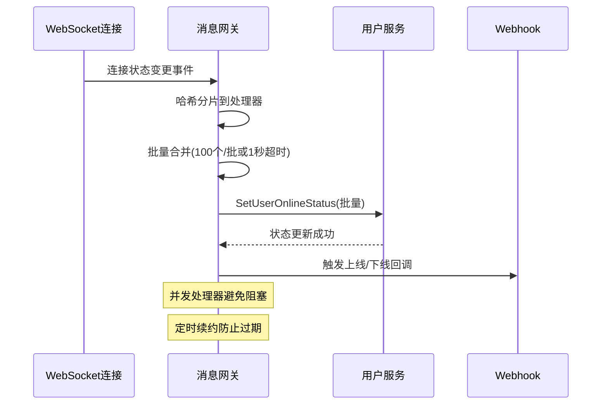
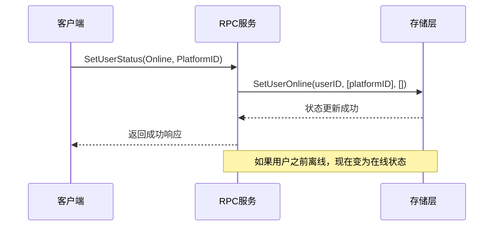
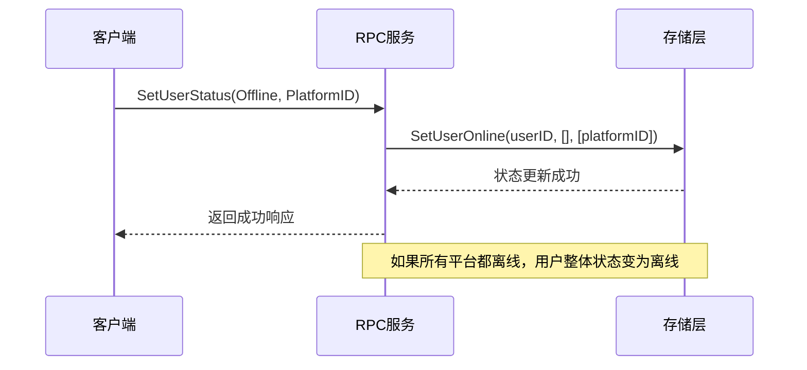
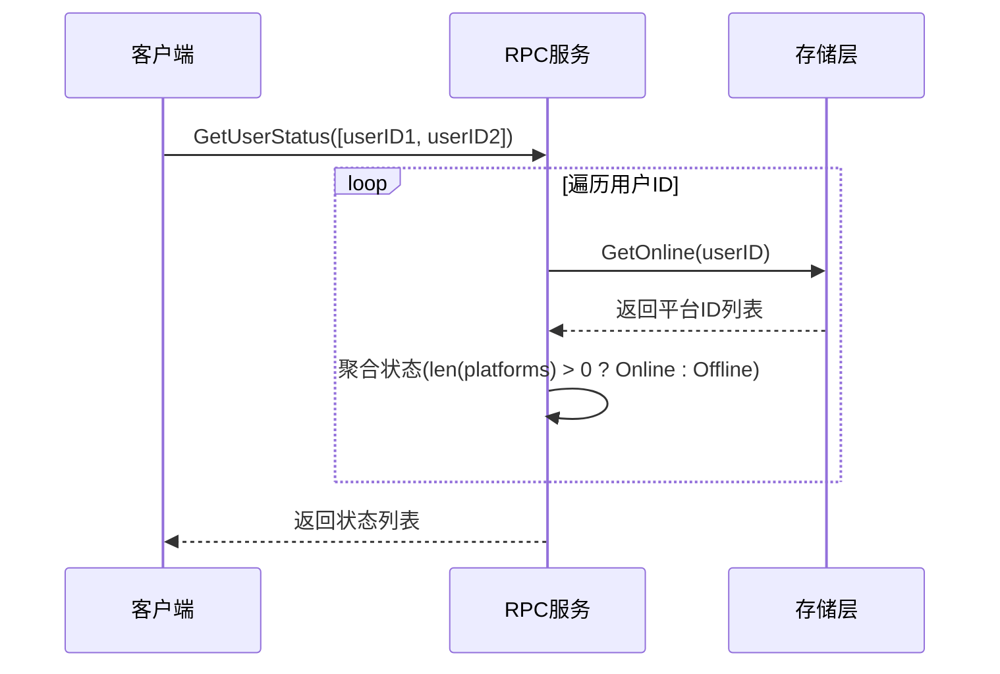

# OpenIM 用户在线状态系统设计文档

## 1. 系统概述

OpenIM 用户在线状态系统是一个分布式实时状态管理系统，负责追踪和管理用户在不同平台和设备上的在线状态。系统支持多平台并发在线，提供实时状态查询、状态变更通知等功能。

## 2. 核心设计理念

### 2.1 多平台并发在线
- 用户可以同时在多个平台（iOS、Android、Web、PC等）保持在线状态
- 每个平台使用唯一的平台ID进行标识
- 只要有任一平台在线，用户整体状态即为在线

### 2.2 状态聚合策略
- **在线状态判定**：`len(platformIDs) > 0` → Online
- **离线状态判定**：`len(platformIDs) == 0` → Offline
- 采用"或"逻辑：任一平台在线，整体在线

### 2.3 分层架构设计
```
┌─────────────────────────────────────┐
│           客户端连接层              │  ← WebSocket连接管理
├─────────────────────────────────────┤
│         消息网关状态管理层          │  ← 实时状态同步、批量处理
├─────────────────────────────────────┤
│           RPC 接口层                │  ← 对外提供gRPC服务
├─────────────────────────────────────┤
│           业务逻辑层                │  ← 状态聚合、批量处理
├─────────────────────────────────────┤
│           存储抽象层                │  ← s.online接口
├─────────────────────────────────────┤
│           底层存储                  │  ← Redis/数据库
└─────────────────────────────────────┘
```

## 3. 核心数据结构

### 3.1 OnlineStatus 结构
```protobuf
message OnlineStatus {
    string userID = 1;           // 用户唯一标识
    int32 status = 2;            // 整体状态(Online/Offline)
    repeated int32 platformIDs = 3;  // 在线平台ID列表
}
```

### 3.2 平台ID枚举
```go
// 平台类型常量
const (
    IOSPlatformID     = 1  // iOS客户端
    AndroidPlatformID = 2  // Android客户端
    WindowsPlatformID = 3  // Windows客户端
    OSXPlatformID     = 4  // macOS客户端
    WebPlatformID     = 5  // Web浏览器
    MiniWebPlatformID = 6  // 小程序
    LinuxPlatformID   = 7  // Linux客户端
    AdminPlatformID   = 8  // 管理端
)
```

## 4. 核心功能模块

### 4.0 消息网关状态管理模块

#### 4.0.1 实时状态同步器 (`ChangeOnlineStatus`)
- **核心职责**: 整个在线状态系统的核心调度器和性能优化中心
- **关键特性**:
  - **并发处理**: 支持配置并发 goroutine 数量，避免单点瓶颈
  - **批量合并**: 自动合并状态变更，减少网络请求次数
  - **哈希分片**: 基于用户ID哈希分片，保证操作顺序性
  - **定时续约**: 防止缓存过期，确保状态持久性
  - **实时响应**: 处理客户端连接状态变更事件

#### 4.0.2 性能优化机制
- **动态批量处理**: 缓冲区满时立即发送，定时器强制推送
- **负载均衡**: MD5哈希+随机数分片，避免热点用户集中
- **内存优化**: 预分配缓冲区，复用底层数组
- **并发安全**: 独立通道避免竞争，原子计数器生成唯一ID

#### 4.0.3 状态事件处理
- **上线事件**: 触发 `webhookAfterUserOnline` 回调
- **下线事件**: 触发 `webhookAfterUserOffline` 回调
- **后台模式**: 支持客户端后台状态识别
- **连接追踪**: 记录连接ID，便于问题排查

#### 4.0.4 三大事件循环
1. **定时合并推送** (1秒间隔): 确保状态更新实时性
2. **定时续约** (缓存过期时间1/3): 防止状态数据丢失
3. **实时状态变更**: 处理客户端连接状态变化

### 4.1 状态查询模块

#### 4.1.1 单用户状态查询
- **函数**: `getUserOnlineStatus(ctx, userID)`
- **功能**: 获取指定用户的实时在线状态
- **实现**: 查询底层存储 → 状态聚合 → 返回结果
- **时间复杂度**: O(1)

#### 4.1.2 批量用户状态查询
- **函数**: `getUsersOnlineStatus(ctx, userIDs)`
- **功能**: 批量获取多个用户的在线状态
- **优化**: 预分配切片容量，减少内存重分配
- **时间复杂度**: O(n)，n为用户数量

#### 4.1.3 全量在线用户查询
- **函数**: `GetAllOnlineUsers(ctx, req)`
- **功能**: 分页获取所有在线用户列表
- **特性**: 游标分页、避免大量数据传输
- **适用场景**: 管理后台、系统监控

### 4.2 状态设置模块

#### 4.2.1 单平台状态设置
- **函数**: `SetUserStatus(ctx, req)`
- **功能**: 设置用户在指定平台的在线/离线状态
- **参数处理**: 根据状态类型构建在线/离线平台列表
- **原子性**: 单次操作保证一致性

#### 4.2.2 批量状态设置
- **函数**: `SetUserOnlineStatus(ctx, req)`
- **功能**: 批量设置多个用户的状态信息
- **优势**: 减少网络往返，提高批量操作效率
- **适用场景**: 系统维护、状态同步

### 4.3 状态订阅模块（预留）

#### 4.3.1 状态订阅管理
- **函数**: `SubscribeOrCancelUsersStatus(ctx, req)`
- **功能**: 订阅/取消用户状态变更通知
- **设计**: 预留接口，支持实时推送扩展

#### 4.3.2 订阅状态查询
- **函数**: `GetSubscribeUsersStatus(ctx, req)`
- **功能**: 获取已订阅用户的状态信息
- **配合**: 与订阅管理接口配合使用

## 5. 系统流程设计

### 5.0 消息网关状态同步流程


### 5.1 用户上线流程


### 5.2 用户下线流程


### 5.3 状态查询流程


## 6. 关键技术决策

### 6.1 状态存储策略
- **存储结构**: `userID -> []platformID` 映射
- **优势**: 支持多平台并发，查询效率高
- **实现**: 依赖底层 `s.online` 接口抽象

### 6.2 状态聚合逻辑
- **聚合策略**: 任一平台在线 → 整体在线
- **实现**: `len(platformIDs) > 0 ? Online : Offline`
- **优势**: 简单直观，符合用户期望

### 6.3 批量操作优化
- **预分配内存**: `make([]*pbuser.OnlineStatus, 0, len(userIDs))`
- **减少网络往返**: 支持批量查询和设置
- **分页支持**: 游标分页避免大数据集问题
- **动态批量**: 缓冲区满(100个)立即发送，定时器(1秒)强制推送
- **哈希分片**: MD5哈希+随机数分布，避免热点集中

### 6.4 错误处理策略
- **快速失败**: 遇到错误立即返回，不影响其他操作
- **错误透传**: 将底层错误信息传递给调用方
- **事务一致性**: 单个操作保证原子性

## 7. 性能特性

### 7.1 查询性能
- **单用户查询**: O(1) 时间复杂度
- **批量查询**: O(n) 线性复杂度，n为用户数量
- **分页查询**: 游标分页，避免深度分页问题
- **并发处理**: 可配置并发数，水平扩展处理能力
- **负载均衡**: 基于哈希的分片策略，避免热点

### 7.2 内存优化
- **预分配切片**: 减少内存重分配开销
- **即时释放**: 及时释放临时变量
- **批量处理**: 减少函数调用开销

### 7.3 扩展性设计
- **接口抽象**: `s.online` 接口支持不同存储实现
- **分页支持**: 支持大规模用户场景
- **预留接口**: 订阅机制为实时推送做准备

## 8. 安全考虑

### 8.1 数据隔离
- **用户隔离**: 每个用户的状态信息独立存储
- **平台隔离**: 不同平台状态分别管理
- **权限控制**: 依赖上层认证授权机制

### 8.2 并发安全
- **底层保证**: 依赖存储层的并发安全特性
- **无状态设计**: RPC服务层无共享状态
- **原子操作**: 单次状态变更保证原子性

## 9. 监控与运维

### 9.1 关键指标
- **在线用户数**: 实时在线用户统计
- **平台分布**: 各平台用户分布情况
- **状态变更频率**: 上线/下线操作频率
- **查询性能**: 接口响应时间和吞吐量
- **批量处理效率**: 批次大小、处理延迟、通道阻塞率
- **并发处理负载**: 各处理器负载分布、哈希冲突率
- **续约成功率**: 定时续约成功率、缓存命中率

### 9.2 异常处理
- **存储异常**: 底层存储不可用时的降级策略
- **网络异常**: 网络波动时的重试机制
- **数据一致性**: 状态数据不一致时的修复机制

## 10. 扩展方向

### 10.1 实时推送
- 实现状态变更的实时通知机制
- 支持好友上线提醒功能
- WebSocket连接管理

### 10.2 状态缓存
- 增加多级缓存机制
- 热点用户状态缓存
- 缓存失效策略

### 10.3 统计分析
- 用户活跃度分析
- 平台使用情况统计
- 在线时长统计

## 11. 总结

OpenIM 用户在线状态系统采用分层架构设计，通过状态聚合策略支持多平台并发在线，提供了完整的状态管理功能。系统具有良好的扩展性和性能特性，为实时通讯应用提供了可靠的状态基础设施。

核心设计优势：
1. **多平台支持**: 支持用户在多个平台同时在线
2. **简单直观**: 状态聚合逻辑清晰易懂
3. **高性能**: 优化的查询和批量操作
4. **可扩展**: 预留订阅接口，支持实时推送扩展
5. **分层设计**: 清晰的架构分层，便于维护和测试 